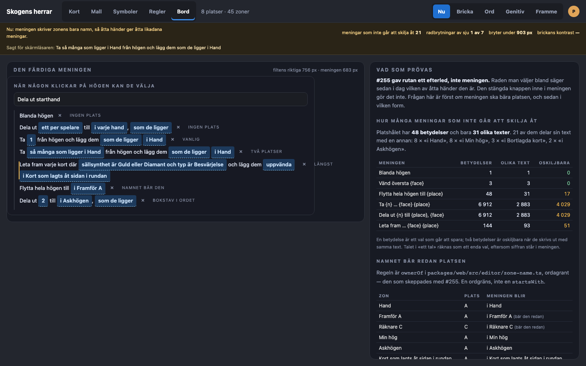
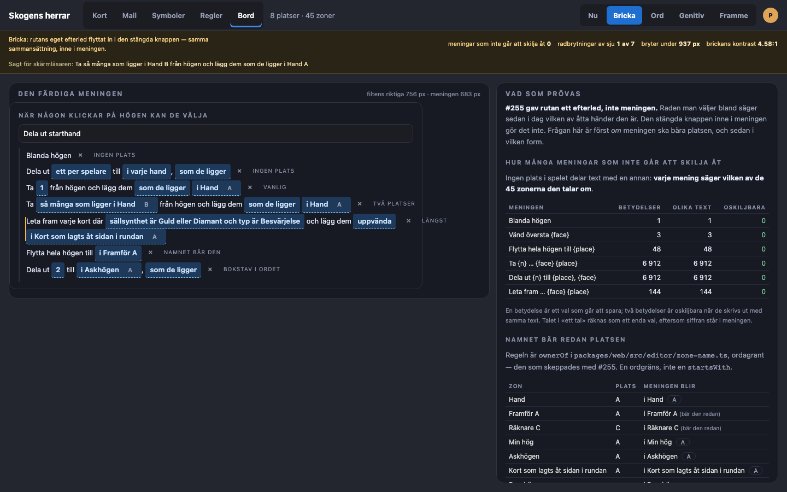
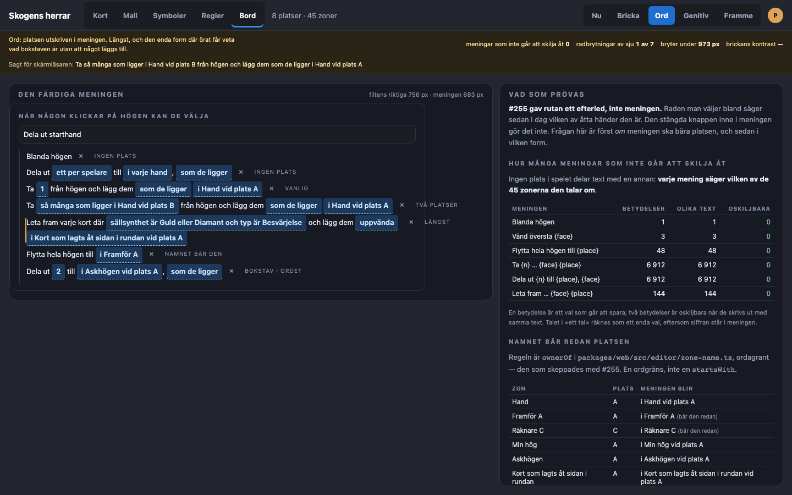
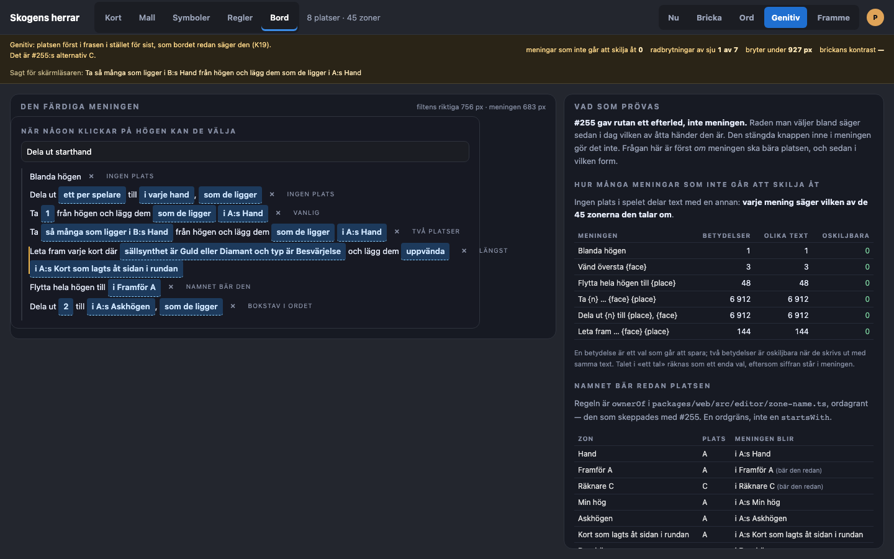
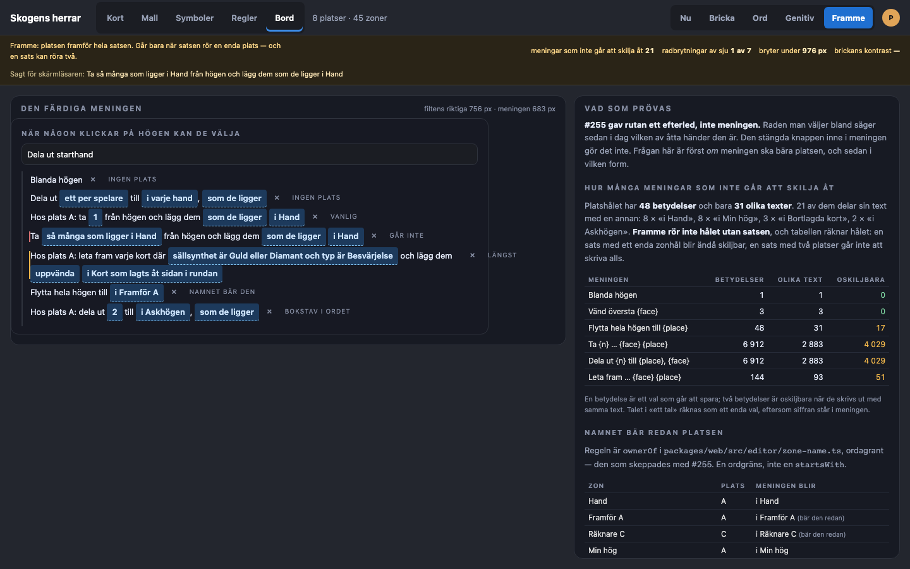

# Prototyp: meningens plats (#269)

#255 gav **raden man väljer bland** ett efterled, och det skeppades i morse (`f159dbe`).
Den färdiga meningen rördes avsiktligt inte, och det står i beslutet ordagrant: knappen inne i meningen läser fortfarande «i Hand» och «så många som ligger i Hand», vilken av åtta händer designern än valde.
Det är #269, och det är ett eget fynd och inte en glömska.

Den här prototypen prövar alltså inte *hur* ett efterled ska se ut — det är avgjort.
Den prövar det #255 lämnade öppet, och i den ordning frågan faktiskt kommer:

1. **Ska meningen bära platsen alls**, eller räckte det att rutan gjorde det vid valet?
2. Om ja: som **bricka**, som **ord**, eller genom att **meningen skrivs om**?

[`prototyper/07-meningens-plats.html`](2026-09-19/prototyper/07-meningens-plats.html) öppnas direkt i en webbläsare.
Växeln uppe till höger jämför **Nu** med fyra former: **Bricka**, **Ord**, **Genitiv** och **Framme**.
`proto.css` måste ligga i samma mapp, annars är sidan ostilad.

Meningarna står i filtens riktiga bredd och inte i en panels: `.byd-setup` ger filten 756 px vid 1440 px fönsterbredd, `.byd-zone-actions` ligger med `left: 0; right: 0` i den, och det som blir kvar åt meningen är **683 px**.
Prototypens egna anteckningar — «vanlig», «längst», «två platser» — ligger utanför raden och ur flödet, för en anteckning som krymper mätobjektet är inget annat än ett mätfel.

Uppsättningen är **åtta platser och 45 zoner**: prototyp 5:s egna 44, så att de två prototyperna talar om samma spel, plus en enda till — `Kort som lagts åt sidan i rundan` vid plats A.
Den behövs, för den här prototypens värsta fall är en lång mening om en **ägd** zon, och #255:s uppsättning hade det långa namnet bara på en zon ingen äger.
Zonen är unik till namnet och lägger alltså ingenting till tvetydigheten; den finns där för radbrytningen.

Sju steg prövas, valda för att täcka varje fall frågan hänger på och inte för att fylla en panel: en mening utan plats alls, en vanlig, en som rör **två** platser samtidigt, det längsta lagliga steget, ett namn som redan bär platsen (`Framför A`), och ett namn där bokstaven står inuti ordet (`Askhögen`).

Allt nedan är läst ur Chromium på 1440 × 900, inte uppskattat.
Typsnittet är `system-ui`, som på den här maskinen är SF Pro; ingen Linux-font finns installerad här, så CI:s bredder är inte mätta — se mätning 2, där det spelar roll.

## Vad som mättes, och som ändrar bilden

### 1. Tvetydigheten är större än issuet säger, och det är först nu den har ett tal

Issuet säger «vid åtta platser är det åtta olika betydelser bakom samma mening».
Det är sant om händerna och för litet om spelet.

Platshålet — det `{place}` fyra av sex meningar har — kan betyda **48 saker** och skrivs ut med **31 olika texter**.
**21 av de 48 betydelserna delar sin text med en annan**: 8 × «i Hand», 8 × «i Min hög», 3 × «i Bortlagda kort», 2 × «i Askhögen».
Antalshålet är identiskt, eftersom `setup.amount.zone` nästlar samma zon.

En hel mening är oskiljbar så snart något av dess zonhål är det, och då växer talet med hålen:

| Meningen | Betydelser | Olika text | Oskiljbara |
| --- | --- | --- | --- |
| `Blanda högen` | 1 | 1 | 0 |
| `Vänd översta {face}` | 3 | 3 | 0 |
| `Flytta hela högen till {place}` | 48 | 31 | **17** |
| `Ta {n} från högen och lägg dem {face} {place}` | 6 912 | 2 883 | **4 029** |
| `Dela ut {n} till {place}, {face}` | 6 912 | 2 883 | **4 029** |
| `Leta fram varje kort där … {face} {place}` | 144 | 93 | **51** |

Med vilken som helst av formerna: **0** i varje rad.

Talet «ett tal» räknas som ett enda val, eftersom siffran står i meningen och skiljer sig själv åt.
Det som gör 6 912 till 2 883 är alltså inga siffror utan zonerna: **58 % av de meningar en designer kan skriva i det här spelet går inte att läsa tillbaka till det hon valde.**

Det är den siffra frågan «ska meningen bära platsen alls» ska vägas mot, och den fanns inte förut.

### 2. Radbrytning: den långa meningen bryter redan i dag, i varje form

Meningen har **683 px**, alltså listans innermått minus ×-knappen och mellanrummet.

Två meningsformer mättes mot **varje** zon i spelet — det längsta lagliga steget och det som har två zonhål — alltså 45 × 2 = **90 meningar per form och 450 totalt**.

| Form | Längsta steget bryter | Två zonhål bryter | Mest tillagt, ett hål | Två hål |
| --- | --- | --- | --- | --- |
| Nu | 45 av 45 | **2** av 45 | — | — |
| Bricka | 45 av 45 | **5** av 45 | +34 px | +68 px |
| Genitiv | 45 av 45 | **5** av 45 | +25 px | +49 px |
| Framme | 45 av 45 | **5** av 45 | +74 px | +75 px |
| Ord | 45 av 45 | **15** av 45 | +71 px | +141 px |

Två saker faller ut ur den tabellen.

**#255:s fynd håller här också: det som bryter rad är designerns eget namn, inte verktygets tillägg.**
Det längsta lagliga steget — `Leta fram varje kort där sällsynthet är Guld eller Diamant och typ är Besvärjelse och lägg dem uppvända i …` — bryter för **alla 45 zoner redan i dag**, med `Ruinen` lika väl som med `Kort som lagts åt sidan i rundan`.
Den meningen behöver 903 px i Nu och 937 med bricka; båda är långt över 683, och skillnaden mellan dem ändrar ingenting.

**Men Ord är ett verkligt undantag, och det syns bara när man räknar alla zoner.**
En mening med två zonhål går från 2 brytningar till 5 med bricka och genitiv — de tre nya är `Bortlagda kort` A, B och C — och till **15 med Ord**, som utöver dem lägger till hela `Min hög` A–H och `Askhögen` A–B.
`i Hand vid plats A` är 141 px längre än `i Hand` när meningen rör två zoner, vilket är en femtedel av raden.
Och det här är mätt i SF Pro; repots egen mätning säger att DejaVu på CI:s Linux är ~13 % bredare, så Ords tröskel ligger ännu sämre till där.

### 3. Ordgränsregeln håller, och den skrevs inte om

`ownerOf` i `packages/web/src/editor/zone-name.ts` är regeln, ordagrant den som skeppades med #255.
Prototypen importerar den inte — filen är fristående — men den kopierar uttrycket och inte en `startsWith`, och resultatet är det #255 mätte.

| Zon | Plats | Meningen blir |
| --- | --- | --- |
| `Hand` | A | `i Hand ⟨A⟩` |
| `Framför A` | A | `i Framför A` — namnet bär den redan |
| `Räknare C` | C | `i Räknare C` — namnet bär den redan |
| `Min hög` | A | `i Min hög ⟨A⟩` |
| `Askhögen` | A | `i Askhögen ⟨A⟩` — `A` inuti ordet är inget ord |
| `Kort som lagts åt sidan i rundan` | A | `i Kort som lagts åt sidan i rundan ⟨A⟩` |
| `Draghögen` | — | `i Draghögen` |

Av de 38 ägda zonerna får **16 ingenting alls** (`Framför A`–`H`, `Räknare A`–`H`), och ingen mening blev `i Framför A A`.
Det gäller alla fyra formerna: regeln sitter före formen och inte i den.

### 4. Brickan faller under kravet under pekaren — och det gör den som skeppades i morse också

#255 mätte efterledet mot rutans botten `#12141a` och fick 7,28:1.
Prototypen får samma tal, vilket är en rimlig kontroll av att den mäter samma sak.

Men brickan inne i meningen står inte på rutans botten.
Den stängda knappen är `#1d3a5c`, och under pekaren blir både rutans rad och knappen `#24507f`.

| Bricka | På | Kontrast |
| --- | --- | --- |
| Rutans egen färg `#9aa3b8` | rutans rad `#12141a` — det #255 mätte | 7,28:1 |
| Rutans egen färg `#9aa3b8` | rutans rad under pekaren `#24507f` | **3,28:1** |
| Rutans egen färg `#9aa3b8` | den stängda knappen `#1d3a5c` | 4,58:1 |
| Rutans egen färg `#9aa3b8` | den stängda knappen under pekaren `#24507f` | **3,28:1** |
| Meningens bläck `#cfe6ff` | den stängda knappen `#1d3a5c` | 9,06:1 |
| Meningens bläck `#cfe6ff` | den stängda knappen under pekaren `#24507f` | 6,49:1 |

Två saker, och den ena är inte den här issuens.

**Inne i meningen håller rutans färg vilande med 0,08 till godo och brister under pekaren.**
Brickan i meningen bör alltså ta meningens egen bläckfärg, `#cfe6ff`, som håller i båda lägena.
Det är inte ett avsteg från «ordagrant zonlistans form»: formen är ramen och storleken, och en färg som bara går att läsa på en av tre bottnar är ingen form utan en slump.

**Och efterledet som skeppades i morse har samma brist i rutan.**
`.byd-slot-pop button:hover` sätter `#24507f`, och där är efterledet 3,28:1.
#255:s eget acceptanskriterium säger «minst 4,5:1 mot sin botten» — det mättes mot den vilande botten, och hovringen kontrollerades inte.
1.4.3 gäller texten i varje läge den kan stå i.
**Det är en rättning i #255:s kod och hör hemma i ett eget issue, inte i den här skivan.**

### 5. Uppläsningen: samma fälla som #255 hittade, och den biter två av fyra former

Namnen nedan är lästa ur Chromiums eget tillgänglighetsträd via CDP, matchade mot exakt de knappar som mäts — inte ur DOM-texten.

Platsens ord är **osynligt** i Bricka och i Genitiv: där bär en ensam bokstav hela skillnaden, och en uppläsning hör varken en ram eller en genitivändelse som ett *ord*.
Ordet måste alltså sättas i knappens namn, och var det sätts är hela frågan.

| Form | Utan ord | Ordet före bokstaven | Ordet efter meningen |
| --- | --- | --- | --- |
| Nu | `i Hand` · `i Hand` — **örat hör ingen skillnad** | samma | samma |
| Bricka | `i Hand A` — håller, men säger inte vad `A` är | `i Hand plats A` — **2.5.3 brister** | `i Hand A, plats` — **håller** |
| Genitiv | `i A:s Hand` — håller, men säger inte vad `A` är | `i plats A:s Hand` — **2.5.3 brister** | `i A:s Hand, plats` — **håller** |
| Ord | `i Hand vid plats A` — **håller, och behöver ingen etikett** | oförändrad | oförändrad |
| Framme | `i Hand` · `i Hand` — **örat hör ingen skillnad** på knappen | samma | samma |

Fällan är #255:s egen och den biter likadant: den form som läser bäst — «i Hand, plats A» — är den som inte innehåller det synliga, så en röststyrd användare som säger knappen hon läser får ingen träff (WCAG 2.5.3).
Efterledsformen håller och säger ändå vad bokstaven är, till priset av en lätt stel ordföljd.
Det är samma val beställaren redan gjorde för raden i morse, och det svarar sig självt här: **`{zone} {owner}, plats`**, alltså `setup.slot.zone.owned.tail` som redan finns i katalogen.

**Ord är den enda formen som inte behöver någon etikett alls**, eftersom ordet står synligt.
Det är dess starkaste kort, och det ska sägas rakt ut: den formen kan inte hamna i konflikt med 2.5.3, för den har ingen dold information att förklara.

**Framme fixar inte knappen.** Den flyttar platsen ut i satsen, så *meningen* blir skiljbar men *knappen* heter fortfarande «i Hand» — och det är knappen 2.5.3 och L12 gäller.

## De fyra formerna

### Bricka — `i Hand ⟨A⟩`

Rutans eget efterled, flyttat in i den stängda knappen: samma ram, samma 11 px, samma sammansättning.
Ramen säger att bokstaven inte är en del av namnet, vilket är hela skillnaden mot att bara skriva `Hand A` — som designern verkligen kan ha döpt en zon till (A4).

**Kostar noll nya katalognycklar.** `setup.slot.zone.owned` (`'{zone} {owner}'`) finns sedan #255, och meningen nästlar den sammansättningen i `setup.place.zone` precis som antalsrutan redan nästlar den i `setup.amount.zone`.
En nyckel bär då rutan, antalsrutan och meningen.

**Kostar en ändring i `ZoneActions`:** `targetWords` och `amountWords` returnerar `string` i dag och används som `label` på `Slot`, som också är typad `string`.
En bricka är en nod, så de tre måste lämna `ReactNode`.
Det är den enda formen med den kostnaden.

**Kostar en färg:** `#cfe6ff` i stället för rutans `#9aa3b8`, av skälen i mätning 4.

### Ord — `i Hand vid plats A`

Platsen utskriven som ord, synligt.
Den enda formen där örat får veta vad bokstaven är utan att något läggs till, och den enda som inte kan hamna i 2.5.3-fällan.

Priset är bredd, och det är mätt: **15 av 45 tvåhålsmeningar bryter rad mot Nus 2 och de andras 5.**
Och tätheten: i ett block med fem steg står «vid plats» fem gånger, i en mening som redan är verktygets längsta.

### Genitiv — `i A:s Hand`

Platsen först i frasen i stället för sist — meningen omskriven, och den omskrivning som har mest stöd i repot.
Det är bordets egen form (K19, #86: «Adas hand»), och det är #255:s alternativ C, som beslutet den 18 september pekade vidare hit.
Den använder `{owner:s}` och `possessive`, som skrevs i #89 för exakt det här fallet: `A:s` på svenska, `A’s` på engelska.
Smalast av alla (+25 px), billigast i kod (den lämnar en sträng), en enda ny nyckel.

**Och den går ändå bort, av ett skäl prototypen gjorde synligt: den låter verktygets grammatik styra designerns ord.**
`i A:s Hand` läser fint.
`i A:s Askhögen` och `i A:s Kort som lagts åt sidan i rundan` gör det inte — svensk genitiv framför ett bestämt substantiv är fel, och det rätta vore «A:s askhög», ett ord designern inte har skrivit.
En efterställd bricka rör inte namnet; ett framförställt genitiv böjer meningen runt det.
Det är den gräns A4 ber ytan att hålla, sedd från ett håll ingen hade tittat från: inte «blanda inte ihop orden», utan «låt inte verktygets ord kräva en form av designerns».

`Hand` är det enda vanliga zonnamnet som råkar vara obestämt.
Formen ser rätt ut i prototypens första rad och fel i dess sista, och det är inte en smaksak.

### Framme — `Hos plats A: ta 1 från högen och lägg dem …`

Platsen framför hela satsen, alltså den omskrivning issuet efterfrågar: platsen flyttad till satsens början i stället för dess svans.
Den läser bäst av allt när den fungerar.

**Den fungerar inte, och prototypen visar varför i en enda rad.**
En sats kan röra **två** platser: «Ta så många som ligger i Hand B från högen och lägg dem som de ligger i Hand A» är ett lagligt steg, och det finns ingen framförställd plats att skriva.
Raden står märkt «går inte» i prototypen och faller tillbaka på Nu, alltså på den tvetydiga meningen.

Priset är dessutom fyra nya katalognycklar — en per verb, `split`, `deal`, `take`, `movePile` — i två språk, plus fallbacken.
Och den fixar inte knappen: hålet är oförändrat, så platsrutans stängda knapp heter fortfarande «i Hand».

## Vad jag förordar

**1. Ja, meningen ska bära platsen.**

Det är inte en smakfråga och talet i mätning 1 är skälet: 58 % av de meningar en designer kan skriva i ett spel med åtta platser går inte att läsa tillbaka till det hon valde.
K21 säger att meningen *är* specifikationen, ordagrant, och att det inte finns något annat att kontrollera den emot.
En specifikation som inte går att läsa tillbaka är ingen specifikation, och rutan hjälper inte: den säger vilken hand det är i det ögonblick valet görs, och är stängd varje gång meningen läses därefter.

Det finns ett riktigt motargument och det ska bemötas och inte tigas ihjäl: i ett spel där varje zon har ett eget namn lägger platsen till ord som inte skiljer något åt.
Två saker gör det ändå rätt.
Zonlistan i Bord-fliken skriver redan ut ägaren för *varje* ägd zon, oavsett om namnet krockar — att meningen skulle göra något annat vore två sanningar om samma zon.
Och #255 avvisade redan «bara när namnet inte är unikt» (alternativ B) med rätt skäl: en zons ord skulle då ändras när en *annan* zon döps om, och en specifikation som tyst ändrar sig är värre än en som är lång.
Regeln är alltså **alltid, utom när namnet redan bär platsen** — vilket är precis den regel `ownerOf` redan är.

I det här spelet betyder «alltid» 22 av 45 zoner: 16 ägda bär redan platsen i sitt namn, och 7 zoner står på bordet.

**2. Formen är Bricka.**

- Den är den enda som kostar **noll** nya katalognycklar: den sammansättning rutan gör sedan i morse nästlas in i meningen, och `setup.slot.zone.owned` bär då alla tre ytorna.
- Den säger med sin ram vems ordet är, vilket är A4:s gräns och skälet `Hand A` inte får bli typografiskt likadan som `Framför A`.
- Den är näst smalast (+34 px) och lägger till tre radbrytningar av 45 där Ord lägger till tretton.
- Den är samma sak som raden man nyss valde i: att välja `Hand ⟨A⟩` i rutan och sedan läsa `i Hand ⟨A⟩` i meningen är en enda upplysning, inte två.

Genitiv är smalare, billigare i kod och vackrare i sin bästa rad, och går bort på `i A:s Askhögen`.
Ord är renast för örat och går bort på bredden.
Framme går bort på att den inte kan skrivas för en sats som rör två platser.

**3. Knappen läses «i Hand A, plats».**

`setup.slot.zone.owned.tail`, som redan finns.
Det synliga står först, så WCAG 2.5.3 håller, och ordet säger ändå vad bokstaven är.
Samma val som beställaren gjorde för raden i morse — och att rad och mening säger samma sak är i sig ett skäl.

**4. Brickan i meningen tar `#cfe6ff`, inte `#9aa3b8`.**

Rutans färg håller precis vilande (4,58:1) och brister under pekaren (3,28:1) på den blå knappen.

## Vad som inte är den här frågan

**«Flytta hela högen till i Framför A».**
Prototypen skriver ut det därför att produkten gör det: `setup.step.movePile` är `'Flytta hela högen till {place}'` och `setup.place.zone` är `'i {zone}'`, så meningen får «till i».
Det gäller varje zon och varje plats-ord — «till i varje hand», «till i min hand» — och det gäller båda språken («to in Draghögen»).
Inget test i `packages/web/test` läser den meningen, så ingenting fångade det.
Det är en katalogbugg som fanns före #255 och som ingen av formerna ovan rör.
**Den bör bli ett eget issue.**

**Efterledets kontrast i rutan under pekaren.**
3,28:1, i koden som skeppades i morse.
Ett eget issue, i #255:s kod.

**Antalsrutans stängda knapp.**
Den är också en del av meningen och får samma behandling som platsknappen — `setup.amount.zone` nästlar samma hål.
Det är ingen extra fråga, bara värt att säga rakt ut, eftersom beslutet den 19 september uttryckligen sa att den läser «så många som ligger i Hand» *tills detta issue avgörs*.

## Kvar att avgöra

1. **Ska meningen bära platsen alls?** Jag förordar ja, av skälet i mätning 1.
2. **Bricka, Ord, Genitiv eller Framme?** Jag förordar Bricka — Genitiv är det starkaste alternativet och faller på `i A:s Askhögen`; om det svaret känns för hårt är det just den raden som ska tittas på i prototypen.
3. **Brickans färg inne i meningen.** Jag förordar `#cfe6ff`; alternativet är att i stället ändra hovringsbotten `#24507f`, vilket rör varje ruta i editorn och är ett större ingrepp.
4. **Ska de två sidofynden bli egna issues?** Rutans hovringskontrast (en rättning i #255) och «till i Framför A» (en katalogbugg äldre än båda).

Ingenting här importeras av appen.
Tokens och regler är kopierade ur `packages/web/src/editor/editor.css`, `packages/web/src/editor/zone-name.ts` och `packages/web/src/i18n/sv.editor.ts`.
