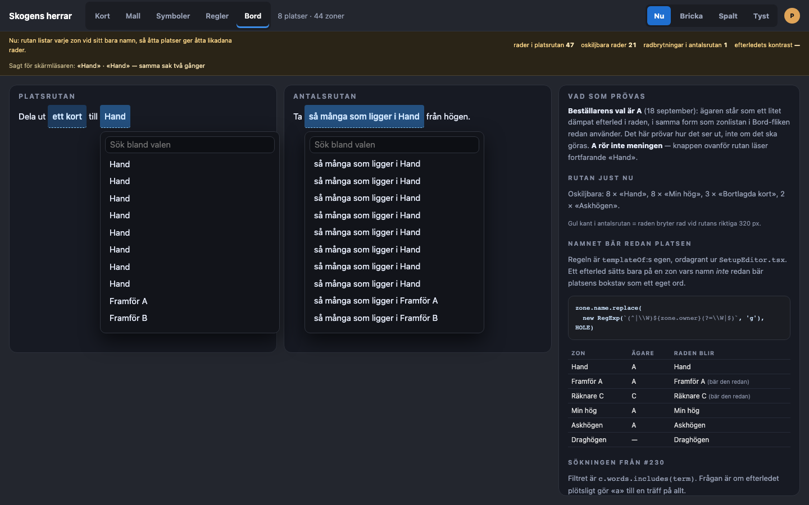
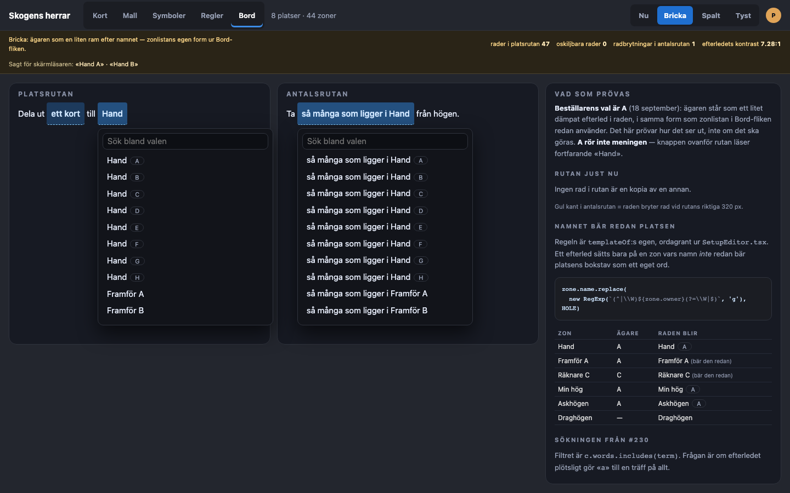
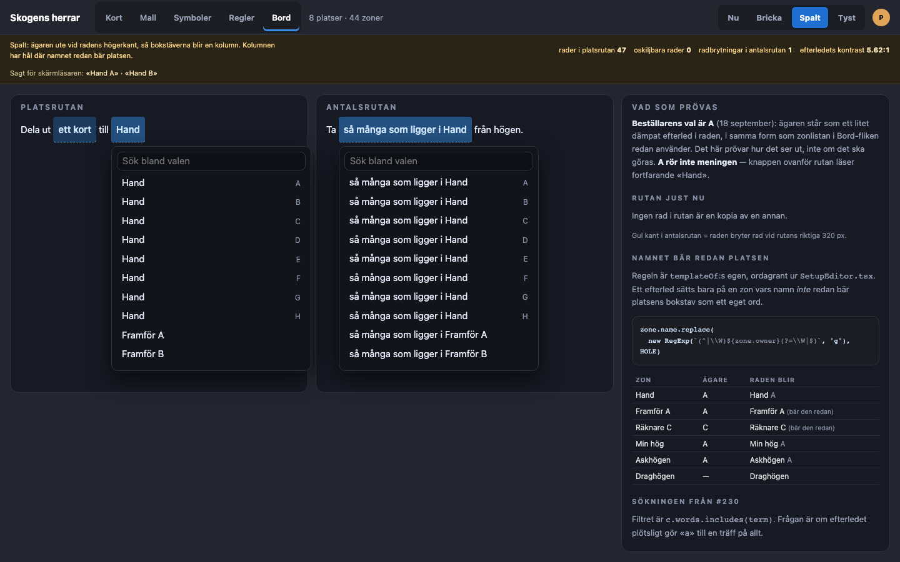
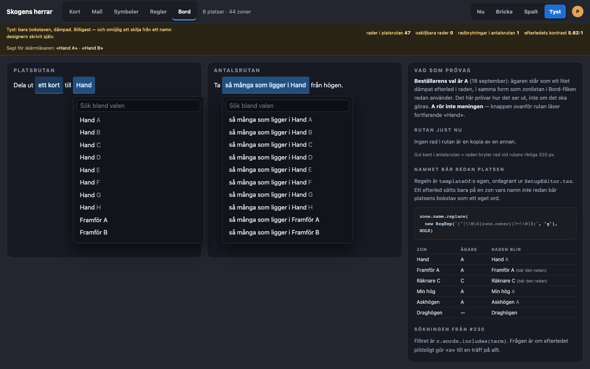

# Prototyp: platsrutans ägare (#255)

Beställaren valde **alternativ A** den 18 september: ägaren skrivs som ett litet dämpat efterled i raden, i samma form som zonlistan i Bord-fliken redan använder.
Prototypen prövar alltså inte *om* det ska göras, utan hur det ska se ut, hur det ska låta, och vad det kostar.

En sak följer med valet och står kvar som ett öppet fynd: **A rör inte meningen.**
Den stängda knappen ovanför rutan läser fortfarande «Hand» och «så många som ligger i Hand».
Det syns i prototypen och är avsiktligt.

[`prototyper/05-platsrutans-agare.html`](2026-09-19/prototyper/05-platsrutans-agare.html) öppnas direkt i en webbläsare.
Växeln uppe till höger jämför **Nu** med tre former av efterledet: **Bricka**, **Spalt** och **Tyst**.
Båda rutorna står öppna samtidigt — platsrutan och antalsrutan — eftersom båda får efterledet och båda ska bedömas i sin riktiga bredd.
Rutorna är ställda där de ägda zonerna börjar, för det är de raderna som prövas.
Protoraden överst bär mätningarna och den upplästa meningen, som i prototyperna 4–7.

Uppsättningen är **åtta platser och 44 zoner**: `Hand`, `Framför X`, `Räknare X` och `Min hög` vid var sin plats, `Bortlagda kort` vid tre, `Askhögen` vid två, och sju zoner på bordet som ingen äger.
Två platser hade dolt problemet på samma sätt som varje litet stickprov gör.



## Vad som mättes, och som ändrar bilden

Allt nedan är läst ur Chromium på 1440 × 900, inte uppskattat.

**1. Tätheten är värre än issuet säger.**
Issuet säger att skalan är platsantalet — åtta platser, åtta likadana `Hand`-rader.
Vid åtta platser är det i själva verket **21 av 47 rader** i platsrutan som är kopior av en annan rad, fördelade på fyra familjer: 8 × «Hand», 8 × «Min hög», 3 × «Bortlagda kort», 2 × «Askhögen».
Med efterledet är siffran **0**.
Det är inte händerna som är problemet; det är varje zon designern gett samma namn vid flera platser.

**2. Efterledet kostar ingen bredd och ingen radbrytning.**
Rutan är 320 px, vilket är `max-width` i `editor.css`.
Ingen rad i någon av de tre formerna svämmar över den bredden.
I antalsrutan — den långa rutan, där raden läser «så många som ligger i …» — bryter **exakt en rad** på två rader, och det är `så många som ligger i Kort som lagts åt sidan`.
Den bryter **med och utan** efterled.
Farhågan att efterledet skulle göra den långa rutan tvåradig stämmer alltså inte; det som bryter rad är designerns eget långa namn.

**3. Sökningen blir inte sämre, den blir bättre.**
Filtret är `c.words.includes(term)`, och frågan var om «a» plötsligt matchar allt.

| Skrivet | Nu | Med efterled |
| --- | --- | --- |
| `a` | 37 av 47 | 38 av 47 |
| `hand` | 10 | 10 |
| `hand a` | **0** | **1** |
| `min hög` | 8 | 8 |
| `min hög h` | **0** | **1** |

«a» går från 37 till 38 träffar — en enda rad till, och det är `Min hög A`, den enda ägda zonen vars namn inte redan innehåller ett `a`.
Att «a» matchar nästan allt är alltså sant redan i dag och beror på att `Hand`, `Marknaden` och `Spelytan` innehåller bokstaven, inte på efterledet.
Vinsten är den andra vägen: **«hand a» går från noll träffar till en.**
Det är en väg till en enskild rad som inte finns i dag — men bara om efterledet står i `words` och inte bara i märkningen.

**4. Regeln om dubbel bokstav är en ordgränsregel, inte en «börjar med»-regel.**
`templateOf` byter platsens bokstav mot ett hål bara när den står som ett eget ord.
Av de 37 ägda zonerna får **16 inget efterled** (`Framför A`–`H` och `Räknare A`–`H`), och ingen rad i rutan blev `Framför A A`.
`Askhögen` vid plats A får däremot efterledet och blir `Askhögen A`, eftersom `A` inuti `Askhögen` inte är ett ord.
Det är rätt, och det är skillnaden mellan regeln som finns och en `startsWith` någon annars hade skrivit.

**5. Rutan visar åtta rader åt gången.**
Med `editor.css`:s riktiga tak (`min(40vh, --byd-place-room)`) är listan 308 px hög och innehållet 1487 px.
Åtta av 47 rader syns utan att skrolla — alltså exakt de åtta handraderna, och inget mer.
Det är skälet att efterledet måste bära hela skillnaden: ordningen hjälper inte, för raderna över och under syns inte samtidigt.

**6. Kontrasten håller.**
Efterledet mot rutans `#12141a`: 7,28:1 som bricka, 5,62:1 som spalt och tyst.
Kravet är 4,5:1, och skillnaden bärs dessutom av ett ord och inte av färg ensam (L12).

## De tre formerna



**Bricka** — `<span>Hand</span> <em>A</em>`, ordagrant zonlistans form ur `editor.css` (`.byd-setup-name em`).
Ramen runt bokstaven säger att den inte är en del av namnet.
Inom en familj står brickorna redan i lodrätt linje — bokstaven ligger på x = 237 i alla åtta handraderna, eftersom namnet är detsamma — så den spaltverkan Spalt argumenterar för är redan vunnen just där raderna är lika.
Över familjer vandrar den mellan 237 och 298, vilket inte spelar någon roll: två rader man ska skilja åt har alltid samma namn.
Kostar en CSS-regel. Raden behåller `display: block`.



**Spalt** — bokstaven skjuts ut till radens högerkant, 472–474 px för alla efterled.
Åtta bokstäver blir en riktig kolumn, och det är vackert att titta på.
Två priser, och båda är mätta.
Kolumnen har hål exakt där regeln slår till: `Framför A` bär sin bokstav inne i namnet, till vänster, så 16 av 37 ägda rader står utanför kolumnen.
Och den kräver att `.byd-slot-pop button` går från `display: block` till `display: flex` — den regeln delas av varje ruta i editorn, inte bara den här.



**Tyst** — bara bokstaven, dämpad, utan ram.
Billigast på sidan, och den som ser mest ut som en ny idé i stället för zonlistans gamla.
Priset är att den **förfalskar ett namn**: `Hand A` blir typografiskt omöjlig att skilja från `Framför A`, som designern verkligen har döpt så.
Verktygets ord och designerns blir samma sorts text, vilket är just den gräns A4 ber ytan att hålla.

**Jag förordar Bricka.** Den är zonlistans form tre klick bort, ramen säger vems ordet är, och den vinner spaltens enda riktiga förtjänst gratis på de rader som behöver den.

## Så låter raden, och den konflikt som inte går att mäta bort

Namnen nedan är lästa ur Chromiums eget tillgänglighetsträd, inte ur DOM-texten.

| Form | Vad rad A och B heter för en uppläsning | WCAG 2.5.3 |
| --- | --- | --- |
| Bara raden | `Hand A` · `Hand B` | håller |
| Platsens ord före bokstaven | `Hand, plats A` · `Hand, plats B` | **brister** |
| Platsens ord efter raden | `Hand A, plats` · `Hand B, plats` | håller |

Den mellersta läser bäst och är den enda som säger vad `A` *är* — men det som syns, «Hand A», står inte i den, och en röststyrd användare som säger raden får ingen träff.
Den nedersta säger samma sak och behåller det synliga, till priset av en lätt stel ordföljd.
Den översta lägger inget till alls: örat får en lös bokstav, men hör ändå skillnad mellan raderna, vilket är vad acceptanskriteriet bokstavligen kräver.

Ett fjärde spår som inte byggdes: **skriva ut `plats A` synligt** i stället för bara `A`.
Då försvinner konflikten helt, eftersom det synliga och det upplästa är samma sak.
Priset är fem tecken extra på varje ägd rad, och att zonlistan i Bord-fliken då säger en annan sak än platsrutan.

## Sammansättningen bor i katalogen

`ZoneActions` sätter aldrig ihop designerns ord med verktygets själv (A4).
Katalogen äger ordningen och mellanrummet; rutan skickar noder och inte textbitar (K21).

```ts
// sv.editor.ts
'setup.slot.zone.owned': '{zone} {owner}',
'setup.slot.zone.owned.said': '{zone}, plats {owner}',
'setup.slot.zone.owned.tail': '{zone} {owner}, plats',
```

```tsx
// ZoneActions.tsx — `owner` är undefined när namnet redan bär platsen.
const owner = ownerOf(z)
words: owner === undefined ? z.name : t('setup.slot.zone.owned', { zone: z.name, owner }),
said:  owner === undefined ? z.name : t('setup.slot.zone.owned.said', { zone: z.name, owner }),
label: owner === undefined ? z.name : parts(t('setup.slot.zone.owned'), { zone: z.name, owner: <em>{owner}</em> }),
```

Antalsrutan nästlar samma hål — den sammansatta zonen går in i `setup.amount.zone` som ett hål — så **en nyckel räcker för båda rutorna**.
`Choice` behöver då två fält den inte har: `said` för uppläsningen och `label` för noden, vid sidan av `words` som söket läser.

En följd som är värd att säga rakt ut: regeln om att namnet redan bär platsen måste nu gälla på två ställen.
`templateOf` är privat i `SetupEditor.tsx` i dag.
Den hör hemma i en egen liten modul som både zonlistan och `ZoneActions` läser, annars är två kopior av samma reguljära uttryck ett fel som väntar.

## Vad som inte är den här frågan

**Meningen.** Den stängda knappen läser «i Hand» efter det här också. Om det ska lösas är det alternativ C och ett eget issue.

**Radhöjden.** En rad i rutan är 30,5 px hög, alltså under tapphöjden. Det gäller varje rad i varje ruta i editorn sedan #230 och är inte något efterledet ändrar — men det stod inte skrivet någonstans, så det står här.

## Kvar att avgöra

1. **Bricka, Spalt eller Tyst?** Jag förordar Bricka, av skälen ovan.
2. **Hur raden ska läsas upp?** De tre formerna kan inte alla vara rätt; den mellersta bryter mot WCAG 2.5.3 och läser bäst. Eller det fjärde spåret: skriv ut `plats A` synligt.
3. **Ska ägaren gå att söka på?** «hand a» ger en träff bara om efterledet står i `words`. Jag förordar ja — det är rutans enda väg till en enskild hand.
4. **Gäller efterledet också den stängda antalsknappen?** A säger att meningen inte rörs, och antalsknappen *är* en del av meningen — så nej, den läser «så många som ligger i Hand». Värt att bekräfta, eftersom det är den ruta där det ser mest ut som en glömska.

Ingenting här importeras av appen. Tokens är kopierade från `packages/web/src/editor/editor.css`.
