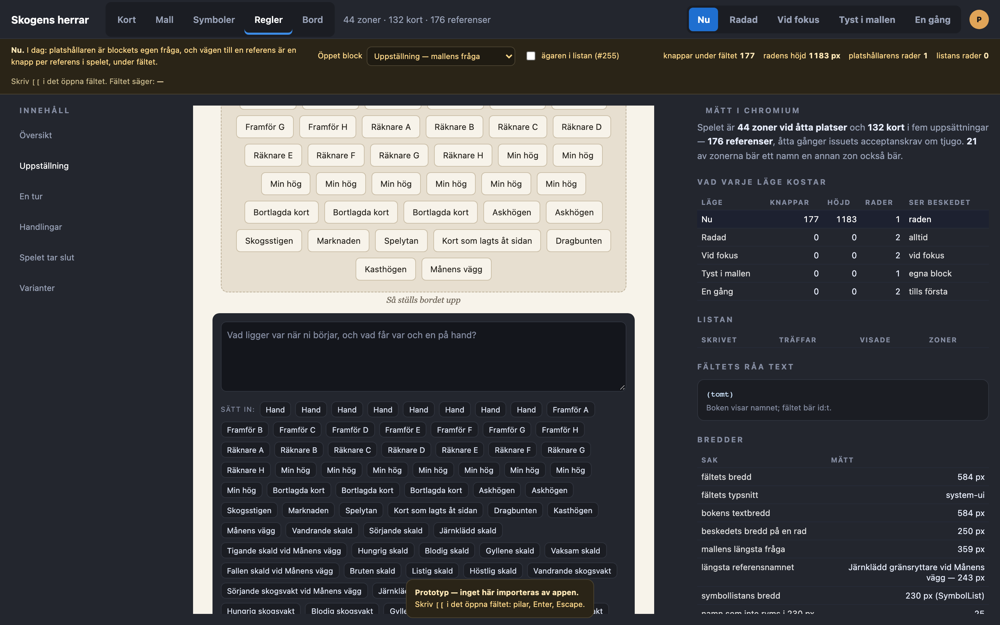
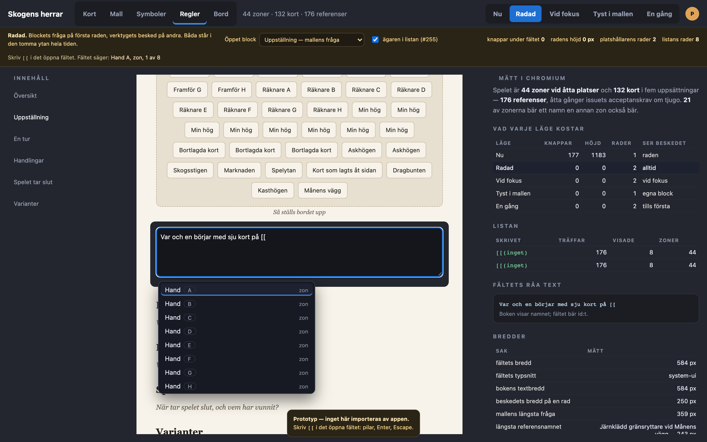
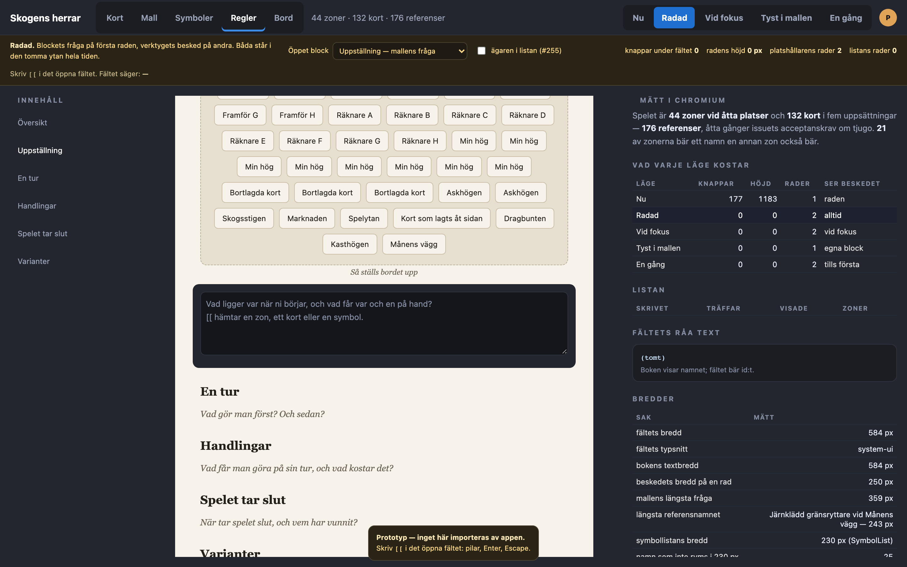
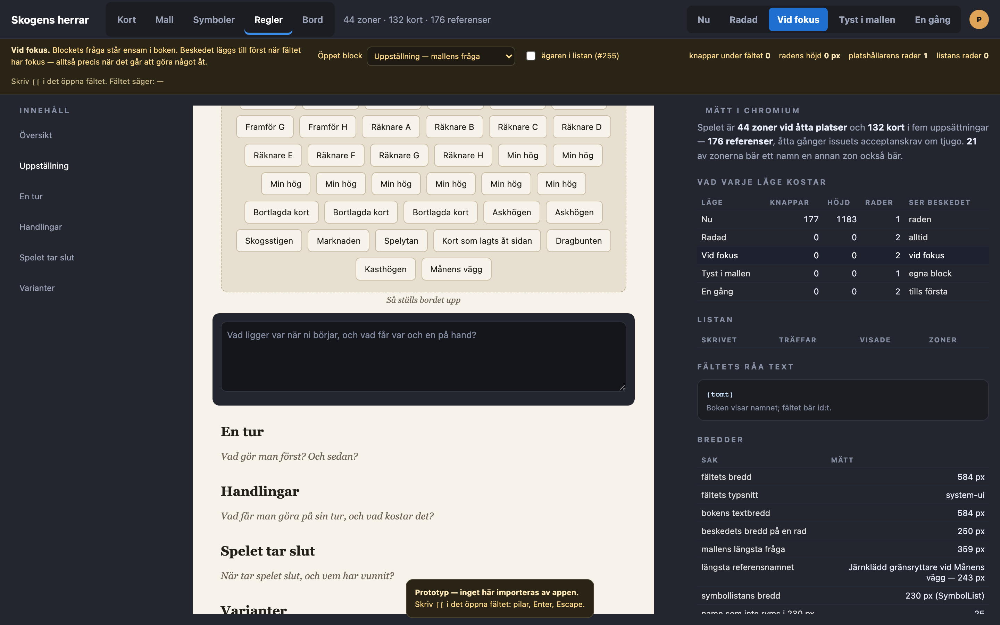
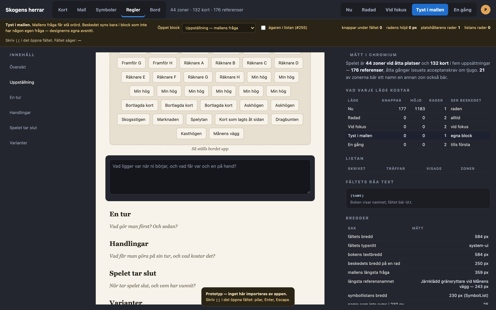
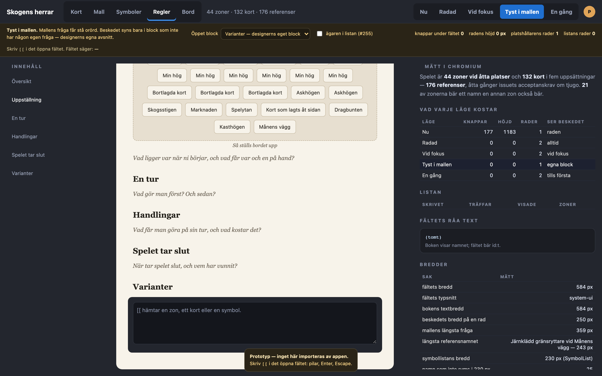
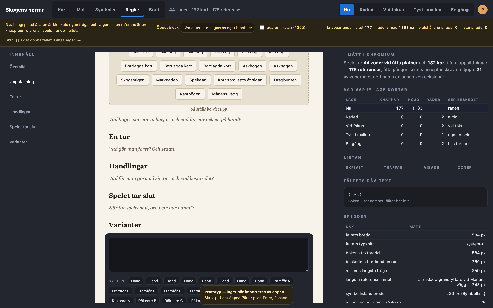
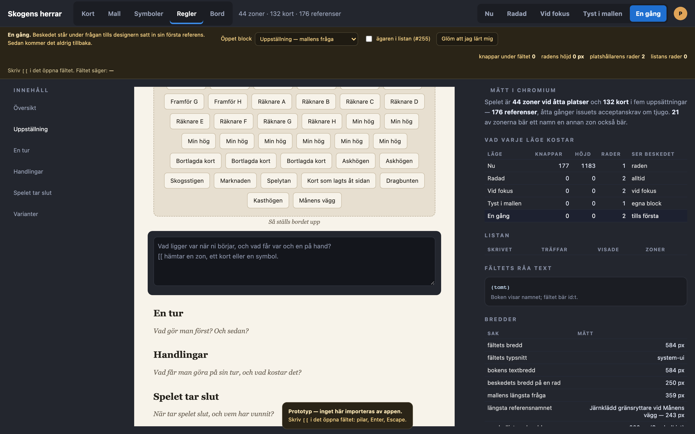
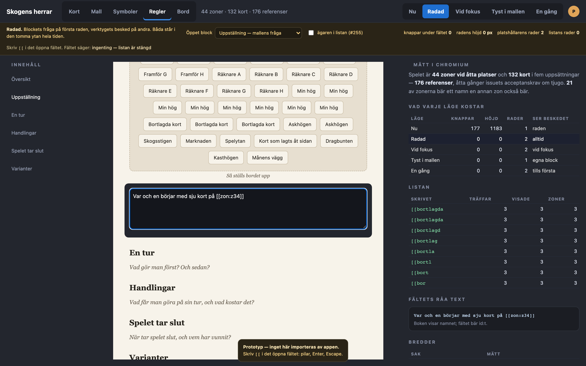

# Prototyp: regelbokens infogning (#215)

Beställaren avgjorde saken den 18 september, och den prövas inte om här.
Man skriver `[[` och väljer ur en lista som smalnar; infogningsraden försvinner helt; ingen knapp står kvar som en andra väg in; och det är blockets egen platshållartext som bär beskedet om att `[[` finns.

Prototypen svarar på det enda beställaren lämnade öppet:

> «Mallens egna frågor («Så ställs bordet upp») ska inte trängas undan av beskedet — de är blockets fråga och den här är verktygets. Hur de två samsas i samma platshållare är en sak för prototypen att visa.»

[`prototyper/06-regelbokens-infogning.html`](2026-09-19/prototyper/06-regelbokens-infogning.html) öppnas direkt i en webbläsare.
Växeln uppe till höger jämför **Nu** med fyra former av beskedet: **Radad**, **Vid fokus**, **Tyst i mallen** och **En gång**.
Fältet, listan och infogningsraden är riktiga: skriv `[[` i det öppna blocket, gå med pilarna, ta med Enter, stäng med Escape.
Rullgardinen i protoraden flyttar det öppna blocket mellan ett avsnitt mallen lagt ut (som har en egen fråga) och ett avsnitt designern lagt till själv (som inte har någon), eftersom det är just där de fyra formerna skiljer sig åt.

## Uppsättningen

Spelet är **44 zoner vid åtta platser och 132 kort i fem uppsättningar — 176 referenser**.
Issuets acceptanskriterium säger «minst 20»; det här är åtta gånger så mycket, och det behövs.
`referables()` räknar upp varje zon *och varje kortrad* i leken, så referensmängden växer med leken och inte med regelboken — en lek på 308 kort, som prototyperna i det här repot annars mäter på, ger över 350 referenser.

Zonerna är samma uppsättning som prototyp 5 mätte platsrutan på, så de två prototyperna talar om samma spel.
Kortnamnen är satta av två fasta ordlistor för att bli lika långa och lika krångliga som en designers egna — `Järnklädd gränsryttare vid Månens vägg`, inte `Kort 12` — och två av dem är nytryck av samma kort i två uppsättningar.

Allt nedan är läst ur Chromium på 1440 × 900, inte uppskattat.
Fältets typsnitt är `system-ui`, som på den här maskinen är SF Pro; varken DejaVu Sans eller Liberation Sans finns installerade här, så Linux-bredden är inte mätt utan resonerad — se mätning 4.

## Vad som mättes, och som ändrar bilden

**1. Det är inte tiotals knappar. Det är 177, och raden är högre än fönstret.**
Issuet säger «tiotals knappar under varje textfält».
Vid 176 referenser ritar `.byd-rules-picker` **177 knappar** — en per referens plus «Ta bort avsnittet» — och raden blir **1183 px hög**.
Det är högre än hela fönstret vid 1440 × 900.
Det öppna blocket går från 133 px till **1322 px**, och boken från 1124 px till **2313 px**: att öppna ett stycke i Uppställning skjuter resten av boken mer än en skärmhöjd nedåt.

Två saker som påståendet «under varje öppet block» behöver preciseras med, eftersom de drar åt olika håll.
`editing` i `RulesPanel` är ett enda block-id, så det finns aldrig mer än **en** sådan rad på skärmen samtidigt.
Men den ritas om identiskt för varje block man öppnar: i en bok med tio avsnitt är det tjugo öppningsbara block, alltså **3 540 knappar** under ett varv genom boken.

**2. 177 tabbstopp, mot noll.**
Knapparna i raden är vanliga `<button>` utan `tabIndex`, alltså 177 stopp i tabbordningen mellan textfältet och «Ta bort avsnittet».
Listan i korttabellen sätter `tabIndex={-1}` på varje alternativ och pekar ut det valda med `aria-activedescendant` från fältet.
`[[`-listan ärver det och lägger därmed till **noll** stopp.
För den som går med tangentbordet är det här den största enskilda skillnaden, och den syns inte alls på en skärmbild.

**3. Platshållaren bryter inte rad, i någon form.**
Fältet är **584 px brett** (566 px innanför sin padding), vilket är bokens egen textbredd: `.byd-rules-edit` har `margin: 8px -12px` och `padding: 12px`, så fältet blir exakt de `68ch` Georgia som `.byd-rulebook` sätter.

| Text | Bredd på en rad | Ryms i 566 px |
| --- | --- | --- |
| `[[ hämtar en zon, ett kort eller en symbol.` | 250 px | ja, med 2,3 gångers marginal |
| `Vad ligger var när ni börjar, och vad får var och en på hand?` | 359 px | ja |
| `Vad handlar spelet om, i två meningar? Hur många spelar, och hur länge?` | 441 px | ja, och det är mallens längsta fråga |
| De två hopfogade på **en** rad med mellanslag | 613 px | **nej — bryter** |

Staplade på var sin rad är platshållaren alltså **två rader** och inget mer, i varje läge som visar båda.
Fogar man ihop dem till en enda mening blir det också två rader, men brutna där bredden råkar ta slut i stället för där meningen tar slut.
Det är skälet att formerna nedan staplar och inte fogar ihop.

Fältet blir smalare först när boken själv gör det, och boken är fast: `calc(68ch + 80px)` = 664 px, plus innehållsspalten 200 px, mellanrummet 24 px och flikens 2 × 16 px — alltså **under 920 px fönsterbredd**.
Vid 566 px innermått krävs det att beskedet blir 2,3 gånger bredare innan det bryter.
Repots egen mätning säger att DejaVu är ~13 % bredare än SF Pro, vilket skulle ge 283 px.
Slutsatsen «ingen radbrytning» håller alltså även på ett Linux som CI:s, med god marginal — vilket inte är samma sak som att någon mätt den, och det är därför siffran står här som ett förhållande och inte som ett löfte.

**4. Listan visar 8 av 176, och 2 tecken räcker nästan alltid.**
Listan är kapad vid 8 rader, som korttabellens är (`searchSymbols(...).slice(0, 8)`), och blir då **230 px hög och 320 px bred**.

| Skrivet | Träffar | Visade |
| --- | --- | --- |
| `[[` | 176 | 8 |
| `[[a` | 152 | 8 |
| `[[skog` | 13 | 8 |
| `[[vandrande` | 11 | 8 |
| `[[hand` | 8 | 8 |
| `[[bortlagda` | 3 | 3 |
| `[[kort som` | 1 | 1 |

Kravet «varje referens `referables` känner till går att nå» håller: för var och en av de 176 referenserna finns en inledning av dess eget namn som lyfter den in i de åtta visade.
**110 av 176 nås på två tecken, 140 på fyra, och den värsta kräver elva.**
Ingen referens är onåbar.

**5. Listan är 320 px bred och kan inte vara 230.**
Symbollistan är 230 px, för bibliotekets namn är verktygets egna och korta.
Referensernas namn är designerns: det längsta är 243 px, och **25 av 176 namn ryms inte** i det utrymme en 230 px bred ruta lämnar (177 px, när rutans padding, radens padding och ordet «zon» är avdragna).
I 320 px ryms alla.
«Samma slags komponent» kan alltså inte betyda samma bredd — och det är ett skäl att bredden blir en egenskap hos listan i stället för en siffra i dess stilmall.

**6. Åtta rader som alla heter `Hand`.**
Det här är prototypens obehagligaste bild och den syns direkt.

**25 av 176 referenser bär ett namn som en annan referens också bär**: 8 × `Hand`, 8 × `Min hög`, 3 × `Bortlagda kort`, 2 × `Askhögen` och två nytryckta kort.
Skriver man `[[hand` får man åtta rader med exakt samma ord och ingen väg att välja rätt.
Det är inget listan har infört — infogningsraden har åtta identiska knappar av samma skäl, och det syns i bilden av läget Nu — men listan ärver felet om ingen gör något.

Boten finns redan och är beslutad i ett annat issue: **#255:s efterled**.
Kryssrutan «ägaren i listan» i protoraden slår på den, i formen «Bricka», ordagrant som zonlistan i Bord-fliken ritar den.

Samma regel som `templateOf` använder gäller: `Framför A` får inget efterled, `Askhögen` vid plats A får det.
Kortens nytryck har ingen motsvarande bot — där skiljer bara uppsättningen dem åt, och den vet `Names` ingenting om.

## De fyra formerna

Alla fyra tar bort infogningsraden. Skillnaden är bara vem som får se beskedet, och när.

**Radad** — blockets fråga på första raden, verktygets besked på andra, båda i platshållaren hela tiden.
Två rader, alltid, i varje tomt block som öppnas.
Kostar ingen ny mekanism alls: en `\n` i strängen, och webbläsaren ritar båda raderna i en `<textarea>`.
Priset är att beskedet står kvar hos den som redan kan det, och att de två raderna är **samma grå**: `::placeholder` färgar hela platshållaren, så «verktygets rad i en dämpad vikt» går inte att få inuti en riktig platshållare.
Vill man ha den dämpningen måste man rita ett eget skikt ovanpå fältet, och då är det inte längre en platshållare utan en sak till att hålla i synk med `value`.

**Vid fokus** — sidan visar bara mallens fråga; beskedet läggs till när fältet får fokus.
Det är den enda formen där beskedet kommer *precis* när det går att använda, och den enda som aldrig stör läsningen av en bok man bläddrar i.
Två priser.
Texten byts under ögat i samma ögonblick som markören landar, vilket är en rörelse användaren inte bad om.
Och en platshållare som ändras vid fokus är svår att upptäcka för den som redan har fokus i fältet — den som tabbar in i ett tomt block och genast börjar skriva ser den i bråkdelen av en sekund.

**Tyst i mallen** — mallens fråga får stå ensam; beskedet syns bara i block som inte har någon egen fråga.
Bokstavstroget mot beställarens mening att mallens frågor inte ska trängas undan, och den form som kostar minst yta.
Priset är stort och rakt: **mallen är det första en ny designer möter**, och de fem avsnitten mallen lägger ut har alla en egen fråga.
Den som skriver sin första regelbok från mallen och aldrig lägger till ett eget avsnitt får aldrig se beskedet.
Formen lägger alltså beskedet exakt där det behövs minst.

Bilden ovan är samma läge med ett eget avsnitt öppet.
Den säger också något om läget **Nu**: i ett block utan egen fråga är fältet i dag *helt tomt*, utan ett ord om vad som kan skrivas där — och under det står ändå de 177 knapparna.

**En gång** — beskedet står under frågan tills designern satt in sin första referens, och kommer sedan aldrig tillbaka.
Det svarar mot beställarens egen motivering, «den som skrivit en bok en gång behöver den inte igen», och är den enda formen som tar bort texten för den som lärt sig.
Två priser, och det andra är det tyngre.
Den behöver ett minne **utanför dokumentet** — det är inte leken som har lärt sig något utan människan, så det hör hemma per konto och inte per projekt, och något sådant minne finns inte i dag.
Och den är oåterkallelig i fel riktning: en enda referens som satts in av misstag, eller av en medredigerare, släcker beskedet för alla i det projektet.
Knappen «Glöm att jag lärt mig» i protoraden finns bara för att kunna se båda tillstånden.

## Vad ingen av formerna löser

Beställaren har redan accepterat priset och det upprepas här bara för att prototypen bekräftar det:
**beskedet syns bara i tomma block.**
Den som redigerar en importerad bok, där varje block har text, ser det aldrig.
Ingen av de fyra formerna ändrar på det, eftersom alla fyra är platshållare, och en platshållare försvinner vid första tecknet.

## Vad prototypen hittade som beslutet inte tar upp

**1. Beskedets tredje ord har ingen kod bakom sig.**
Den beslutade texten lyder «`[[` hämtar en zon, ett kort eller en symbol.»
Men `Names` är `{ zones, cards }` och `referables()` returnerar bara `zone` och `card`.
`[[`-syntaxen i `parseInline` känner bara `zon:` och `kort:`.
Symboler skrivs med måsvinge, och L23 säger det rakt ut: «`{` för en symbol, `[[` för en referens i regelboken».
Dessutom finns ingen måsvingeplockare alls i regelbokens fält i dag — den bor i `DataTable` — och `{namn}` i en regeltext ritas av `Span` som `<b class="byd-rules-pip">namn</b>`, alltså **ordet** i en liten rund bricka och inte symbolen.
Prototypen använder den beslutade texten ordagrant, men den lovar något verktyget inte gör.
Tre vägar, och det är ett beslut och inte en implementationsdetalj: skriv om texten till «en zon eller ett kort»; låt `[[` också lista symboler (vilket river L23:s uppdelning); eller ge regelbokens fält samma `{`-plockare som korttabellen och låt texten nämna båda tecknen (ett eget issue).

**2. Infogningen hamnar i slutet av fältet, inte vid markören.**
`insert()` skriver `` `${block.text} ${ref}` `` — referensen läggs sist, med ett mellanslag före, oavsett var markören står.
I en lista går den i det sista strecket.
Det är alltså inte bara tätheten som är fel med dagens rad: den kan över huvud taget inte sätta en referens mitt i en mening.
`[[` löser det gratis, eftersom platsen är den man just skrev på — och det är värt att säga i issuet, för det är ett andra skäl till beslutet som inte står där.

**3. Raden ritas på block där varje knapp är död.**
`.byd-rules-picker` ligger utanför alla `block.kind`-grenar i `Editing`, men `insert()` gör bara något för `text`, `heading` och `list`.
Öppnar man ett **bild**- eller **uppställnings**block ritas alltså 176 knappar som inte gör någonting alls när man trycker på dem.
Beslutet tar bort dem utan att någon behöver skriva en rad om det.

**4. En referens i en rubrik blir aldrig en referens.**
`insert()` tillåter `heading`, men `renderRules` inline-tolkar inte rubriker (`case 'heading'` returnerar blocket som det är), och `Block` ritar `block.text` rått.
En referens som satts in i en rubrik står alltså kvar som `[[zon:z34]]` i boken, i häftet och i sökningen.
Om `[[` ska svara i rubrikfältet måste rubriker inline-tolkas; om de inte ska det ska listan inte öppnas där.
Prototypen öppnar bara i textblocket och tar inte ställning.

**5. Det man väljer på namn skrivs in som ett id.**
Efter ett val står det `Var och en börjar med sju kort på [[zon:z34]]` i fältet, medan boken visar `Bortlagda kort`.

Det är dagens lagringsform och inget `[[` ändrar, men listan gör den synlig oftare: infogningsraden sattes en gång i slutet av texten, `[[` sätts mitt i meningen man läser.
Ett fält som visar namnet och lagrar id:t är en helt annan sorts fält (ett `contenteditable` med atomära brickor), alltså ett eget issue och ett eget beslut — men frågan kommer att ställas första gången någon ser sin egen mening full av `z34`.

## Vad som inte är den här frågan

**Listans placering.** Prototypen hänger listan under fältets vänsterkant, som `.byd-data-symbols` hänger under cellen. En lista som följer markören hade krävt en spegel av fältets text för att veta var markören står i pixlar; det är en mätning värd att göra, men den ändrar inget av det som avgörs här.

**Rutans riktning.** Löst i #229: en ruta öppnas dit det finns plats. Listan i prototypen gör det inte, och ska göra det i implementationen.

**Uppställningsbilden.** 44 zoner i en dunge tar en halv skärm i boken. Det syns i varje bild här och är inte det här issuet.

## Vad jag förordar

**Radad, med Vid fokus som andrahandsval.**

Radad kostar ingen ny mekanism, ingen ny lagring och ingen rörelse på skärmen: en `\n` i en katalognyckel, och båda raderna står där de ska.
Den bryter inte rad i någon fönsterbredd verktyget är byggt för, och den håller beställarens mening — mallens fråga står först och orörd, verktygets besked står under den och trängs inte in i den.
Att båda raderna blir samma grå är en verklig förlust mot skissen, men priset för att få dämpningen är ett eget skikt ovanpå fältet, och ett skikt som ska hållas i synk med ett värde är precis den sortens sak som glider isär.

Tyst i mallen förordar jag emot: den släcker beskedet just i de fem avsnitt en ny designer möter först.
En gång är den vackraste idén och den dyraste — den behöver ett minne per konto som inte finns, och släcks av en enda oavsiktlig infogning.
Om den ändå väljs bör den vila på samma minne som andra «har sett»-lägen i tjänsten, inte på ett eget.

## Kvar att avgöra

1. **Radad, Vid fokus, Tyst i mallen eller En gång?** Jag förordar Radad.
2. **Vad ska beskedet faktiskt säga?** «en symbol» har ingen kod bakom sig i regelboken. Skriv om texten, eller öppna ett issue för måsvingen i regelbokens fält.
3. **Ska `[[` svara i rubrikfältet?** I dag går det att sätta in en referens där, och den blir aldrig en referens.
4. **Ska efterledet ur #255 gälla också referenslistan?** 25 av 176 rader är annars omöjliga att skilja åt. Jag förordar ja, och samma modul som platsrutan läser.
5. **Hur många rader ska listan visa?** Prototypen tar korttabellens åtta. Åtta av 176 är 4,5 %, och listan har plats för fler innan den blir högre än fältet.

Ingenting här importeras av appen. Tokens och mått är kopierade från `packages/web/src/editor/editor.css`.
