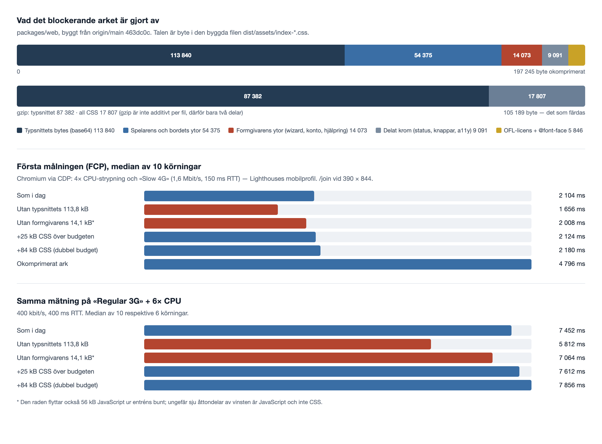

# #366 — vad förstamålningen faktiskt kostar

Mätning, inget bygge.
Inget i budgeten, i `felt-font.spec.ts` eller i `DESIGN-BESLUT.md` är ändrat av det här arbetet; beslutet om var linjen ska gå är beställarens.

Allt nedan är mätt på `origin/main` vid `463dc0c`, byggt med `pnpm --filter @byd/web build` på Node 26.8.1.
Byte är byte i de byggda filerna under `packages/web/dist`, inte i källan — källfilernas storlek säger ingenting här, eftersom repots egna kommentarer är en stor del av dem (`join/join.css` är 18 480 byte på disk och 3 738 byte i bygget).

## Sammanfattning i fyra rader

1. Editorns CSS ligger **inte längre** i det blockerande arket; #186 tog bort den 2026-09-17 och kvar finns 397 byte som namnger `.byd-editor`.
   Det som fortfarande är formgivarens och inte filtens är wizarden, kontosidorna och hjälpringen: **14 073 byte, 16,9 % av budgeten**.
2. Hela budgeten — 83,4 kB CSS vid sidan av ansiktet — kostar **omkring 72 ms** av en förstamålning på 2 104 ms på Lighthouses mobilprofil.
   Att fördubbla den kostar 76 ms. Marginalen på 95 byte kostar 0,08 ms.
3. Att lyfta formgivarens ytor ur arket tar bort **14 073 byte** (83 405 → 69 332 vid sidan av ansiktet). Mätt, inte uppskattat.
4. Budgeten mäts i okomprimerade byte, men det som färdas är komprimerat: de 83,4 kB blir **17,8 kB gzip**, medan ansiktet budgeten finns till för att skydda är 87,4 kB gzip.
   På tråden reglerar linjen 17 % av arket.

## Två saker som inte stämmer i issuets premiss

Issuet beskriver den sista höjningen som `83,5 → 84,6 kB` (#305).
Den höjningen finns inte på `main`.
`main` säger i dag `inlined + 83_500`, och 84,6 kB står på grenen `claude/305-hjalptexter-spelarvyerna`, som inte är sammanslagen.
Marginalen på `main` är därför inte ~140 byte utan **95 byte**.

Issuet säger också att editorns CSS i spelarens blockerande ark orsakade flera av de sju första höjningarna.
Det stämde, och det är åtgärdat: L20 (#186) flyttade editorns ark 2026-09-17.
Påståendet om *i dag* är alltså falskt, och mätningen nedan visar vad som verkligen ligger kvar.

## 1. Vad ligger i det blockerande arket i dag?

Mätmetoden: varje CSS-fil under `packages/web/src` fick en unik vaktregel (`.byd-sentN{z-index:…}`) först i filen, appen byggdes, och det byggda arket delades vid vaktreglerna.
Det ger exakt byteattribution i det minifierade resultatet i stället för en gissning ur källan.
Experimentet är återställt; ingen sådan regel finns kvar i källan.

Summan av segmenten är 83 385 byte mot grindens 83 405 i det oinstrumenterade bygget — 20 byte skillnad, som är minifierarens hopslagningar över filgränserna.

| Fil | Byte i arket | Andel | Vems yta |
| --- | ---: | ---: | --- |
| `table/table.css` | 25 378 | 30,4 % | filten |
| `player/player.css` | 12 415 | 14,9 % | telefonen |
| `wizard/wizard.css` | **7 838** | **9,4 %** | **formgivaren** |
| `fonts/felt-font.css` | 5 846 | 7,0 % | ansiktets eget hus |
| `online/online.css` | 5 459 | 6,5 % | spelare med plats |
| `status/status.css` | 5 081 | 6,1 % | delat |
| `account/account.css` | **5 054** | **6,1 %** | **formgivaren** |
| `table/keyboard.css` | 4 128 | 4,9 % | filten |
| `join/join.css` | 3 738 | 4,5 % | vägen in |
| `buttons.css` | 2 610 | 3,1 % | delat |
| `table/texture.css` | 2 135 | 2,6 % | filten |
| `a11y.css` | 1 400 | 1,7 % | delat |
| `help.css` | **1 181** | **1,4 %** | **formgivaren** (se nedan) |
| `rules/rules-open.css` | 774 | 0,9 % | filten |
| `dropping.css` | 348 | 0,4 % | filten |

Grupperat:

| Ursprung | Byte | Andel av budgeten |
| --- | ---: | ---: |
| Spelarens och bordets ytor | 54 375 | 65,2 % |
| Formgivarens ytor (wizard, konto, hjälpring) | **14 073** | **16,9 %** |
| Delat krom (status, knappar, a11y) | 9 091 | 10,9 % |
| Ansiktets eget hus (`@font-face` + OFL-texten) | 5 846 | 7,0 % |

Tre saker ur den tabellen.

**Editorn är borta, så när som på 397 byte.**
Två regelblock i `buttons.css` sätter editorns egna tokens på `.byd-editor`.
Utöver dem nämns `.byd-editor` i knappspråkets delade `:is(…)`-listor över nio ytor; räknar man hela de reglerna blir det 1 861 byte, men de reglerna klär alla nio ytorna och skulle stå kvar även om editorn inte fanns.
Den ärliga siffran för «editorns CSS i spelarens ark» är alltså **397 byte**, 0,5 % av budgeten.

**Formgivarens övriga ytor är kvar, och de är sjutton procent.**
`/new` (wizarden), `/` (starten), `/login`, `/claim` och `/invites/…` importeras statiskt i `App.tsx` och ligger därför i entréns ark.
De ritas aldrig av en telefon som skannat en QR-kod, aldrig av en TV, aldrig av en observatör.

**Hjälpringen betalas av filten för ytor filten inte har.**
`help.css` ligger i det blockerande arket enbart därför att `NewProjectPage`, `HomePage` och `LoginCard` använder `<Help>`.
Ingen spelar-, bords- eller observatörsyta gör det på `main` i dag — det gör de först när #305 landar.
Kommentaren överst i `help.css` säger det rakt ut, och de «813 byte över budgeten» den nämner är just den kostnaden.

**OFL-texten är 5 128 byte, och den är inte förhandlingsbar.**
Licensen och upphovsrättsraden måste följa med varje kopia av typsnittet (K20, E4), och kopian är arket.
6,1 % av budgeten är alltså en juridisk konstant, inte design.

## 2. Vad kostar det i tid?

### Uppställningen

Chromium 1.63.0 via Playwright, ett nytt kontext och tömd cache per körning, `dist` serverat från en lokal HTTP-server med `Content-Encoding: gzip` på HTML/CSS/JS (lådan ligger bakom Cloudflare, som komprimerar text i kanten; inget i repot konfigurerar komprimering själv).
Fönster 390 × 844, `deviceScaleFactor` 3, `isMobile`, `hasTouch`. Rutten är `/join`, som är det första en spelare med telefon möter.

Strypning via CDP:

- **«Slow 4G» + 4× CPU** — `Network.emulateNetworkConditions` 1,6 Mbit/s ned, 750 kbit/s upp, 150 ms RTT, och `Emulation.setCPUThrottlingRate` 4.
  Det är exakt Lighthouses mobilprofil, vald därför att den är den enda siffran i branschen som fler än vi har kalibrerat mot riktiga mellanklasstelefoner.
- **«Regular 3G» + 6× CPU** — 400 kbit/s, 400 ms RTT, `rate: 6`.
  Den är där för att visa lutningen på en långsammare linje, inte för att vi tror att någon spelar över 3G.
- **«Fast 4G» + ingen CPU-strypning** — 9 Mbit/s, 40 ms RTT, som referens uppåt.

Mätvärdet är `first-contentful-paint` ur `performance`, tio körningar per rad (sex för de två sista 3G-raderna).

### Resultat

«Slow 4G» + 4× CPU, FCP i ms, median (min–max över tio körningar):

| Scenario | FCP | Δ mot i dag | Arkets överföring |
| --- | ---: | ---: | ---: |
| Som i dag | **2 104** (2 040–2 156) | — | 105 636 B |
| Utan formgivarens 14,1 kB * | 2 008 (1 968–2 164) | −96 ms | 102 904 B |
| +25 kB CSS över budgeten | 2 124 (2 100–2 148) | +20 ms | 111 488 B |
| +84 kB CSS (dubbel budget) | 2 180 (2 156–2 220) | +76 ms | 123 591 B |
| Utan typsnittets 113,8 kB | 1 656 (1 636–1 676) | **−448 ms** | 18 256 B |
| Arket okomprimerat | 4 796 (4 784–4 824) | **+2 692 ms** | 197 545 B |
| «Fast 4G», ingen CPU-strypning | 420 (412–420) | −1 684 ms | 105 636 B |

«Regular 3G» + 6× CPU:

| Scenario | FCP | Δ mot i dag |
| --- | ---: | ---: |
| Som i dag | **7 452** (7 408–7 484) | — |
| Utan formgivarens 14,1 kB * | 7 064 (7 052–7 108) | −388 ms |
| +25 kB CSS över budgeten | 7 612 (7 572–7 644) | +160 ms |
| +84 kB CSS (dubbel budget) | 7 856 (7 792–7 872) | +404 ms |
| Utan typsnittets 113,8 kB | 5 812 (5 668–5 844) | **−1 640 ms** |

\* Den raden flyttar också 56 kB JavaScript ur entréns bunt (212,3 → 195,3 kB gzip), och bara 2,7 kB CSS.
Ungefär sju åttondelar av de 96 ms är alltså JavaScript. Ren CSS-vinst enligt lutningen nedan är omkring 13 ms.

Spridningen är liten: på «Slow 4G» ligger tio körningar inom 116 ms, på 3G inom 76 ms.
Det är en maskin utan riktig radio, och det är också därför spridningen är så liten — se förbehållen.

### Vad en byte kostar

Fyllningen är riktig CSS med unika selektorer, så den komprimerar som CSS gör och inte till noll.

| Linje | +25 kB rå | +84 kB rå | Lutning |
| --- | ---: | ---: | --- |
| Slow 4G + 4× CPU | +20 ms | +76 ms | **0,80–0,90 ms per kB rå CSS** |
| Regular 3G + 6× CPU | +160 ms | +404 ms | **4,8–6,4 ms per kB rå CSS** |

Räknat på den lutningen:

- Hela budgeten, 83,4 kB, är **omkring 72 ms** av 2 104 ms på Slow 4G — 3,4 % av förstamålningen. På 3G omkring 450 ms av 7 452, 6 %.
- Marginalen på 95 byte är **0,08 ms** på Slow 4G och 0,5 ms på 3G.
- #305:s höjning på 1,1 kB är **1 ms** respektive 6 ms.
- Ansiktet, som budgeten finns till för att skydda, är 448 ms respektive 1 640 ms. Det är **sex gånger hela budgeten**.

### Komprimering, som ingen räknat på

| | Rått | gzip −9 | brotli |
| --- | ---: | ---: | ---: |
| Hela arket | 197 245 | 105 189 | 100 916 |
| Ansiktets base64 | 113 840 | ~87 382 | ~85 638 |
| All CSS vid sidan av ansiktet | **83 405** | **17 807** | **15 278** |
| Samma, med formgivarens ytor ute | 69 332 | 15 057 | 13 014 |

Base64-kodad woff2 är redan komprimerad och går inte att komprimera igen; CSS går ned till en femtedel.
Budgeten reglerar alltså 42 % av arket räknat i råa byte och **17 % räknat i det som färdas**.
Att servera arket utan komprimering kostar 2 692 ms — trettiofem gånger vad det skulle kosta att fördubbla hela CSS-budgeten.
Ingenting i repot sätter `Content-Encoding`; det hänger helt på Cloudflare.

### Vad en strypt Chromium på en Mac kan och inte kan säga

Kan: hur många byte som färdas, i vilken ordning, och vad ett marginellt kilobyte kostar på en given bandbredd.
Lutningarna ovan är i huvudsak `bytes ÷ bandbredd` och överlever bytet av maskin.

Kan inte:

- **Absolutnivån.** 2 104 ms är den här Macen, strypt fyra gånger. En riktig mellanklasstelefon har långsammare minne, en annan schemaläggare, en annan GPU och termisk strypning som CDP inte modellerar. Behandla 2 104 som en storleksordning och 76 ms som en mätning.
- **Radion.** CDP:s nätverksstrypning är en kö i renderaren. Det finns ingen DNS, ingen TLS-handskakning, ingen paketförlust, ingen RRC-uppvakning. Verklig variation på en telefon är sekunder, inte de 116 ms som mättes här.
- **Typsnittsavkodningen.** Chromium på macOS avkodar woff2 med systemets bibliotek. Kostnaden för ansiktet på en Android är inte mätt.
- **Vad läsaren faktiskt ser.** FCP är första pixeln med innehåll. Filtens verkliga krav är strängare — namnen ska vara rätt ritade från början (K20) — men det är samma ark och samma tidpunkt, så FCP är rätt proxy här.

Ingen riktig telefon har mätts. Det är den enskilt största luckan i den här rapporten.

## 3. Vad skulle gå av om formgivarens CSS lyftes ut?

Mätt genom att bygga det, inte räkna på det: `NewProjectPage`, `HomePage`, `LoginPage`, `ClaimPage` och `InvitePage` gjordes `lazy()` i `App.tsx` på precis samma sätt som `EditorPage` (#186), appen byggdes om, och arket mättes.
Experimentet är återställt.

| | I dag | Med formgivarens rutter delade | Δ |
| --- | ---: | ---: | ---: |
| Blockerande ark, rått | 197 245 | 183 172 | −14 073 |
| Vid sidan av ansiktet | **83 405** | **69 332** | **−14 073** |
| Samma, gzip | 17 807 | 15 057 | −2 750 |
| Entréns JavaScript, gzip | 212,34 kB | 195,29 kB | −17,05 kB |
| Marginal mot dagens linje 83 500 | 95 B | 14 168 B | — |

De 14 073 byte är exakt `wizard.css` 7 838 + `account.css` 5 054 + `help.css` 1 181.
Nya ark: `NewProjectPage-*.css` 7,84 kB, `account-*.css` 5,06 kB, `HelpDrawer-*.css` 1,18 kB, plus fem små JS-chunkar.

**Varning om hållbarheten i den siffran.**
`help.css` följer med ut bara så länge ingen spelaryta använder `<Help>`.
När #305 landar gör de det, och då är vinsten 12 892 byte i stället för 14 073.

**Vad det kostar i upplevelse.**
En rutt som delas av får en Suspense-gräns. Editorn löste det snyggt: väntan ritas som den sida editorn själv visar i nästa andetag (L20, UX-07).
För `/login` och `/` är det sämre — de *är* den första sidan någon ser, och att lägga en extra rundtur mellan adressen och inloggningskortet är att flytta kostnaden från filten till starten.
För `/new` är det som editorn: formgivaren har redan appen laddad.
Experimentet ovan använde `fallback={null}`, vilket inte är en godtagbar produktlösning; kostnaden i tid för starten är alltså inte mätt och skulle behöva mätas innan någon delar den rutten.

## 4. Var linjen kan gå

Fyra alternativ. Talen är dagens: arket är 83 405 byte vid sidan av ansiktet, linjen står på 83 500, marginalen är 95 byte.

### A. Linjen står kvar på 83,5 kB, men överskridandet byter innebörd

Regeln blir att en höjning inte får skrivas; den som spränger linjen ska i stället namnge vad som går ut.
Ingen mätning, ingen kod, ingen delning.

- **Kostar:** ingenting i dag.
- **Förbjuder:** all tillväxt. Marginalen är 95 byte, alltså ungefär två selektorer.
- **Nästa yta som vill in** får ta ut formgivarens ytor (14,1 kB) eller `help.css` (1,2 kB) eller hitta motsvarande i `table.css`, som är 30 % av budgeten och aldrig har komprimerats i avsikt.
- **Svagheten:** linjen är fortfarande definierad av förra raden i filen. Den mäter inget mål — den bara gör det dyrare att höja.

### B. Linjen sätts till 72 kB efter att formgivarens ytor lyfts ut

Gör delningen i #3, bygg, mät 69 332, och sätt linjen till 72 000 — 2,7 kB marginal, samma storleksordning som #346 lämnade.

- **Kostar:** en delning av fem rutter, och en riktig Suspense-yta för `/` och `/login` som måste ritas och mätas (se förbehållet ovan). I tid: cirka 13 ms CSS på Slow 4G, plus 80 ms JavaScript som är en bonus och inte poängen.
- **Förbjuder:** att en yta som inte ritas på första bildrutan importeras statiskt. Det är regeln som saknades 2026-09-13.
- **Nästa yta som vill in** har 2,7 kB. Därefter är `status.css` (5,1 kB) den nästa kandidaten att granska — den ligger där för Suspense-fallbacken och för 404, vilket är ett riktigt skäl, men 5,1 kB för en felsida är inte självklart.
- **Styrkan:** linjen blir en mätning med ett uttalat mål, och det som ligger i arket är då per konstruktion det första bildrutan ritar.

### C. Linjen mäter det som färdas: brotli, inte råa byte

Byt enheten. Grinden komprimerar arket utan ansiktet och kräver att det är under, säg, 16 kB brotli (i dag 15 278).

- **Kostar:** en rad i grinden. Ingen delning, ingen omflyttning.
- **Förbjuder:** det grinden alltid ville förbjuda — ett andra ansikte, som inte komprimerar alls och slår i taket omedelbart.
- **Nästa yta som vill in** har 722 byte brotli, vilket är omkring 3–4 kB CSS, eftersom CSS komprimerar fem gånger. Linjen blir alltså *lösare* i praktiken, vilket är ärligt: det är vad ytan faktiskt kostar en telefon.
- **Svagheten:** talet rör sig när minifieraren eller brotli-versionen byts, och ingen läser det utan att köra grinden. Och det säger ingenting om *vems* CSS det är — formgivarens 2,75 kB brotli skulle rymmas lika tyst som i dag.

### D. Ingen storlekslinje alls: en medlemsregel plus ett tak högt ovanför

Grinden slutar väga och börjar fråga vem.
Varje CSS-fil i det blockerande arket måste höra till en yta som ritas på första bildrutan — listan står i grinden och läses av från `App.tsx`:s statiska importer.
Ovanpå det ett tak på exempelvis 120 kB, som inte är en budget utan en larmklocka för ett andra ansikte.

- **Kostar:** delningen i B, plus att grinden måste veta vilka rutter som är filtens. Den kunskapen finns redan halvvägs i `editorsOwnClasses()`.
- **Förbjuder:** exakt det som orsakade de sju höjningarna, och ingenting annat. Filtens egna ytor får växa så mycket de vill, vilket de ska få — det var därför varje höjning var hederlig.
- **Nästa yta som vill in** svarar på frågan «ritas du på första bildrutan?». Är svaret ja kommer den in gratis; är det nej får den ett eget ark.
- **Svagheten:** ingen övre gräns på filtens egen CSS. `table.css` är redan 25 kB och kan bli 60 utan att någon säger till. Mätningen säger att det ändå bara vore 30 ms, men den som vill ha en siffra får ingen.

### Vad mätningen lutar åt

Den säger att storleken på CSS:en inte är problemet: hela budgeten är 3,4 % av förstamålningen, och ansiktet är sex gånger så mycket.
Det linjen faktiskt har åstadkommit är att den två gånger stoppade ett andra ansikte och sju gånger tvingade fram en diskussion om vad som får ligga i arket.
Det är en medlemsfråga förklädd till en storleksfråga, vilket är varför siffran har flyttats åtta gånger utan att någon blivit klokare.

## Vad som inte gick att mäta

- **En riktig telefon.** Ingen fanns. Allt ovan är en strypt Chromium på en Mac.
- **Cloudflares faktiska kodning på lådan.** Ingen åtkomst. gzip −6 användes som stand-in och brotli redovisas vid sidan av.
- **gzip per källfil.** Komprimering är inte additiv, så tabellen i #1 finns bara i råa byte.
- **Kostnaden för en riktig Suspense-yta på `/` och `/login`.** Experimentet använde `fallback={null}`.
- **Om byteantalen är identiska på CI:s Linux.** Minifieraren är deterministisk, men bygget kördes bara på macOS.

## Hur mätningarna kan göras om

Metoderna, för den som vill reproducera utan att leta:

1. **Byteattribution:** lägg `.byd-sentN{z-index:900000+N}` först i varje `packages/web/src/**/*.css`, bygg, dela `dist/assets/index-*.css` vid vaktreglerna. Återställ källan efteråt.
2. **Tid:** servera `dist` från en Node-server med gzip, kör Playwrights Chromium med `Emulation.setCPUThrottlingRate` och `Network.emulateNetworkConditions`, läs `performance.getEntriesByName('first-contentful-paint')`. Nytt kontext och `Network.clearBrowserCache` per körning.
3. **Lutning per byte:** häng på fyllnads-CSS med unika selektorer på arket i servern, inte i bygget, så bygget inte behöver röras.
4. **Delningen:** gör de fem rutterna i `App.tsx` `lazy()` precis som `EditorPage`, bygg, mät. Återställ.
