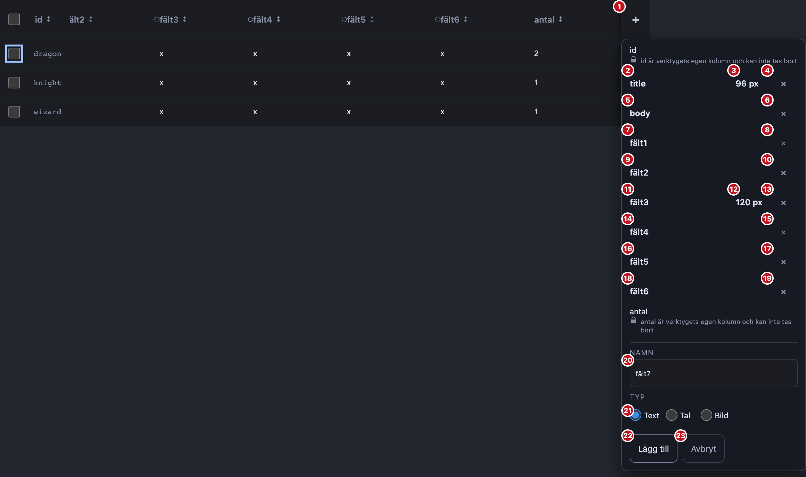

# #388 — vad vägen till en kolumn faktiskt kostar i tangenttryck

Mätning, inget bygge.
Ingenting i `packages/` är ändrat av det här arbetet, och beslutet om var handen ska släppas är beställarens.

Allt nedan är mätt på `proto/388-dorrens-fokus` med `origin/main` vid `ceeba2c` under sig, i Playwrights Chromium mot editorns egen markup och editorns egna ark (`editor.css`, `buttons.css`, `a11y.css`), fönster 1280 × 900.
Tabbordningen är **läst ur sidan** — `page.keyboard.press('Tab')` tryckt i en riktig motor, ett stopp i taget, och varje stopp namngivet av det element som blev `document.activeElement`.
Ingen ordning är räknad ur markupen för hand, och ingen radiogrupp är gissad: Chromium svarar själv att de tre `Typ`-knapparna är **ett** tabbstopp.

## Sammanfattning i fem rader

1. Dörren vid tio kolumner är **23 tabbstopp**: `＋`, sedan 18 i listan, sedan 4 i formuläret.
   Autofokus landar på stopp 20. Första kolumnens namn är stopp 2.
2. Att nå första kolumnens namn kostar i dag **18 tangenttryck** (20 om två kolumner har en egen bredd), inte de «upp emot trettio» issuet uppskattar.
   Att nå den **sista** kolumnens namn kostar **4**. Dagens placering är alltså inte dålig överallt — den är dålig i exakt en ände av listan.
3. **Ingen av de tre efterfrågade placeringarna vinner båda ärendena.**
   Listans första kolumn kostar 17–19 tangenttryck för att skapa en kolumn, panelen 18–20 — mot dagens 1.
   Det är en sjuttonfaldig försämring av det vanligaste ärendet, och acceptanskriteriet förbjuder det rakt ut.
4. Kostnaden sitter inte i **var** handen släpps utan i att listan är **18 tabbstopp lång**.
   Gör listan till ett enda tabbstopp med piltangenter — mönstret finns redan i repot som `roving.ts` och används på nio andra ytor — och varje ärende blir lika bra som eller bättre än i dag, utan att flytta autofokus alls.
5. Ett fynd issuet inte förutsåg: **dörren är inte fokusfälld och stänger inte på blur.**
   En Tabb från `Avbryt` landar i tabellens celler *bakom* den öppna dörren, och en shift-Tabb förbi första kolumnen landar på `＋` och sedan på rubrikernas sorteringsknappar — med dörren fortfarande öppen.

## Uppställningen

`DataTable` monteras i jsdom med den riktiga `ColumnDoor`, dörren öppnas med ett klick på `＋` precis som en hand gör, och den markup React då står med lyfts över till Chromium tillsammans med editorns ark.
Var React släpper fokus är en fråga om React och inte om layout, så den läses i jsdom: `document.activeElement` efter öppnandet är formulärets `Namn`-fält, som `NewField` bär `autoFocus` på.
Allt annat — vilka element som *är* tabbstopp, i vilken ordning, och hur många de är — läses i Chromium.

Egna bredder ligger i `localStorage` under `byd.widths` per projekt (`widths.ts`), så fallet «kolumner med en egen bredd» seedas där i stället för att simuleras.
Det är den enda vägen: bredd-knappen i dörren finns bara för en kolumn designern själv har dragit, aldrig för en kolumn tabellen mätt.

Ett tabbstopp räknas som ett tangenttryck.
Att öppna rutan där namnet skrivs kräver ett Enter till, eftersom namnet är en knapp som öppnar en `input` med `autoFocus` (#384).
Att «nå» bredden eller `×` räknas som att stå på den, utan Enter.

## 1. Vad dörren är, räknat i tabbstopp

Tio kolumner, `id` + `title` + `body` + `fält1`–`fält6` + `antal`, två av dem med en egen bredd:

| # | Stopp | Var |
| ---: | --- | --- |
| 1 | `＋` (`Kolumner`) | rubrikraden, utanför panelen |
| 2–4 | `title` namn, `96 px`, `×` | listan |
| 5–6 | `body` namn, `×` | listan |
| 7–8 | `fält1` namn, `×` | listan |
| 9–10 | `fält2` namn, `×` | listan |
| 11–13 | `fält3` namn, `120 px`, `×` | listan |
| 14–15 | `fält4` namn, `×` | listan |
| 16–17 | `fält5` namn, `×` | listan |
| 18–19 | `fält6` namn, `×` | listan |
| 20 | `Namn` | formuläret — **hit landar autofokus** |
| 21 | `Typ` (tre radioknappar, **ett** stopp) | formuläret |
| 22 | `Lägg till` | formuläret |
| 23 | `Avbryt` | formuläret |

Två saker i den tabellen motsäger issuets premiss.

**`id` och `antal` är inga tabbstopp alls.**
De två kolumnerna tabellen äger har ett `` som namn och ett `` med hänglåset i `×`:ets ställe, och ingendera går att tabba till.
Tio kolumner ger alltså inte tio rader i ringen utan **åtta**, och listan är 16 stopp när ingen bredd är satt.

**«Upp till tre kontroller per rad» gäller bara en kolumn designern dragit i.**
Utan egna bredder är listan 16 stopp och första kolumnens namn kostar 18 tangenttryck; med två egna bredder är den 18 stopp och kostar 20.
Varje egen bredd lägger alltså exakt ett tangenttryck på vägen till varje kolumn ovanför den.

**Panelen är inget tabbstopp.**
`.byd-columns` är `role="group"` utan `tabindex`, så den går bara att landa på programmatiskt.
Mätningen av kandidat C nedan gav den `tabindex="-1"` för att kunna mätas alls — den kandidaten kostar alltså en rad kod utöver fokusflytten.

## 2. De tre kandidaterna, vid tio kolumner

Tangenttryck från **stängd dörr**. `＋` är fokuserad; ett Enter öppnar dörren.

Utan egna bredder (listan 16 stopp):

| Ärende | A: dagens (formuläret) | B: listans första kolumn | C: panelen (`tabindex="-1"`) |
| --- | ---: | ---: | ---: |
| 1. Skapa en kolumn (namnet kan skrivas) | **1** | 17 | 18 |
| 2. Första kolumnens namn (kan bytas) | 18 | **2** | 3 |
| 3. Sista kolumnens namn (kan bytas) | **4** | 16 | 17 |

Med två egna bredder (listan 18 stopp):

| Ärende | A: dagens | B: första kolumnen | C: panelen |
| --- | ---: | ---: | ---: |
| 1. Skapa en kolumn | **1** | 19 | 20 |
| 2. Första kolumnens namn | 20 | **2** | 3 |
| 3. Sista kolumnens namn | **4** | 18 | 19 |
| 4a. `fält3`:s bredd (mitt i listan) | **9** | 11 | 12 |
| 4b. `fält3`:s `×` | **8** | 12 | 13 |
| 4c. `title`:s bredd (först i listan) | 18 | **2** | 3 |
| 4d. `title`:s `×` | 17 | **3** | 4 |

Fyra kolumner, som jämförelse (listan 4 stopp utan egna bredder):

| Ärende | A: dagens | B: första kolumnen | C: panelen |
| --- | ---: | ---: | ---: |
| 1. Skapa en kolumn | **1** | 5 | 6 |
| 2. Första kolumnens namn | 6 | **2** | 3 |
| 3. Sista kolumnens namn | **4** | 4 | 5 |

Det är där issuets instinkt stämmer: vid fyra kolumner kostar B ingenting värt namnet på ärende 1 (5 mot 1) och vinner ärende 2 (2 mot 6).
Vid tio kolumner blir samma byte 19 mot 1, och det är en annan sak.

**Vad avvägningen kostar åt båda håll, vid tio kolumner och utan egna bredder:**
att byta från A till B kostar **+16 tangenttryck** på att skapa en kolumn och ger **−16** på första kolumnens namn, samtidigt som det kostar **+12** på sista kolumnens namn.
Bytet flyttar alltså inte kostnaden, det lägger till en tredje förlorare.
B vinner ett av fyra ärenden och förlorar tre.

## 3. En fjärde kandidat mätningen pekar på

Talen ovan har en gemensam nämnare: listan är 16–18 tabbstopp, och varje placering är bara ett val av vilken ände av de 16 man betalar.
Ingen punkt i en ring på 23 stopp kan ligga nära både stopp 2 och stopp 20.

Repot har redan svaret på den formen av problem.
`src/editor/roving.ts` är APG:s roving tabindex — en lista är **ett** tabbstopp och piltangenterna flyttar inuti den, med `Home` och `End` till ändarna — och den används på nio ytor i dag, bland dem lagerlistan, editorns flikar och filten.

**D: listan blir ett roving-tabbstopp, autofokus står kvar i formuläret.**

Det är inte mätt på byggd kod, eftersom koden inte finns; talen nedan är räknade på den **mätta** liststrukturen (åtta rader med kontroller, två eller tre kontroller per rad) med `roving.ts`:s egen semantik: `↑`/`↓` mellan rader, `←`/`→` inom en rad, `Home`/`End` till ändarna, tabbstoppet börjar på `ids[0]`.

| Ärende (tio kolumner, två egna bredder) | A: dagens | D: roving-lista |
| --- | ---: | ---: |
| 1. Skapa en kolumn | **1** | **1** |
| 2. Första kolumnens namn | 20 | **3** (Enter, shift-Tabb, Enter) |
| 3. Sista kolumnens namn | **4** | **4** (Enter, shift-Tabb, `End`, Enter) |
| 4a. `fält3`:s bredd | 9 | **7** (Enter, shift-Tabb, `↓`×4, `→`) |
| 4b. `fält3`:s `×` | **8** | **8** |
| 4c. `title`:s bredd | 18 | **3** |
| 4d. `title`:s `×` | 17 | **4** |
| Dörrens stopp i dokumentets ring | 23 | **6** |

D vinner eller går jämnt ut i **varje** ärende, och ändrar inte var handen släpps — vilket är precis varför den inte kostar något på ärende 1.
Den gör också dörren billigare att tabba *förbi*, vilket ingen av A, B och C rör: 23 stopp blir 6.

Vad D kostar: en `useRoving` i `ColumnDoor`, och att listan får `role="list"`-semantik som tål det.
Vad den inte kostar: någon pixel. Dörren ser likadan ut, och `--byd-tap` rörs inte.

## 4. Ett problem siffrorna avslöjade som issuet inte förutsåg

Dörren har **ingen fokusfälla och stänger inte på blur**.
`adding` sätts bara av `＋`, av `onCreate` och av `onCancel` (Escape eller `Avbryt`); det finns ingen `onBlur` och ingen lyssnare på pekaren utanför.

Det betyder, mätt i samma ring:

- En Tabb från stopp 23 (`Avbryt`) går rakt in i tabellens första cellrad — som ligger **bakom** den öppna dörren och till stor del är skymd av den.
- En shift-Tabb från stopp 2 går till `＋`, och nästa till rubrikradens sorteringsknappar — också med dörren öppen.

En panel som är `role="group"` och inte modal får bete sig så enligt APG, så det är inte i sig fel.
Men det gör dagens 18 shift-Tabb värre än talet säger: designern som tabbar ett steg för långt bakåt är ute ur dörren utan att något sagt ifrån, och ett steg för långt framåt står hon i en cell hon inte kan se.
D minskar den ytan från 23 stopp till 6 men tar inte bort den.

## 5. Vad mätningen stöder

Prototypsteget kan hoppas över, men inte till någon av issuets tre placeringar.

- **A (dagens) är rätt för tre av fyra ärenden och fel för ett.** Den vinner ärende 1 med 1 mot 17–20, ärende 3 med 4 mot 16–19, och ärende 4 mitt i listan med 8–9 mot 11–13.
- **B och C är uteslutna av acceptanskriteriet.** «Att skapa en kolumn är inte långsammare än i dag» och 1 → 17 är samma påstående, med motsatt tecken.
- **Acceptanskriteriet «vägen framåt, inte bakåt» kan inte uppfyllas av en fokusflytt alls.** Formuläret ligger sist i dörren; varje placering som gör vägen till listan framåt gör vägen till formuläret lika lång bakåt. Det enda som ändrar den geometrin är att göra listan kortare i ringen.
- **D gör det, och vinner eller tangerar allt.** Den är den enda kandidaten som uppfyller båda acceptanskriterierna samtidigt.

Att flytta formuläret överst i dörren mättes också, som kontroll: ärende 2 blir 6 i stället för 18, men ärende 3 blir 20 i stället för 4.
Det byter bara vilken ände som är dyr, och det byter dessutom vad designern ser först i en dörr vars vanligaste ärende är formuläret.

## Vad som inte gick att mäta

- **D på byggd kod.** Talen i tabellen är räknade på den mätta liststrukturen med `roving.ts`:s semantik, inte tryckta i en motor. De blir en mätning först när koden finns.
- **En skärmläsare.** Vad `role="group"` och den roving-listan *säger* är inte mätt, bara vad de kostar i tryck.
- **Om designern faktiskt siktar på första kolumnen.** Ärende 2 är issuets exempel, inte en observation. `roving.ts` börjar på `ids[0]`, så D:s 3 gäller första kolumnen; en godtycklig kolumn mitt i listan kostar 3 plus avståndet i `↓`.
- **Vad dörren gör på en telefon.** Editorn degraderar där per L12 och mättes inte.

## Hur mätningen kan göras om

Mätkoden var slängbar och är inte committad.
Två filer i `packages/web/test`, körda med `npx vitest run <fil>` från `packages/web` med `DATABASE_URL` satt:

1. `tmp-388-focus.test.tsx` — monterar `DataTable` med 4 respektive 10 kolumner, med och utan seedade `byd.widths`, klickar upp dörren, lyfter markupen till Chromium och går ringen med `page.keyboard.press('Tab')` tills den vänder. Skriver `/tmp/byd-388-ring.json`.
2. `tmp-388-shot.test.tsx` — samma uppställning, men hänger en numrerad bricka på varje stopp inuti dörren och fotograferar `.byd-data-scroll`. Det är bilden överst.

Avstånden i tabellerna är index-aritmetik på ringen i `/tmp/byd-388-ring.json`: en Tabb framåt om målet ligger efter, en shift-Tabb bakåt om det ligger före, plus ett Enter där ärendet kräver att en ruta öppnas.
