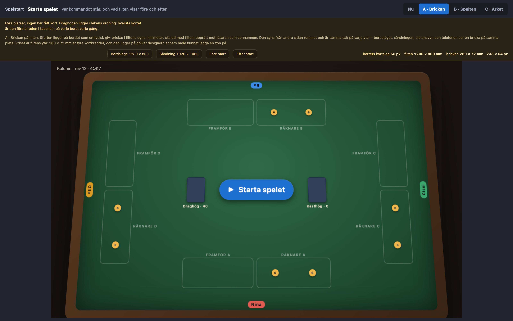
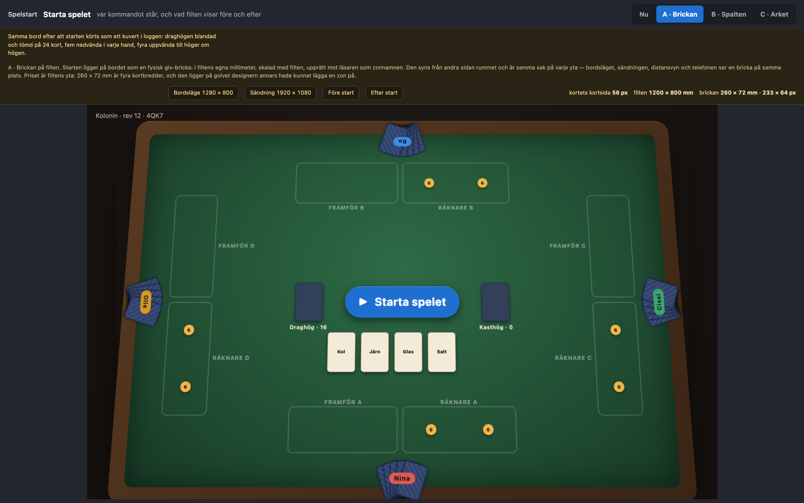
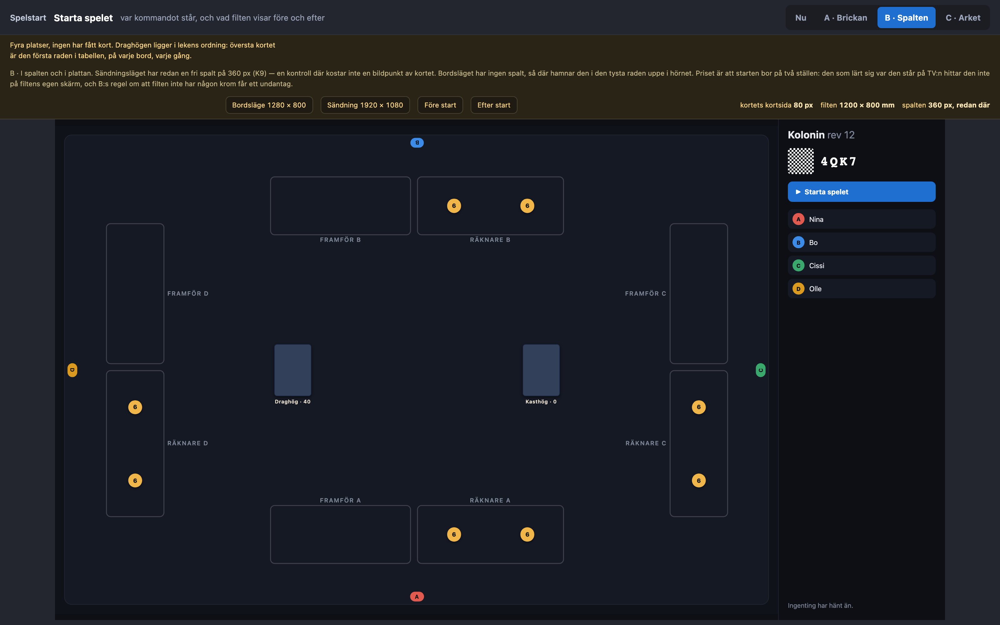
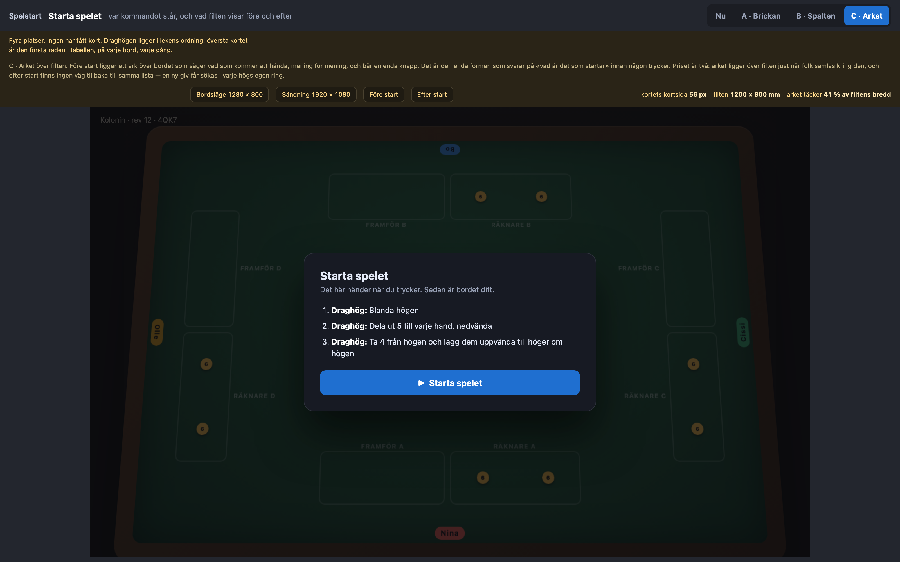
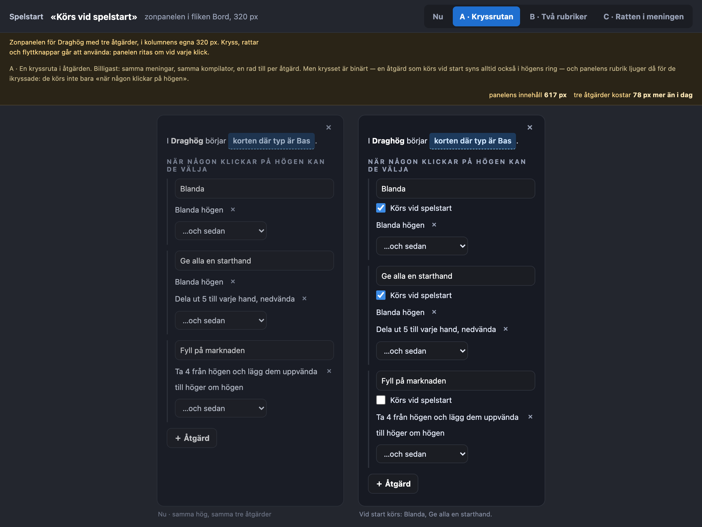
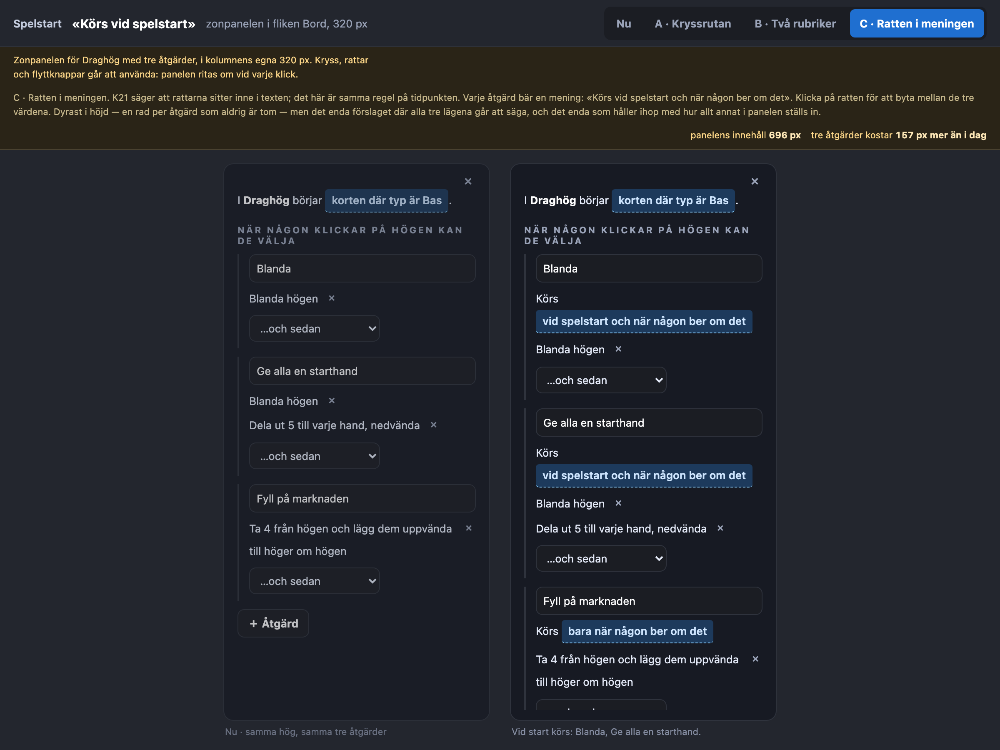

# Prototyp: vad som händer med lekarna vid spelstart

Beställningen: *«Det ska gå att bestämma vad som ska hända med en lek vid spelstart, t.ex. vända upp ett par kort eller kanske mer vanligt, blanda alla lekar.»*

Tre saker bestämdes av beställaren innan prototypen ritades, och prövas alltså inte här:

1. **Spelstarten är ett uttryckligt kommando vid bordet**, inte något som sker när bordet föds.
   Skälet är platserna: «dela ut fem till varje hand» går inte att säga alls vid ett bord ingen satt sig vid, och `ActionAmount.of: 'seats'` räknar just de tagna platserna.
2. **Designern säger det på de åtgärder K21 redan gav en hög** — inte i en egen startsekvens som hör till bordet och namnger zoner vid namn.
3. **Receptets öppningsbord skriver «Blanda» på draghögen** åt varje nytt spel, som det redan lägger ut själva draghögen; designern tar bort det som allt annat receptet föreslår.

Prototyperna prövar därför bara formen: *var* kommandot står vid bordet, och *hur* editorn säger att en åtgärd hör till starten.

[`prototyper/index.html`](2026-09-22-spelstart/prototyper/index.html) är ingången; båda prototyperna öppnas direkt i en webbläsare och växlas med knapparna uppe till höger.

## Vad som gäller i dag, läst i koden och inte antaget

**Det finns ingen spelstart.**
`setupFromProject` i `packages/server/src/setup.ts` lägger korten i dokumentets ordning, och `materialise` i `packages/engine/src/setup.ts` bygger zonerna ur samma uppställning.
Ingenting blandar.
Översta kortet i draghögen är den första raden i tabellen, på varje nytt bord, varje gång.

**`setup.reset` finns i protokollet men har ingen knapp.**
Verbet är byggt hela vägen genom `decide` och `apply`, och `describe.ts` kan säga «N återställde bordet» — men ingen yta i `packages/web/src` skickar det.

**Åtgärderna finns, men bara en människa kan köra dem.**
K21 gav en hög `actions`: ett namn och en ordnad lista av steg.
`compileAction` i `packages/web/src/table/actions.ts` gör om dem till vanliga verb, räknar «ett per spelare» när någon sitter, och säger nej med skäl när målet inte finns.
Den maskinen är redan skriven; det som saknas är ett andra sätt att trycka på den.

**Ingenting nytt behövs i protokollet.**
En start är ett vanligt kuvert med vanliga verb, och `batch` är kuvertets eget id.
Slumpen hamnar i loggen som resultat precis som när någon trycker Blanda för hand, så uppspelningen är identisk (D4) och inget verb tillkommer.

## Prototyp 1 — var «Starta spelet» står vid bordet

[`01-starta-spelet.html`](2026-09-22-spelstart/prototyper/01-starta-spelet.html).
Bordsläget i 1280 × 800 och sändningen i 1920 × 1080, i produktens egen geometri: filten, zonerna, högarna och händerna är ritade ur `recipe.ts`, `drop.ts` och `hand.ts`, och färgerna är `table.css`:s egna.
Växeln **Före start / Efter start** visar samma bord före och efter att exemplets sekvens körts — blanda, dela ut fem till varje hand, lägg ut fyra uppvända kort.

**Nu**: ingen väg alls. Leken ligger i dokumentets ordning och den som vill ha den blandad håller på högen, väljer Blanda ur ringen, och gör om det per hög och per bord.

**A · Brickan på filten.** Starten ligger på bordet som en fysisk giv-bricka, i filtens egna millimeter, skalad med filten och upprätt mot läsaren som zonnamnen.
Samma sak på varje yta: bordsläget, sändningen, distansvyn och telefonen ser en bricka på samma plats.
Kostar 260 × 72 mm av filten — fyra kortbredder — och ligger i bandet mellan draghögen och kasthögen, som är tomt på receptets bord men inte nödvändigtvis på designerns.

**B · I spalten och i plattan.** Sändningsläget har redan en fri spalt om 360 px — K9 säger rakt ut att spalten är fri medan en rad över eller under filten kostar kortstorlek — så en kontroll där kostar noll bildpunkter av kortet.
Bordsläget har ingen spalt, så där hamnar den i den tysta raden uppe i hörnet.
Priset är att starten bor på två ställen, och att B:s regel om att filten inte har någon krom får ett undantag.

**C · Arket över filten.** Före start ligger ett ark över bordet som säger vad som kommer att hända, mening för mening, och bär en enda knapp.
Enda formen som svarar på «vad är det som startar» innan någon trycker.
Priset är två: arket ligger över filten just när folk samlas kring den, och efter start finns ingen väg tillbaka till samma lista.

### Mätningar

| | kortets kortsida | vad förslaget kostar |
| --- | --- | --- |
| Bordsläge 1280 × 800, 4 platser | 56 px | A: 233 × 64 px av filten · B: krom på en filt utan krom · C: 41 % av filtens bredd, tillfälligt |
| Sändning 1920 × 1080, 4 platser | 80 px | A: 329 × 91 px av filten · B: 0 px, spalten finns redan · C: 33 % av filtens bredd, tillfälligt |

Ingen av de tre kostar en enda bildpunkt av kortet: filten är höjdbunden, och ingen av formerna lägger en rad över eller under den.

## Prototyp 2 — hur designern säger att en åtgärd körs vid start

[`02-startkrysset.html`](2026-09-22-spelstart/prototyper/02-startkrysset.html).
Zonpanelen för draghögen med tre åtgärder, i kolumnens egna 320 px, med produktens egna meningar ur `sv.editor.ts`.
«Nu» står kvar bredvid varje förslag, så att höjden går att läsa i bild och inte bara i tal.

**A · Kryssrutan.** En rad till per åtgärd: «Körs vid spelstart».
Billigast, och kostar **78 px** på tre åtgärder.
Men krysset är binärt: en åtgärd som körs vid start syns alltid också i högens ring, och panelens rubrik — «När någon klickar på högen kan de välja» — ljuger då för de ikryssade.

**B · Två rubriker.** Rubriken är redan meningen som säger när något händer, så panelen får en till: «Vid spelstart» över den befintliga.
Åtgärden flyttas mellan dem.
Läses bäst av de tre, och kostar **117 px**.
Men en åtgärd kan bara stå under en rubrik, så «blanda vid start *och* när någon ber om det» måste skrivas två gånger.

**C · Ratten i meningen.** K21 säger att rattarna sitter inne i texten; det här är samma regel på tidpunkten.
Varje åtgärd bär en mening — «Körs vid spelstart och när någon ber om det» — med tre värden i ratten.
Dyrast: **157 px** på tre åtgärder, och panelen svämmar över kolumnens höjd vid tre åtgärder.
Men det enda förslaget där alla tre lägena går att säga, och det enda som ställs in som allt annat i panelen.

## Fynd som behöver avgöras innan bygget

**1. Meningarna är skrivna relativt, och en startlista måste sätta högens namn framför.**
Stegen säger «högen» och aldrig en zon vid namn — det är vad som gör att en kopierad zon bär sina åtgärder med sig (K21).
Varje yta som *listar* starten måste därför säga vilken hög det är, och i arket blir det «Draghög: Blanda högen», vilket är en klumpig svensk mening.
Antingen får startlistan en egen katalogsträng («Blanda Draghög»), eller så lever ytan med förledet.

**2. Vad gör knappen andra gången?**
Ingenting hindrar att den trycks mitt i spelet — och det är rätt enligt K23:s «verktyget säger inte nej»; det är så en ny giv ges.
Men etiketten står kvar på «Starta spelet» medan spelet pågår, vilket syns i bilden ovan.

**3. Ett steg som frågar efter ett tal.**
`ActionAmount.of: 'ask'` frågar läsaren vid bordet.
En start som innehåller flera sådana blir en trave frågor i samma ögonblick som någon trycker.
Antingen vägrar editorn `ask` i en startåtgärd och säger varför, eller så frågar trycket en fråga i taget.

**4. Ordningen mellan högar är dokumentets, och går inte att ändra.**
Inom en åtgärd är ordningen designerns, men mellan två högar är det zonlistans ordning — och `SetupEditor` har ingen omordning alls.
För en start som bara blandar spelar det ingen roll; för en som tar kort ur en hög en annan just fyllt gör det det.

## Rekommendation

**1A + 2C.**
Brickan, för att starten är en sak som händer med bordet och inte med skärmen: den är samma sak på varje yta, den syns från andra sidan rummet, och den kostar ingen kortstorlek någonstans.
Ratten i meningen, för att K21 redan bestämt att det som ställs in i den här panelen ställs in inne i texten, och för att den är den enda som kan säga «vid start *och* på begäran» — vilket är precis vad «Blanda» vill vara.
