# Interaktionsgranskning 2026-09-27: hela tjänsten, en sida i taget

Beställningen: *«Gör en interaktionsgranskning av tjänsten, det finns många saker som inte är så
användarvänligt. Sätt upp en plan för att gå igenom en sida i taget. Skapa issues för dessa så tar
en agent en sida åt gången så att vi får en helhet.»*

Det här dokumentet är tre saker: inventeringen av tjänstens sidor, planen för att arbeta av dem en i
taget, och den första granskningen av varje sida med fynd som issues kan byggas på. Planen är
ordnad efter var en ny användare möter tjänsten först.

## Omfattning och metod

Den riktiga webbappen, byggd och serverad av servern på ett ursprung som på lådan (DRIFT §2), med
minneslagring och `AUTH_BYPASS`, och syntetiska data: `spelkortDoc` — **Sal's Saloon**, 77 kort,
fyra platser, elva zoner — som projekt, och `scripts/seed.ts`:s bord med utdelade händer, marknad,
kasthög och lösa kort. Varje yta granskades i Chromium via Playwright med riktiga pekar-, touch- och
tangenthändelser; mått är lästa ur sidan, inte ur koden. Inga riktiga konton eller personuppgifter.

Bredderna följer [UX-KONTROLLER](UX-KONTROLLER.md) och L12: spelarens ytor i 390, 768 och 1280
och kritiska flöden i 320; editorn i 1280 och 1024 med 768 bara som brytprov; bordets skärm i
1280 × 800 och 1440 × 900 som bordsläge och 1920 × 1080 som TV.

Ej granskat: Postgres och R2 (minneslagring), render-workern (inga texturer, korten ritas av
webbläsaren), riktig pekskärm och skärmläsare (aria lästes ur DOM), mejlflödet (bypass).

## Inventeringen

| # | Sida | Rutt | Vem håller den | Bredder | Kod |
| --- | --- | --- | --- | --- | --- |
| 1 | Start och konto | `/`, `/login`, `/claim`, `/invites/:id`, 404 | designern, gästen efteråt | 1280, 768, 390 | `account/`, `status/` |
| 2 | Guidad start | `/new` | designern | 1280, 1024 (768) | `wizard/` |
| 3 | Editorn: ram och Kortvägg | `/editor` | designern | 1280, 1024 (768) | `editor/EditorPage`, `DeckWall`, `HistoryPanel`, `SharePanel`, `HelpDrawer` |
| 4 | Editorn: Mall | `/editor` → Mall | designern | 1280, 1024 (768) | `editor/TemplateCanvas`, `LayerList`, `panes`, `FontCatalog` |
| 5 | Editorn: Tabell | `/editor` → Tabell | designern | 1280, 1024 (768) | `editor/DataTable`, `BodyCell`, `ColumnDoor`, `NewField`, `csv` |
| 6 | Editorn: Bord | `/editor` → Bord | designern | 1280, 1024 (768) | `editor/SetupEditor`, `TablesTab`, `ZoneActions`, `Question` |
| 7 | Editorn: Symboler, Media, Regler | `/editor` → tre flikar | designern | 1280, 1024 (768) | `editor/SymbolPanel`, `MediaPanel`, `PictureLibrary`, `Crop`, `RulesPanel` |
| 8 | Bordet | `/table?mode=table`, `mode=tv` | gruppen, TV:n | 1280 × 800, 1440 × 900, 1920 × 1080 | `table/` |
| 9 | Telefonen och anslutningen | `/join`, `/play` | spelaren, i en hand | 390, 768, 1280, 320 | `join/`, `player/` |
| 10 | Distansvyn | `/online` | spelaren på avstånd | 1280, 1920, 768, 390, 320 | `online/`, delar av `table/` |
| 11 | Observatören och statuslägena | `/observe`; alla rutters D5-lägen | testledaren; alla | 390, 768, 1280, 320 | `observer/`, `status/`, `client.ts` |

Sidorna är rutterna i `packages/web/src/App.tsx` plus editorns flikar, som var och en är en egen
arbetsyta med egna interaktioner (L8). Det är elva sidor och elva issues.

## Planen: en sida i taget

Ordningen är resan: det en ny designer möter först står först, och bordets och telefonens ytor
kommer när det finns en lek att spela. En agent tar ett issue i taget, i den här ordningen, och
lämnar sidan hel innan nästa börjar.

1. Start och konto — första intrycket, inloggningen, vägen till ett spel.
2. Guidad start — den enda vägen till en första lek.
3. Editorn: ram och Kortvägg — det som omger varje flik: huvudet, flikarna, sparat, Starta bord, Dela, Historik, hjälp.
4. Editorn: Mall — där leken formges.
5. Editorn: Tabell — där leken fylls.
6. Editorn: Bord — där spelet ställs upp.
7. Editorn: Symboler, Media, Regler — de tre mindre flikarna.
8. Bordet — TV:n och bordsläget.
9. Telefonen och anslutningen — spelarens väg in och handen.
10. Distansvyn.
11. Observatören och statuslägena — det som ligger över alla ytor när något går fel.

Varje issue följer samma arbetsgång, så att helheten blir en helhet och inte elva stilar:

1. **Läs** issuet, sidans kod och de beslut i DESIGN-BESLUT som issuet pekar på. Läs också den här
   rapportens avsnitt för sidan och tidigare granskningar under `docs/ux-audits/`.
2. **Återupprepa** fynden i den byggda appen i sidans bredder. Ett fynd som inte går att återupprepa
   stryks med en rad om varför; ett nytt fynd som dyker upp läggs till i issuet innan det byggs.
3. **Prototypa** de fynd som är märkta HITL med `/prototype` — tre strukturellt olika varianter —
   och få dem godkända innan de byggs. AFK-fynden byggs direkt.
4. **Bygg** med `/tdd`: rött test, minsta gröna ändring, refaktorering. Ett mätande test i
   Chromium eller ett fokuserat komponenttest per fynd. Knappspråket (L13), statusfamiljen (D5) och
   ett-tecken-öppnar-en-lista (L23) återanvänds; inget nytt mönster uppfinns per sida.
5. **Verifiera** mot kontrollmatrisen: tangentbord hela vägen, synligt fokus, aria-namn, träffytor,
   `prefers-reduced-motion`, och sidans tomma, laddande och felande lägen.
6. **Stäng** med `pnpm typecheck`, `pnpm test`, `pnpm lint` gröna, skärmbild före/efter i issuet,
   och en rad i den här rapportens avsnitt för sidan om vad som ändrades. Ett beslut som ändras
   skrivs i DESIGN-BESLUT, inte tyst i koden.

Tvärgående fynd — sådant som återkommer på flera sidor — samlas i avsnittet «Mönster» nedan. De
löses på den första sidan där de dyker upp och följs sedan på de andra, så att lösningen blir en.

## Fynden per sida

Varje sida har sitt eget issue med fullständig reproduktion, mätvärden, trolig orsak i koden,
acceptanskriterier och skärmbilder; det här avsnittet är sammanfattningen. «AFK» är entydigt och byggs
direkt; «HITL» kräver ett formval och prototypas först. Bilderna ligger i
[`2026-09-27/`](2026-09-27/).

### 1. Start och konto — `/`, `/login`, `/claim`, `/invites/:id`, 404

Tretton fynd. Det tyngsta är att **inbjudningslänken i mejlet svarar med rå JSON** på den origin
produkten driftas på: `/invites` står i serverns `API_PREFIXES`, så SPA:ns `InvitePage` nås aldrig.
Därnäst raderingsfrågan, som på telefonen ritas 1 000 px ovanför fönstret utan fokus, och ⋯-menyn som
varken Escape, klick utanför eller Tab stänger.

| # | Nivå | Fynd | Disp. |
| --- | --- | --- | --- |
| 1 | Hög | `/invites/<token>` ger `{"error":"not found"}` på samma origin; bara `POST` hanteras (`server.ts:408`) | AFK |
| 2 | Hög | «Ta bort {spel}?» renderas överst utan fokus/Escape; vid 390 utanför fönstret; knappar 66×29 px; ingen kvittens | AFK |
| 3 | Hög | ⋯-menyn stängs inte med Escape, klick utanför eller Tab (mönstret finns i `HelpBox`) | AFK |
| 4 | Medel | Hjälplådan vid «Inget spel ännu.» hamnar på x = −90 vid 390 (`placement.ts:63` vänder åt fel håll) | AFK |
| 5 | Medel | «Mina spel» bryts i två rader vid 390; huvudet saknar `flex-wrap` | AFK |
| 6 | Medel | Inbjudnings- och claim-felen är återvändsgränder: ingen länk, fokus `BODY` (D5 kräver väg ut) | AFK |
| 7 | Medel | Fliken heter «Sidan finns inte» på `/invites/…` (`title.ts` saknar prefixrutt) | AFK |
| 8 | Medel | `/claim` utan token, «Laddar…», «Sparar…» är ostilade `
` på vit sida | AFK |
| 9 | Medel | `/login` visar formuläret för en redan inloggad; ingen vidareskickning till `next` | AFK |
| 10 | Medel | Adress utan «@»: tonad knapp och tyst Enter; felet står kvar efter rättning; inga `aria-invalid`/`describedby` | AFK / HITL |
| 11 | Låg | «Bordet är igång» överst och för evigt; fokus `BODY`; ny flik osagd; `?claimed=` visar notisen om igen | AFK |
| 12 | Låg | Under hämtning visas bara «＋ Nytt spel» i kolumn 1; fallerar `/me/cards` skimrar korten för evigt | AFK |
| 13 | Låg | «Tillbaka till bordet» 19 px hög; platsmarkören saknar namn | AFK |

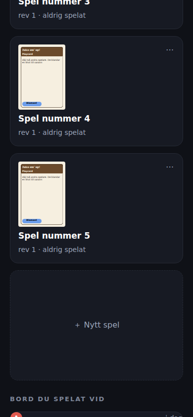
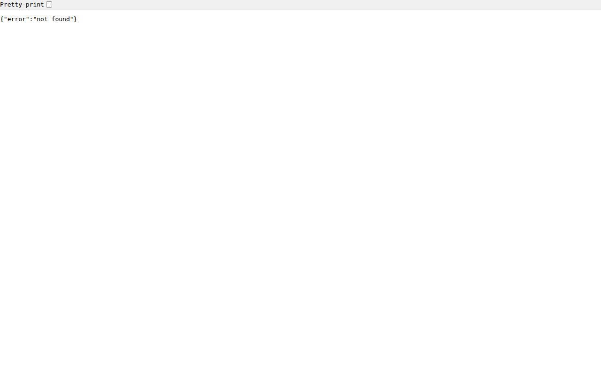

**Ändrat (#475):** alla tretton åtgärdade.
Inbjudningslänken ger appen för en webbläsare som ber om en sida, och ett E2E-test följer den ur mejlloggen till editorn.
Raderingsfrågan är den delade `Question` med fokus på «Behåll», Escape tillbaka till ⋯ och kvittens i live-regionen; ⋯-menyn stängs av Escape, tryck utanför och Tab ut.
Hjälplådan kläms mot fönsterkanten när ingen sida av frågetecknet rymmer den, och rubrikraden bryts.
Claim-, inbjudnings- och 404-sidornas lägen går genom `StatusNotice`, och vägen hem heter «Till startsidan» för den som inte är inloggad.
`/login` skickar den inloggade vidare; knappen är alltid aktiv och säger vad adressen saknar (beslut 2026-09-27), med `aria-invalid` och `aria-describedby`.
Resten: «Öppna bordet» säger att det öppnar en ny flik, `?claimed=` visas en gång, «Hämtar dina spel…» under hämtningen, kortplatserna slutar vänta när `/me/cards` fallerar, och «Tillbaka till bordet» är 44 px hög med en namngiven platsmarkör.

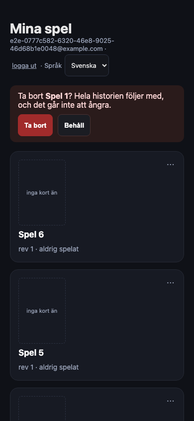
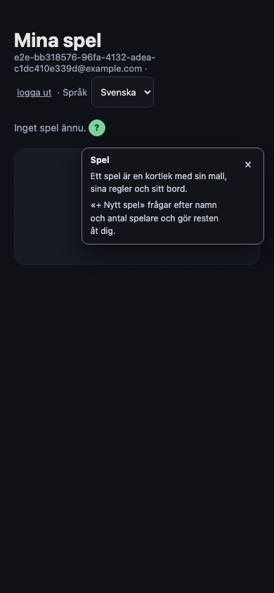
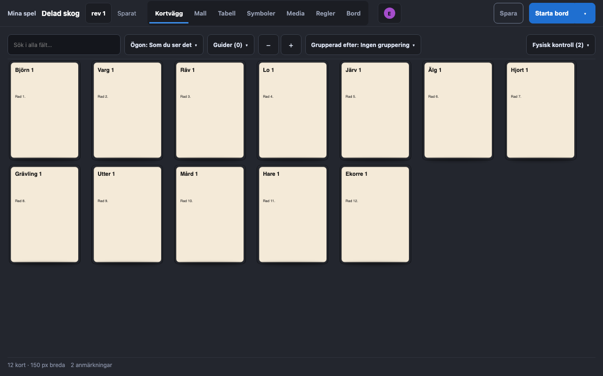
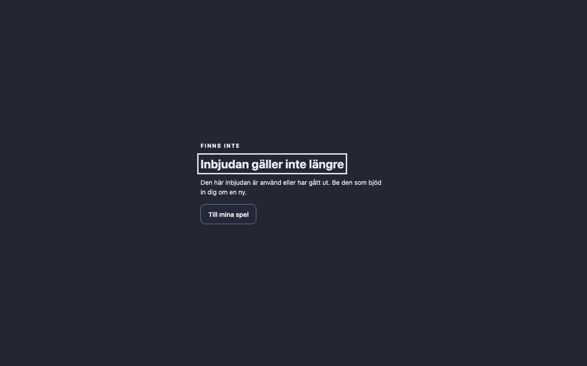

### 2. Guidad start — `/new`

Tolv fynd. Det tyngsta: **fältnamnen designern skriver i steg 2 når aldrig spelet** — editorn får
`cost`, `fält1`, `värde1`. Därnäst att omladdning, bakåt och stängd flik kastar hela utkastet utan ett
ord, medan ett utkast sparat för en inloggningsrunda tvärtom skickas automatiskt vid nästa besök.

| # | Nivå | Fynd | Disp. |
| --- | --- | --- | --- |
| 1 | Hög | Fältnamnen («Pris», «Styrka») lagras bara i wizardens state; `build.ts` läser bara `key` | HITL |
| 2 | Hög | Ingen `beforeunload`, inget minne i `sessionStorage`; sparat utkast skickas utan klick vid nästa `/new` | AFK |
| 3 | Medel | Steg 2 under vecket vid 1280×800 och 1024×768; förhandsvisningen 63 % / 38 % synlig när ramen byts | HITL |
| 4 | Medel | Förhandsvisningen står i reservtypsnitt; ramens familj hämtas först vid skapandet | AFK |
| 5 | Medel | `/new` har noll länkar: ingen «Mina spel», inget «Avbryt» | AFK |
| 6 | Medel | Bildfältet tar `.txt` och 36 MB; felet kommer vid «Skapa spelet» som «415»/«413» | AFK |
| 7 | Medel | Fel som statuskoder och «Failed to fetch»; knappen hoppar 217 px; «Skapar…» krymper knappen 315→95 px | AFK |
| 8 | Låg | Enter gör inget; nytt fält/kort får inte fokus; fokus faller till `<body>` när knappar försvinner | AFK |
| 9 | Låg | Två fält kan heta likadant; ett fält kan heta «» | AFK |
| 10 | Låg | Spelnamnet saknar maxlängd (445 tecken går igenom) | AFK |
| 11 | Låg | Hjälpen i steg 3 säger «efter nästa steg» fast steg 3 är sista | AFK |
| 12 | Låg | Tomma spelet (L42) landar på en svart kortvägg utan ord om nästa steg | HITL |

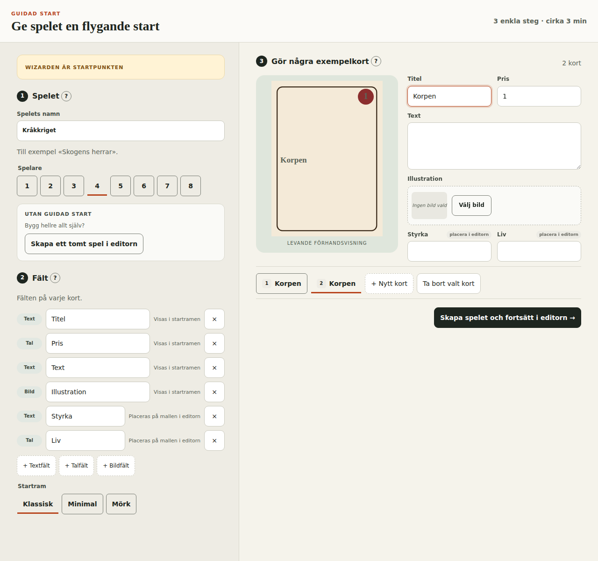
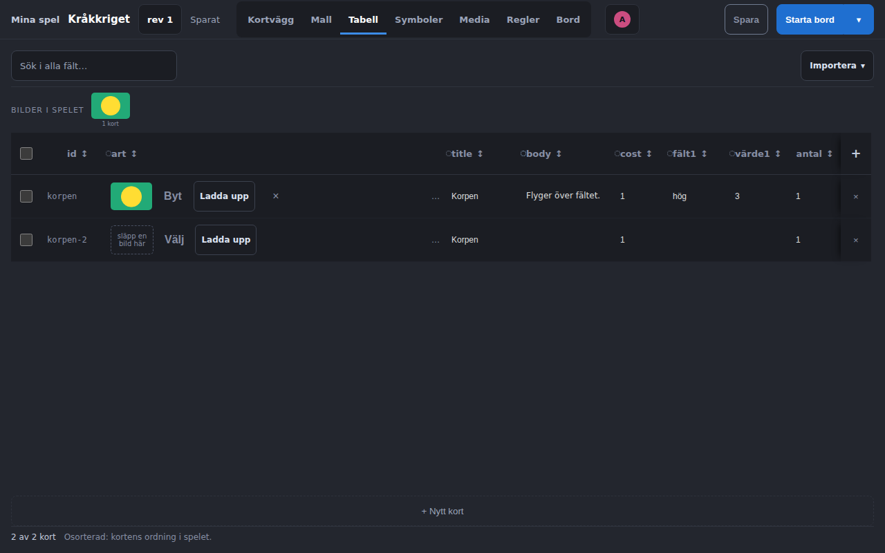

**Ändrat (#476):** alla tolv åtgärdade; fynd 1, 3, 4, 10 och 12 efter beslut 2026-09-27, med [prototyperna](2026-09-27/prototyper/index.html) som underlag.
Namnen i steg 2 är spelets kolumner (L44), startramarna binder per plats på kortet, och `title` är verktygets egen kolumn som visas som «Titel» i guiden och editorn; tomma, dubbla och verktygets egna namn stoppas vid fältet.
Skrivbordsläget står still och spalterna scrollar var för sig, så kortet syns när ramen väljs.
Förhandsvisningen ritas i ramens familj när en ram trycks (L27 håller: inget hämtas innan).
Utkastet överlever en omladdning, webbläsaren frågar först, och det skickas bara på vägen tillbaka från inloggningen det väntade på.
«Mina spel» i huvudet; fel sägs som «Spelet skapades inte.» med vad man kan göra, knappen står still; bildfältet nekar fel typ och storlek direkt; fokus följer arbetet och Enter går vidare; namnet är högst 64 tecken; steg 3:s hjälp rättad.
Den tomma kortväggen har två dörrar, «+ Nytt kort» och «Rita framsidan i Mall →», och säger inte «Inga anmärkningar» om en tom lek.

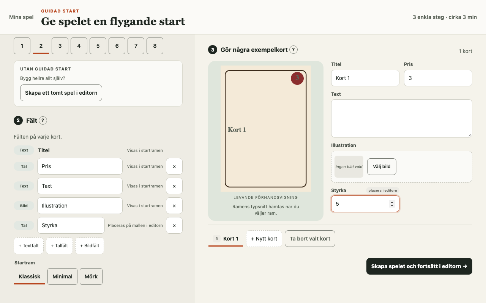
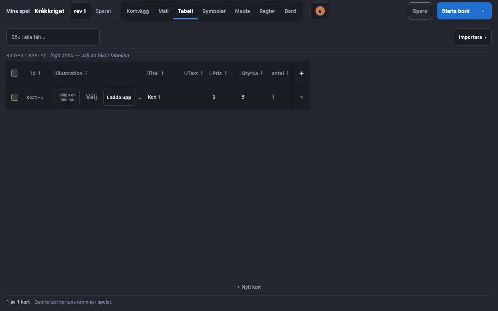
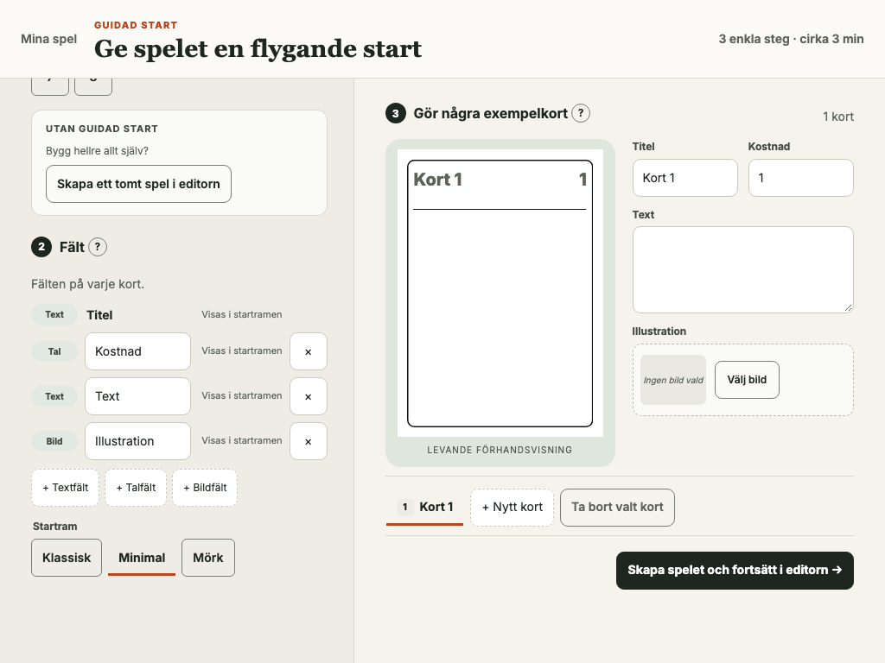
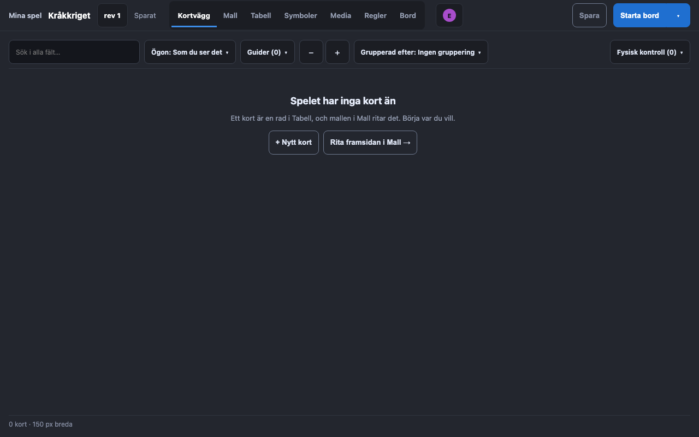

### 3. Editorn: ram och Kortvägg

Sjutton fynd. Fyra höga: **efter en omladdning glömmer editorn bordet** och «Starta bord» startar ett
andra bord i stället för att uppdatera det första; inbjudningslänken (samma som sida 1, fynd 1); ett
kort på väggen går inte att öppna eller välja med tangentbordet och går inte att avmarkera; och med
ett bord i huvudet klipps «Uppdatera bordet» till «Uppdatera bo» vid 1024.

| # | Nivå | Fynd | Disp. |
| --- | --- | --- | --- |
| 1 | Hög | `table` är komponentstat (`EditorPage.tsx:110`); efter omladdning startas ett andra bord | AFK / HITL |
| 2 | Hög | `/invites/<token>` rå JSON — samma som sida 1, löses där | — |
| 3 | Hög | Kort på väggen: `tabIndex −1`, ingen `onKeyDown`, ingen avmarkering, `aria-selected` på `listitem` | AFK / HITL |
| 4 | Hög | «Uppdatera bordet» 101/123 px och namnet 70/102 px vid 1024; klipps även vid 1280 | AFK |
| 5 | Medel | Testledare kan ändra allt lokalt och får «Osparat» hon aldrig kan spara | HITL |
| 6 | Medel | Fokus till `<body>` efter kortklick, Starta bord, Ta tillbaka version, Jämför, Ta bort medlem | AFK |
| 7 | Medel | Historik och Dela tar inte fokus vid öppning; Tab går genom fyra huvudkontroller först | AFK |
| 8 | Medel | «Ta tillbaka den här versionen» byter ut allt utan fråga och utan bekräftelsetext | AFK / HITL |
| 9 | Medel | Väggen glömmer skroll, sökning och öga vid flikbyte; valt kort utanför bild | AFK |
| 10 | Medel | Dela: «kunde inte bjuda in: 400», inga väntande inbjudningar, självinbjudan och dubbletter godtas | AFK / HITL |
| 11 | Medel | «Ta bort» medlem frågar inte; den borttagna sitter kvar med full vy tills omladdning | AFK |
| 12 | Medel | Sökfältet i krönet 58 px vid 1024 («Sök i») | HITL |
| 13 | Låg | Gula markeringsramar på 77 kort kvar när kontrollådan stängts | AFK |
| 14 | Låg | Tom sökning ger tom vägg utan ord; spalten och fällknappen försvinner | AFK |
| 15 | Låg | Escape i adressfältet stänger Dela och kastar texten | AFK |
| 16 | Låg | Versionsnamnet sparas bara på blur; Enter gör inget | AFK |
| 17 | Låg | Dokumenttiteln identisk på alla sju flikar | AFK |

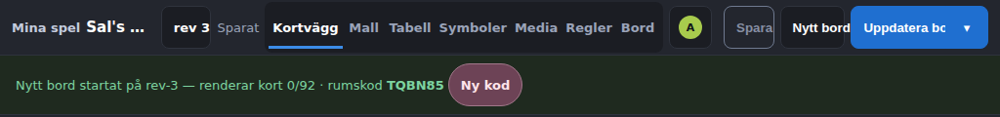

**Ändrat (#477):** sexton av sjutton åtgärdade; fynd 3, 4, 10 och 12 efter beslut 2026-09-27, med [prototyperna](2026-09-27/prototyper/index.html) 08–11 som underlag, och fynd 2 i #475.
Editorn plockar upp det nyaste bordet som kör efter en omladdning, och «Nytt bord» står i pilens meny vid alla bredder (L5 omskriven); primären och namnet läses hela vid 1024 och 1280 på svenska och engelska.
Väggen är en listbox med ett tabbstopp, och samma tryck som valde ett kort släpper det, liksom Escape; den minns sökning, öga och skroll mellan flikarna och rullar in det valda kortet.
Historik och Dela tar fokus när de öppnas, och fokus faller inte till `<body>` efter Starta bord, Spara, Jämför eller ett element som väljs på väggen.
«Ta tillbaka» säger i ord att versionen är tillbaka och att Ångra tar bort den; versionsnamnet sparas på Enter; fliken står i webbläsarens titel.
Dela stoppar självinbjudan och dubbletter i ord, visar inbjudningar som väntar och kan dra tillbaka dem, frågar innan en medlem tas bort, och den borttagna får statusläget direkt.
Krönets boxar säger bara sitt val under 1280, så sökfältet håller sin bredd; en tom sökning har samma form som det tomma spelet; markeringarna släpps när kontrollen stängs.
Fynd 5 (läsläge för roller som inte får ändra) är utbrutet till #489.

### 4. Editorn: Mall

Fjorton fynd. Tre höga: **ett klick på en punkt eller mittprick på en egen form avmarkerar formen**
(punkterna bubblar sitt klick till scenen); **ett element utan fyllning tar pekaren över hela sin
box**, så klick på det synliga bandet väljer ramen; och **att skriva ett tal i ett mätfält skriver
varje mellanled till mallen** — en tömd Bredd blir 0 mm och elementet försvinner.

| # | Nivå | Fynd | Disp. |
| --- | --- | --- | --- |
| 1 | Hög | `.byd-point`-knapparna saknar `stopPropagation` på `click`; scenens `onClick` avmarkerar | AFK |
| 2 | Hög | Heltäckande dragbox för `fill: none`; träff bör vara konturen ±2,4 mm | AFK |
| 3 | Hög | `onWrite(Number(e.target.value))` per tangent; `''` → 0; `min`/`max` gäller inte skrivning | AFK |
| 4 | Medel | Förstoringen ankrar alltid i övre vänstra hörnet; det man zoomade in på hamnar utanför scenen | AFK |
| 5 | Medel | Handtag 9×9 px vid 100 %, 5×5 vid 50 % — skalas med kortet | AFK |
| 6 | Medel | Lagerlistans släpplinje ritas över raden men lagret hamnar under vid drag nedåt | AFK |
| 7 | Medel | Element kan dras helt utanför kortet; scenen autopanorerar inte | HITL + AFK |
| 8 | Medel | Villkorslager (`if-*`) ger tom panel, ingen ram, ingen text om villkoret | HITL |
| 9 | Medel | Egenskapspanelen för en vanlig rektangel 914 px i 682 — Effekter under vikningen | HITL |
| 10 | Medel | «… är låst» klipps i scenens nederkant | AFK |
| 11 | Låg | Färdig baksida byter ut fyra lager utan fråga | AFK |
| 12 | Låg | Svart fyllning visas för form utan fyllning; «ingen fyllning» går inte att välja | AFK |
| 13 | Låg | Namnfältet vid omdöpning förmarkerar inte namnet → «titleRubrik» | AFK |
| 14 | Låg | Mallen säger inte vilket kort som förhandsvisas; byte kräver rundtur via Kortvägg | HITL |

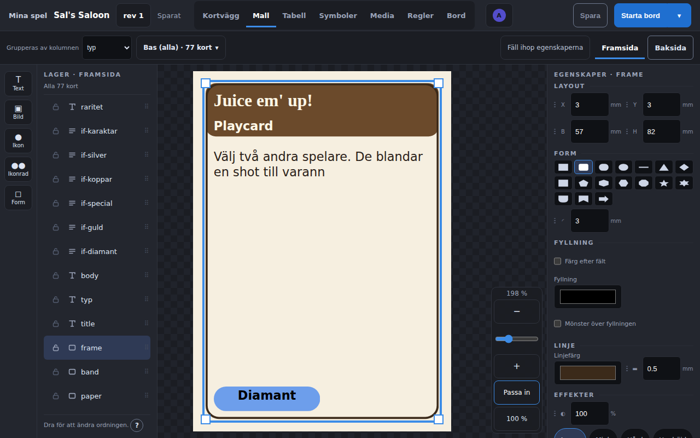

**Ändrat (#478):** alla fjorton åtgärdade; fynd 7, 8, 9 och 14 efter beslut 2026-09-27 med [prototyperna 04–07](2026-09-27/prototyper/index.html) som underlag (L3, L19 och L25 har fått tillägg).
Klick på en punkt behåller formen vald, en form utan fyllning släpper igenom pekaren i sitt inre, och ett tal som skrivs i panelen skrivs en gång när fältet lämnas, hållet till fältets golv och tak (`number-draft.ts`, som #479 och #483 ska dela).
Förstoringen växer kring pekaren och det valda elementet, märkena är minst 10 px, elementets mitt stannar på kortet med en etikett som säger varför, och scenen panorerar under en hand vid kanten.
Släpplinjen ritas där lagret landar, «… är låst» står helt under kortet, baksidesgalleriet frågar, fyllningen är en växel och omdöpning förmarkerar.
Panelen fälls med värdet i det stängda huvudet och ryms för en rektangel vid 1280 och 1024; spelets typsnitt står där när inget lager är valt.
Ett villkor är en mapp med villkoret och antalet kort i raden, en ram på kortet och en panel som redigerar det; en rad under kortet säger vilket kort mallen visas på och byter det.

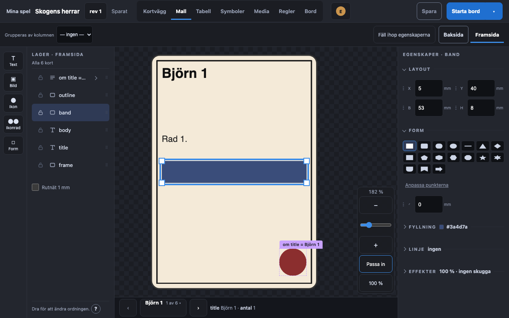
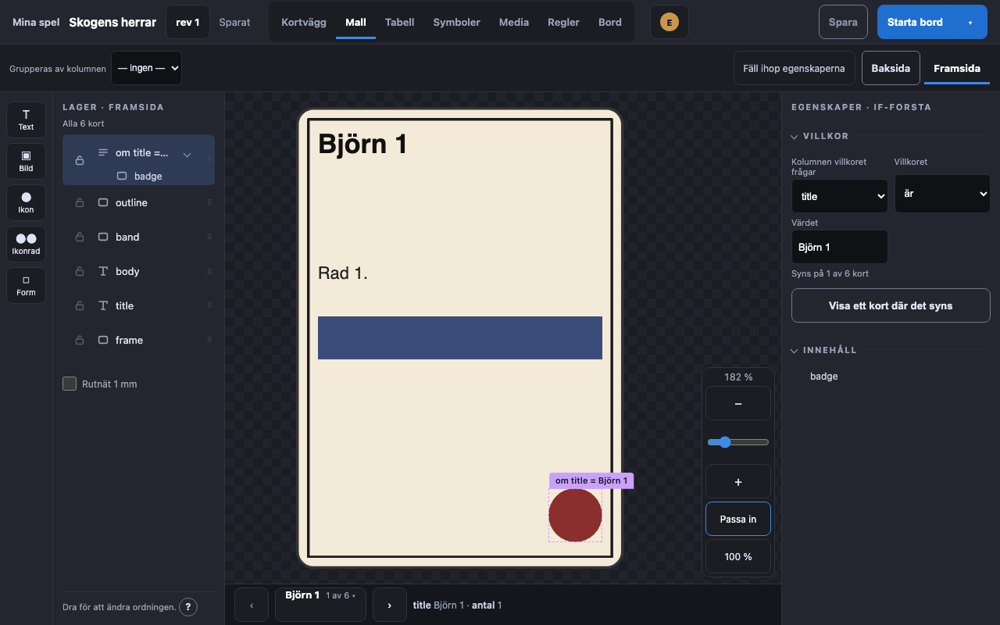

### 5. Editorn: Tabell

Tretton fynd; åtta av de tidigare fynden från 16 och 21 september är verifierat lösta. Fyra höga:
**«+ Nytt kort» lägger raden 3 000 px ner utan att rulla eller flytta fokus**; **ett namnbyte på en
kolumn lämnar filter och sortering nycklade på gamla namnet** («0 av 77 kort» utan nedtryckt chip);
**jämförelseläget ritar ett borttaget kort som en levande rad** vars skrivförsök kastar i konsolen; och
**`antal` tar 0, negativa tal och decimaler utan ett ord** — bordet startar med noll kopior.

| # | Nivå | Fynd | Disp. |
| --- | --- | --- | --- |
| 1 | Hög | Ny rad utan `scrollIntoView` och fokus (`DataTable.tsx:1559`) | AFK |
| 2 | Hög | `renameColumn` rör bara dokumentet; `sort`, `filter`, `widths` nycklas inte om | AFK |
| 3 | Hög | `goneRows` går genom samma radmall; skrivbara fält, ×, kryssruta; `Error: no row` | AFK |
| 4 | Hög | `Number(value)` per tangent; `-2`, `2.5` sparas; cell, åtgärdsrad och import svarar olika | AFK |
| 5 | Medel | «Typ: Text/Tal/Bild» i Nytt fält styr bara namnförslaget — «Bild» ger textkolumn | HITL |
| 6 | Medel | Semikolon-CSV avvisas med «behöver en id-kolumn» | AFK |
| 7 | Medel | Import ersätter 77 kort med 2 utan fråga och statusmening; `Title` bredvid `title` | AFK / HITL |
| 8 | Medel | Prosautfällningen öppnas efter 8 ms hover och täcker tre datarader | AFK |
| 9 | Medel | Ctrl+Z i cell tar ett tecken, utanför cellen hela ordet; Escape återställer inget | HITL |
| 10 | Medel | Rad → Kortvägg: kortet markeras på y 3 231 utan scroll; tillbaka är `scrollTop` 0 | AFK |
| 11 | Låg | Enter/pilar gör inget i cell; två rader TSV klistras i en cell (L4 «kalkylarket») | HITL |
| 12 | Låg | Body-cellen behåller inklistrad HTML på skärmen | AFK |
| 13 | Låg | Frågans och åtgärdsradens knappar 32 px höga (delad `Question`); fokus `<body>` efter Jämför | AFK |

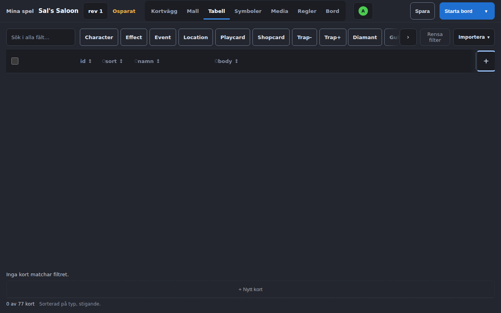

**Ändrat (#479):** alla tretton åtgärdade; fynd 5, 7, 9 och 11 efter beslut 2026-09-27 med [prototyperna 12–15](2026-09-27/prototyper/index.html) som underlag (L4 och L14 har fått tillägg).
«+ Nytt kort» rullar in raden och ställer markören i den, ett namnbyte tar med sig sortering, filter och bredd, och ett borttaget kort i jämförelsen är en rad som bara går att läsa.
`antal` skrivs som ett heltal från 1 med samma regel i cellen, åtgärdsraden och importen, och ett tal som inte går säger varför bredvid cellen.
Nytt fält frågar bara efter ett namn och säger i en rad när en kolumn blir en bildkolumn.
Semikolon-CSV läses, en import som skulle ta bort kort frågar först på en egen rad, och en rubrik som bara skiljer i versaler paras med kolumnen som finns.
Prosautfällningen väntar 300 ms, raden på väggen står i bild åt båda hållen, och inklistrad HTML blir text.
Enter och pilarna går i kolumnen, ett block ur ett kalkylark fyller ett block, Escape återställer cellen och Ctrl+Z går ordvis och sedan vidare till editorn.
Frågans och åtgärdsradens knappar är 44 px, och fokus står kvar efter Jämför.
I förbigående: kortets id mättes i fältens typsnitt och bröts över två rader från `kort-10`; det mäts nu i sitt eget.

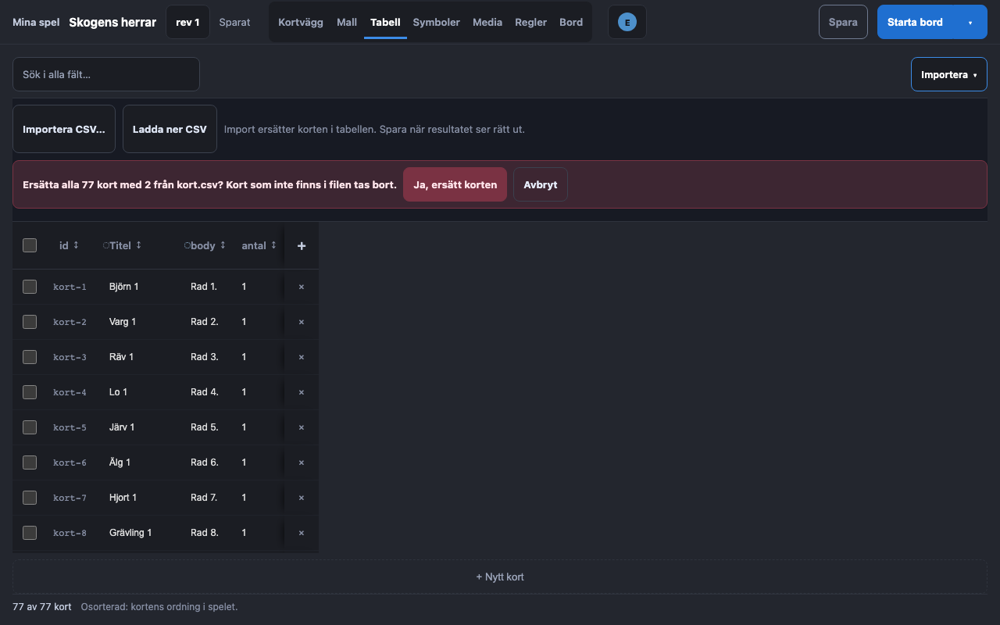
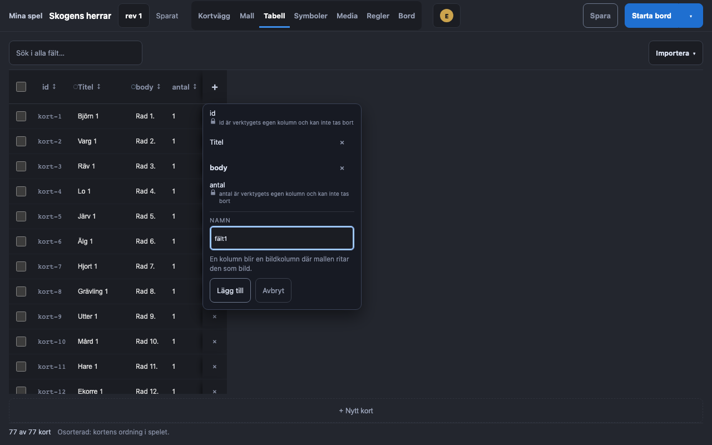

### 6. Editorn: Bord

Femton fynd; #424, #440, #443 och #452–#454 håller. Fyra höga: **Tab in i filten fastnar på leken**
(fokus på högens handtag väljer den och panelen tar fokus, så fjorton handtag hoppas över); **en yta
kan dras helt utanför bordet** och blir onåbar; **vid 1024×768 har vänsterkolumnen 298 px innehåll i
260 px** och rullar i sidled; och **frågerutan är 10 551 px lång** med 166 chippar, varav sjuttio är
hela regeltexter, utan sökfält.

| # | Nivå | Fynd | Disp. |
| --- | --- | --- | --- |
| 1 | Hög | `onFocus={() => onSelect(z.id)}` + panelen fokuserar sig vid montering | AFK |
| 2 | Hög | `move` klipper inte mot golvet; handtaget klipps av `overflow: hidden` | HITL |
| 3 | Hög | Räknarraden utan `flex-wrap`, receptet utan `min-width: 0` | AFK |
| 4 | Hög | `QuerySlot` ritar alla kolumner platt utan sök; fritextkolumner dominerar | HITL |
| 5 | Medel | Val på filten rullar inte fram raden; koordinaterna 72 px under kolumnens kant; ＋-knapparna klipps | AFK |
| 6 | Medel | Fokus `<body>` efter Delete, ×, Ångra, sista steget, Enter i sökrutan, Starta nytt bord | AFK |
| 7 | Medel | «Starta nytt bord» ger bara «· 2 → · 3» i en hopfälld rad; avslutat bord stannar i fel grupp | AFK |
| 8 | Medel | Lekens panel säger «I Kortlek börjar inga kort.» medan filten visar 146 | AFK |
| 9 | Medel | Ctrl+V två gånger lägger kopiorna på samma punkt; bred kopia föds utanför bordet | AFK |
| 10 | Medel | Sista stegets × raderar hela åtgärden tyst; ingen «Ta bort åtgärd» | AFK |
| 11 | Medel | «＋ Yta per plats»/«＋ Räknarzon per plats» är tysta no-ops när alla platser har en | AFK |
| 12 | Låg | Två nya högar får namn som överlappar («HÖGHÖG 1») | AFK |
| 13 | Låg | Bottenkortslistan har 4× «Duel» utan särskiljning | AFK |
| 14 | Låg | Förvalsmeningar «där vilket kort som helst», «till vänster om högen»; talfältet nekar tyst | AFK / HITL |
| 15 | Låg | 768×1024: vänsterkolumnen får 0 px höjd och ligger över filten | AFK |

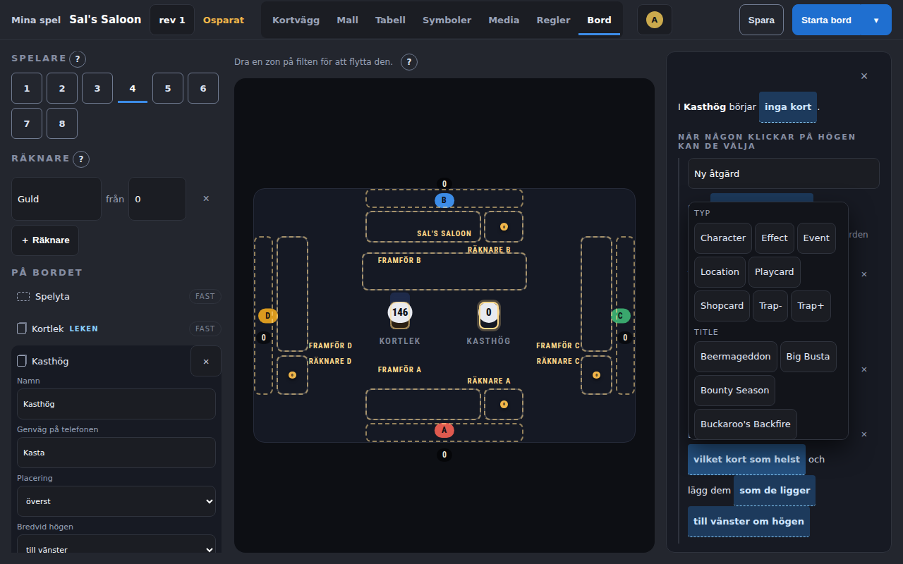
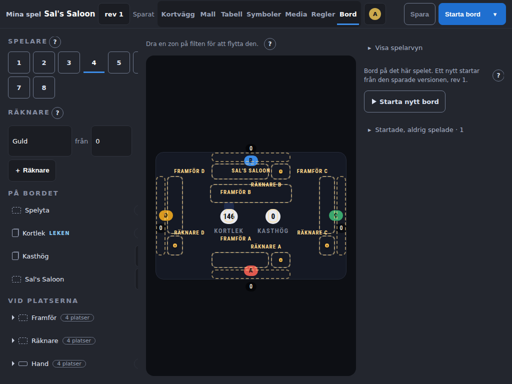

**Ändrat (#480):** alla femton åtgärdade; fynd 2, 4 och 14:s förval efter beslut 2026-09-27, med [prototyperna](2026-09-27/prototyper/index.html) 16–17 som underlag.
Tab går genom filtens handtag utan att välja, och Enter eller Mellanslag väljer; en zons mitt hålls på bordet med en etikett, som #478:s element på kortet.
Vänsterkolumnen ryms i 260 px vid 1024 och har höjd vid 768; fälten är 44 px; ett val på filten rullar fram raden och talen står över filten.
Fokus faller inte till `<body>` efter ×, Delete, Ångra, ett borttaget steg, ett val i en ratt eller «Starta nytt bord»; ett nytt bord sägs i en statusrad och dess grupp öppnas, och ett avslutat bord byter grupp direkt.
Leken säger att den börjar med resten av korten; inklistring landar på ledig filt och ett urklipp kommer tillbaka som sig självt; en åtgärd tas bort med egen knapp och kan ångras; per plats säger ifrån; nya högar lämnar plats åt namnen; bottenkortet säger raden där titlar upprepas.
Frågerutan öppnar på de korta kolumnerna och fäller ihop fritexten; meningarna och talfältet i högens panel är rättade, och «Flytta hela högen» förvalts till den första andra högen.

### 7. Editorn: Symboler, Media, Regler

Sexton fynd; #295–#298, #302, #303, #468 och #469 står kvar lösta. Två höga: **«Ta bort blocket» i
regelboken går inte att trycka på** — `mousedown` blurrar fältet, blocket stängs och knappen försvinner
före `click`, och Tab når den aldrig; och **en symbol kan döpas om till ett namn med mellanslag** som
korten inte kan skriva, så proven går sönder.

| # | Nivå | Fynd | Disp. |
| --- | --- | --- | --- |
| 1 | Hög | `onBlur={onClose}` stänger blocket före knappens `click`; foten står utanför blur-gränsen | AFK |
| 2 | Hög | Namnfältet och `renameIcon` kollar inte `NAME`-regeln (`inline.ts:140`) | AFK |
| 3 | Medel | Uppställningsblockets knappar ostilade tills «Som på bordet» öppnats (`rules.css` lazy) | AFK |
| 4 | Medel | «Häfte för tryck» säger «inga regler» när boken är osparad; sparar inte först | AFK |
| 5 | Medel | Under uppladdning trasig bricka utan besked; källa som inte svarar ser likadan ut; arket svart | AFK |
| 6 | Medel | Samma fil igen: «är tillagd» och befintlig bild byter tyst namn | AFK |
| 7 | Medel | Ctrl+Z i regelfält tar ett tecken i taget (L14) | AFK |
| 8 | Medel | Fil med bara `##` → ingen innehållsförteckning, «＋ Eget avsnitt» försvinner | AFK / HITL |
| 9 | Medel | Efter «Hela bilden» tappas fokus; Escape stänger inte arket förrän man tabbat in | AFK |
| 10 | Medel | Listblock stängs inte av Escape/klick utanför; tomma punkter blir kvar | AFK |
| 11 | Medel | × på symbol/betydelse som kort använder sker utan fråga (Media frågar) | AFK |
| 12 | Medel | Fokus `<body>` efter de flesta avslutande handlingar; Escape stänger inte öppet block | AFK |
| 13 | Låg | Beskärningsarket rullar när bilden sitter på ≥ 5 kort; bildtexten klipps | AFK |
| 14 | Låg | Vid 1024 bryts betydelseraden; × på egen rad | AFK |
| 15 | Låg | Biblioteket markerar inte symboler som redan är i spelet; andra trycket tyst | AFK |
| 16 | Låg | Träffytor: bläckknappar 24×24, frågeremsan 32 px, hörngrepp 12 px synliga | AFK |

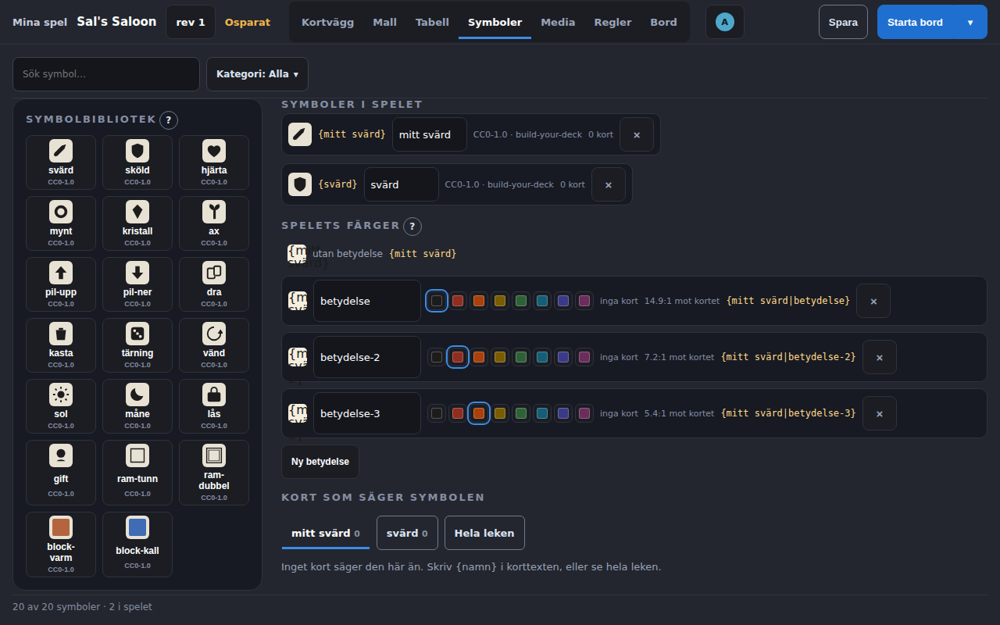

**Ändrat (#481):** alla sexton åtgärdade; fynd 8 efter beslut 2026-09-27 med [prototyp 18](2026-09-27/prototyper/index.html) som underlag (B7:s #202-stycke, L14 och L22 har fått tillägg).
Ett öppet regelblock stänger vid sin egen kant, så «Ta bort blocket» går att trycka på och nås med Tab; Escape stänger alla blockslag, listblocket också, och tomma punkter lämnas inte kvar.
En regelfil utan `#` får sina `##` som avsnitt, spalten och «＋ Eget avsnitt» står kvar, och rapporten säger vad varje rubrik blev.
Ctrl+Z i regelfälten går ordvis och sedan vidare till editorn, med samma kod som tabellens celler; häftet sparar en osparad bok först och säger sina fel i hela meningar.
Uppställningsblocket ritas i bokens stil från start, och fokus landar på något som står kvar efter mall, «Gör boken», importrapporten, luckans ×, «Ta bort» och «Ny betydelse».
En symbol eller betydelse kan inte döpas till ett namn korten inte kan skriva, frågar innan den tas bort när kort skriver den, och biblioteket märker symboler spelet redan har.
Media säger när en bild laddas upp och när den inte gick att hämta, samma bild igen behåller sitt namn, «Hela bilden» lämnar fokus på fönstret och arket hör Escape var fokus än fallit.
Arket rymmer en bild på sex kort vid 1024, betydelseraden är två rader med × bredvid namnet, och bläck och hörngrepp är 44 px.

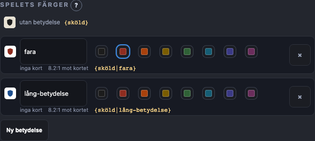
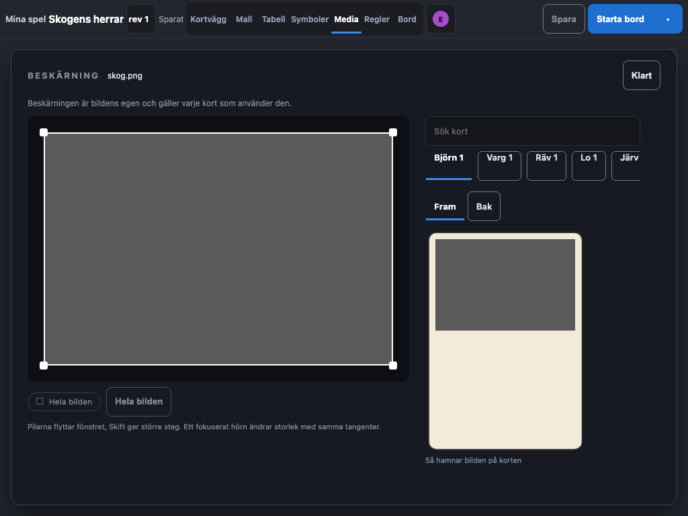

### 8. Bordet — `/table` i bordsläge och TV-läge

Elva fynd. Två höga: **dubbelklick vänder inte kortet** fast hjälpen lovar det (ringens rygg tar andra
trycket och tas bort på `pointerup`, så Chromium skickar aldrig `dblclick`); och **frågan vid ett andra
«Starta spelet» lovar att korten går tillbaka och lekarna blandas om**, medan starten bara kör
designerns startåtgärder — här enbart «Blanda».

| # | Nivå | Fynd | Disp. |
| --- | --- | --- | --- |
| 1 | Hög | `RadialMenu` stänger ryggen på `pointerup`; `dblclick` når aldrig ramen | AFK |
| 2 | Hög | Fast sträng `start.again.text` säger något starten inte gör | HITL / AFK |
| 3 | Medel | Startbrickan ritas över korten hela spelet; kort under den går inte att gripa | HITL |
| 4 | Medel | 18 s offline: ingen notis; släppt kort studsar efter 4 s och utförs vid återanslutning | AFK / HITL |
| 5 | Medel | TV: handens antalsbrickor 13–15 px från kanten, inne i overscan-marginalen (32 px) | AFK |
| 6 | Medel | TV-spaltens text 12–14 px; SENAST klipps vid 211 px och kan inte rullas från soffan | HITL / AFK |
| 7 | Medel | Pekaren får släppa kort i en tom plats hand; adresspanelen utesluter den (K16) | HITL |
| 8 | Låg | Adresspanelen: «På Dolt kort» ×3 och «Blanda» ×2 utan särskiljning | AFK |
| 9 | Låg | Escape i startfrågan lämnar fokus på `BODY` | AFK |
| 10 | Låg | Zonnamnen på bordsfilten 3,0:1 (11 px versaler, rgba 0,45) | AFK / HITL |
| 11 | Låg | Kamerans knappar 40×40 och 34×40 px | AFK |

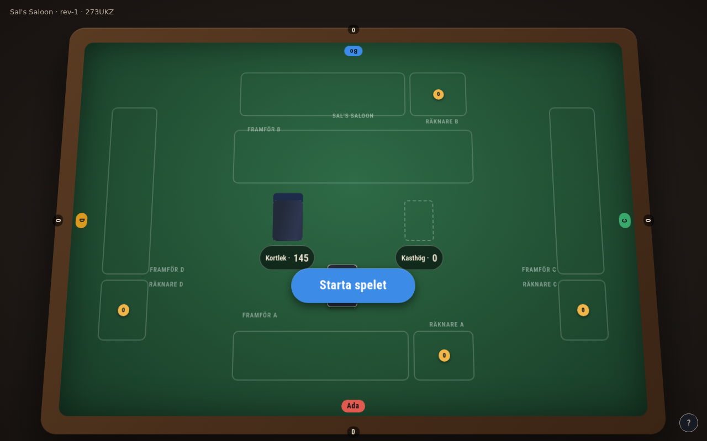
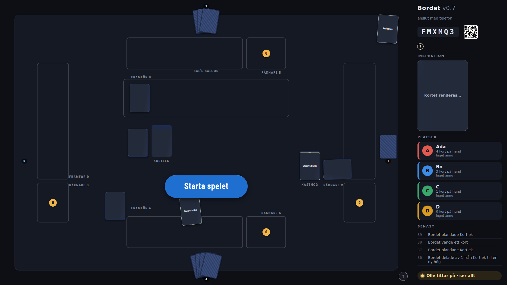

**Ändrat (#482):** alla elva åtgärdade; fynd 2, 3, 5, 6 och 7 efter beslut 2026-09-27, med [prototyperna](2026-09-27/prototyper/index.html) 19–22 som underlag.
Ett andra tryck på ett kort vänder det, också när ringen hunnit öppnas; frågan vid en omstart räknar upp startåtgärderna den kör och säger att korten ligger kvar, och Escape lämnar fokus på knappen.
Efter starten lämnar startbrickan filten och står som «Starta om» i hörnet bredvid «?», så kort som läggs där går att gripa.
Ett drag som bordet inte svarat på säger det i statusraden, och anslutningen står som långsam så länge ett drag väntar.
På TV:n hänger antalet på hand inåt över sin egen solfjäder, utanför overscan, utan att korten krymper.
TV-spalten står i två nivåer — namn 24, antal 20, senaste raden 20, historiken 16 i tre rader — och från sju platser står en plats på en rad, så åtta står hela vid 1080.
Pekaren lägger inga kort i en hand där ingen sitter, som tangentbordet, och säger varför kortet gick tillbaka.
Adresspanelen numrerar platser med samma namn, zonnamnen på filten når 4,5:1 och kamerans knappar har 44 px träffyta.

### 9. Telefonen och anslutningen — `/join`, `/play`

Tolv fynd. Tre höga: **att rulla handremsan i sidled väljer kortet fingret startade på**
(`pointercancel` blir ett tryck); **är regelboken öppen när bordet avslutas målas den över enkäten**
medan trycken går till den osynliga enkäten; och **en återanslutning som aldrig öppnas fastnar på
«Nytt försök om 0 s · försök 1 av 4» för alltid** — bara den första uppkopplingen har en tidsgräns.

| # | Nivå | Fynd | Disp. |
| --- | --- | --- | --- |
| 1 | Hög | `end()` svarar `tap` på `pointercancel`; hålltimern fyrar under långsam rullning; 30 px lyft = tryck | AFK |
| 2 | Hög | Regelpanelen `z-index 40` över enkäten `35`; `inert` ändrar inte målningsordningen | AFK |
| 3 | Hög | `armConnectTimeout` bara när `!everOpen`; uttömd plan säger fortfarande «Vi försöker igen» | AFK |
| 4 | Medel | `/join` vid 320×568: bordets rad 150 px, pillerna hänger 26 px ut över rubrik och etikett | AFK |
| 5 | Medel | Spela-arket namnger kortet med id («Spela shoot-from-the-hip till») | AFK |
| 6 | Medel | Räknarens tal är en `div` med `window.prompt()`: ej fokuserbar, utan namn, 39 px | AFK / HITL |
| 7 | Medel | Tillbakaspolningsfrågan saknar dialogroll och fokus; sidan bakom nåbar; inget besked vid nekat | AFK |
| 8 | Medel | Eget kort vänt ner framför en blir «Dolt kort» även för ägaren | HITL |
| 9 | Medel | Regelboken: Escape stänger inte, × lämnar fokus på `body`; huvudet två rader vid 390 | AFK / HITL |
| 10 | Medel | Efter avslut: fliktiteln kvar på «Din hand», fokus inte till enkäten, omladdning börjar om enkäten | AFK |
| 11 | Låg | Verben under det uppburna kortet står i en rosa ruta (`.byd-inspect > div`) | AFK |
| 12 | Låg | `/join?KOD` utan `code=` ger fel diagnos; tagen plats behåller `aria-pressed`; fokus efter Spela-arket; banderollen täcker Spela…; tangentbordspanel vs tryckark; K4:s omsortering finns inte; lodrät rullning från kort | AFK / HITL |

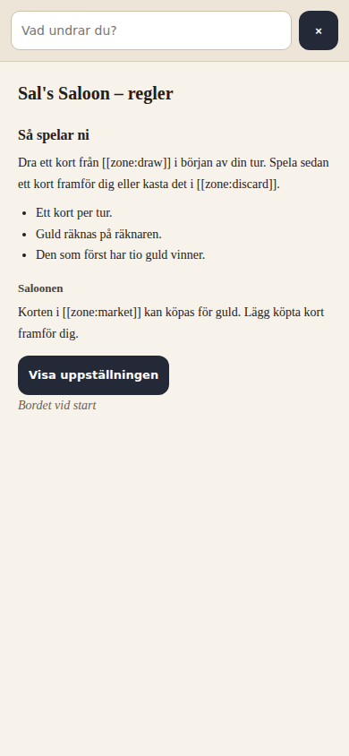
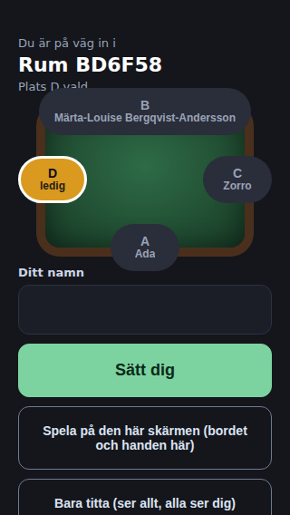

**Ändrat (#483):** alla fynd åtgärdade utom ett; fynd 6, 8, 9 och två delar av 12 efter beslut 2026-09-27 med [prototyperna 30–33](2026-09-27/prototyper/index.html) som underlag (K4 och L48 har fått tillägg).
En tumme som rullar handen väljer inget kort; ett kort som vilat tills det lyft sig och sedan dras i sidled sorteras om, och Alt med en pil gör samma sak.
Enkäten ligger överst när bordet avslutas med regelboken öppen, och varje återanslutningsförsök har en tidsgräns, så planen går vidare och en uttömd plan säger det i ord.
Platsväljaren vid 320 lämnar plats för pillerna, `/join?KOD` läses som koden, och Spela-arket och tangentbordspanelen säger kortets titel och erbjuder samma platser.
Räknarens tal är en knapp som öppnar verktygets sifferknappar, utan gränser; tillbakaspolningsfrågan är en dialog som håller fokus, och den som föreslog får veta när svaret är nej.
Ett eget kort vänt ner framför en själv visas för ägaren med framsidan i ryggens ränder och «nervänt · bara du», och bara ägarens tråd bär det.
«Regler» står i en egen rad längst ner, huvudet håller en rad vid 390 med namnet som ger vika, och boken stängs med Escape och lämnar fokus på knappen.
Efter avslut byter fliken namn, enkäten tar fokus och minns att den skickats; verben under ett uppburet kort är inte längre en rosa ruta.
Kvar: en tagen plats behåller sin ring och `aria-pressed`, eftersom #408 beslutade att valet står kvar tills spelaren flyttar det.

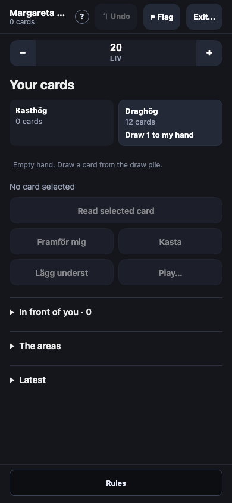
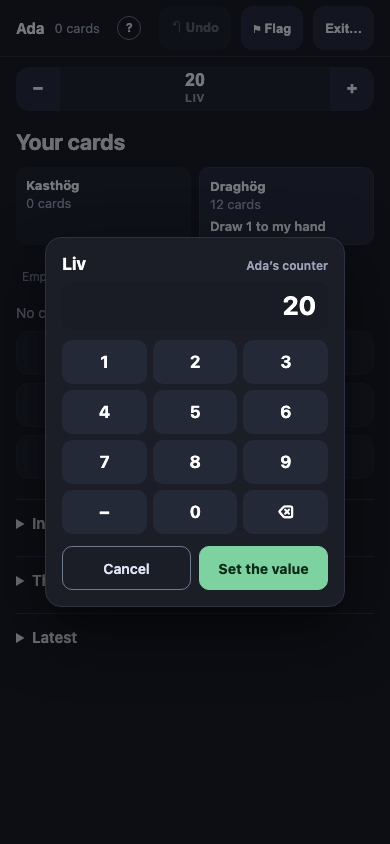

### 10. Distansvyn — `/online`

Femton fynd. Tre höga: **ett kort som släpps utanför filten spelas ändå** — även när det släpps
tillbaka på den egna kolumnen; **Escape avbryter inte ett drag ur handen**, så det finns ingen
ångerväg alls för ett lyft kort; och **med finger öppnar ett tryck på ett filtkort ringen och stänger
den 8 ms senare** (det syntetiska `click` träffar ryggen) — samma kod ligger under `/table` på en
platta.

| # | Nivå | Fynd | Disp. |
| --- | --- | --- | --- |
| 1 | Hög | `play()` projicerar varje punkt genom `toTable` och `keptOnFelt` drar in den på golvet | AFK |
| 2 | Hög | `handDrag.tsx` har ingen tangentlyssnare | AFK |
| 3 | Hög | `RadialMenu.tsx:33` `onPointerUp={onClose} onClick={onClose}` på ryggen | AFK |
| 4 | Medel | Spöket 119×166 px mot 47×63 på filten; ingen zon tänds; inget närvaro-drag | HITL |
| 5 | Medel | Efter spel ur handen via panelen hamnar fokus på första filtkortet | AFK |
| 6 | Medel | «Visa alla»: klick på ryggen stänger inte, Escape dör när fokus lämnar; fokus under mörkret | AFK |
| 7 | Medel | Utgångs-/Flagga-/Avsluta-arken: `aria-modal="true"` men Tab går bakom; delas med `/play` | AFK |
| 8 | Medel | Avvisad plats får bordsskärmens «Bordet hör till ett annat konto» utan «Välj plats igen» | AFK |
| 9 | Medel | 768×1024 ritar 33×45-kort (K9-golv 45) med 250 px död höjd; `BOARD_FLOOR = 600` | HITL |
| 10 | Medel | Touch: tryck/håll på handkort gör inget; enda vägen till Titta är Visa alla | HITL |
| 11 | Låg | Telefonbredd: C2:s «säger var bordet finns» saknas; huvudet radbryts; 320 kräver rullning | AFK / HITL |
| 12 | Låg | Motståndarens drag syns 1,6 s och sedan bara i skärmläsarregionen | HITL |
| 13 | Låg | Handen lyfter spöke medan bordet är låst; släppet försvinner tyst | AFK |
| 14 | Låg | Uttömd återförsöksplan sägs inte; «Till mina spel» leder gäst till `/` | AFK |
| 15 | Låg | Kolumnen klipper namn vid 44 px steg («Stolen Go…» ×2) | HITL |

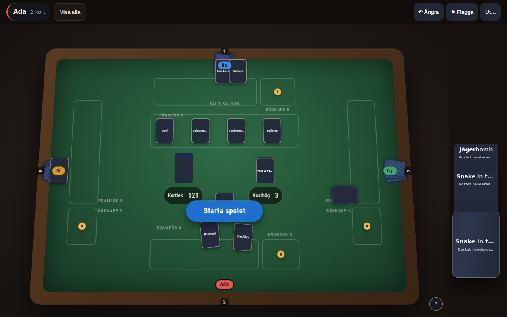
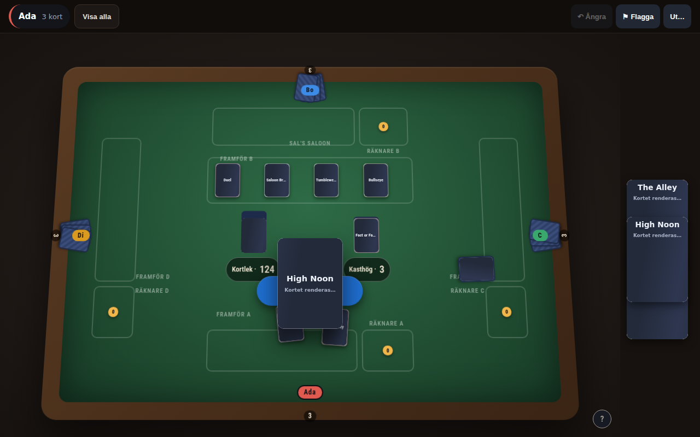

**Ändrat (#484):** alla femton åtgärdade; fynd 4, 9, 10, 11:s 320-del, 12 och 15 efter beslut 2026-09-28, med [prototyperna](2026-09-27/prototyper/index.html) 23–28 som underlag (C2 har fått ett tillägg).
Ett kort ur handen som släpps utanför bordets bild går tillbaka i handen, Escape lägger tillbaka det, och en låst hand lyfter inget; träramen lägger kortet på filten som förut (#66).
Medan kortet bärs är spöket filtens kort över bordet, ytan eller högen under det ramas, en annan plats hand tänder sin kant som K24, och utanför bordet säger handen «Tillbaka i handen».
Ett fingertryck på ett filtkort öppnar ringen och den står kvar, och klicket av trycket kör inget verb; ett tryck på ett handkort öppnar det, och panelen står kvar.
Fokus följer kortet som spelats ur handen; «Visa alla» stängs av Escape var fokus än står, av ett tryck bredvid och av ett spel ur det; arken håller tangentbordet som `aria-modal` lovar.
En avvisad plats får telefonens besked med «Välj plats igen», och ett tappat `/online` erbjuder platsväljaren före vägen hem.
Ett stående fönster får filten först vid 960 px bredd, där kortet når 45 px; en telefon säger var hela bordet står, och bottenraden spelar det valda kortet vid 320.
Topplisten säger vad någon annan senast gjorde och hur länge sedan; kolumnens namn läses på två rader, och hover eller fokus lyfter kortet ut över filtkanten.

### 11. Observatören och statuslägena — `/observe`, D5 över alla rutter

Tolv fynd; D5:s nio lägen håller sin timing och form på alla fem live-rutter, och #76:s vridning står
kvar. Tre höga: **ett projekt som raderas medan editorn är öppen får aldrig ett läge** — vid Spara
skrivs serverns råa `unknown project` ut och arbetet kan inte räddas; **en avvisad eller sparkad gäst
på `/observe` och `/online` får «Bordet hör till ett annat konto» med «Logga in» som primär väg**,
som leder tillbaka till samma döda länk; och **platsväljaren släpper in nya spelare på ett avslutat
bord** och landar dem i en inert hand med en enkät om ett spel de inte spelat.

| # | Nivå | Fynd | Disp. |
| --- | --- | --- | --- |
| 1 | Hög | Raderat projekt: inget läge; `setNotice(result.reason)` skriver «unknown project»; servern stänger inte edit-uttaget | AFK |
| 2 | Hög | `table`-röstens `forbidden` saknar `rescan`; `/observe` och `/online` använder den för gäster | AFK |
| 3 | Hög | `/join` på avslutat bord ser normalt ut; join-endpointen ger token; `JoinPage` känner bara `gone`/`offline` | AFK |
| 4 | Medel | Observatören ser inte tillbakaspolningsförslaget (ingen `standingRewind`/`previewOf`) | AFK |
| 5 | Medel | Observatörens live-regioner tysta hela sessionen; toasten en `div` utan roll | AFK |
| 6 | Medel | Flaggarket `aria-modal` utan fokusfälla; Escape dör utanför; fokus `body` vid stängning | AFK |
| 7 | Medel | Utloggad i annan flik: editorn återansluter 37–46 gånger per 8–10 s utan besked | AFK |
| 8 | Medel | Editorns tappade lina är en egen remsa, inte D5-modellen; «Sparat och uppkopplat igen» används aldrig | AFK |
| 9 | Medel | Telefon: tryck på kort ger ingen synlig inspektion; med lådan öppen krymper filten till 319/199 px | HITL |
| 10 | Medel | Okänt bord på gäströster: «Starta ett nytt bord från Mina spel» och «Till mina spel» → inloggning; ingen `rescan` | AFK |
| 11 | Låg | `/play` `forbidden` har två primärknappar (L13) | AFK |
| 12 | Låg | `cursor: grab` över kort observatören inte får dra; rollnoten dold på telefon; fokus efter «Försök nu» | AFK |

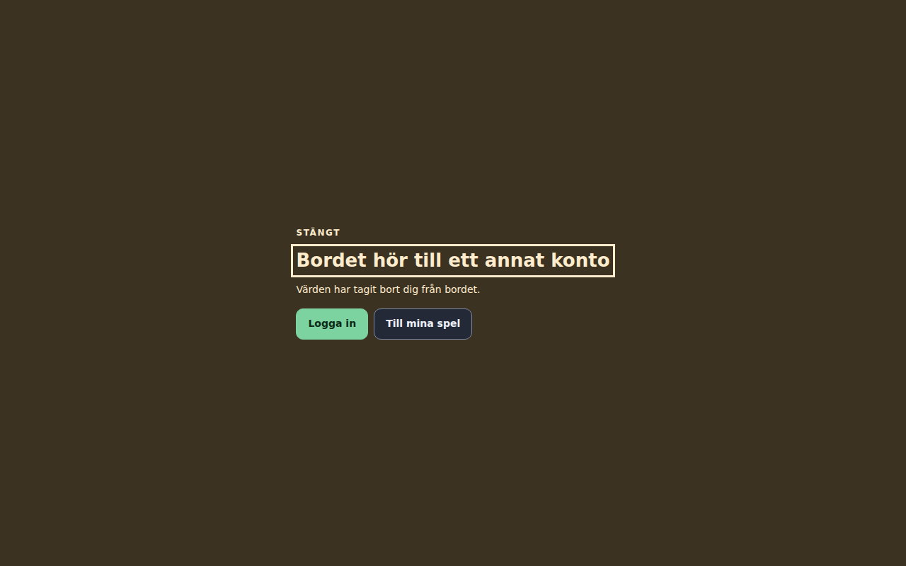
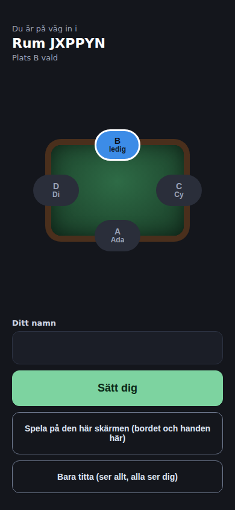

## Mönster som återkommer

Det här är de fynd som står på flera sidor. De löses en gång, på den sida där de står först, och
följs sedan upp på de andra.

| Mönster | Sidor | Löses på |
| --- | --- | --- |
| Fokus faller till `<body>` efter handlingar som tar bort eller låser den kontroll som hade fokus | alla | 1, som regel; varje sida verifierar |
| Escape och klick utanför stänger inte menyer, ark, block och listor | 1, 7, 9, 10 | 1 (`HelpBox`/`doors.ts` är förlagan) |
| Ark med `aria-modal="true"` som inte fångar fokus (`SessionSheets.tsx`) | 9, 10, 11 | 9 |
| Fel sagda som statuskoder eller på engelska («… : 400», «Failed to fetch», «unknown project») | 2, 3, 7, 11 | 2 |
| `Number('')` blir 0 och skrivs per tangent i mätfält, `antal` och räknare | 4, 5, 9 | 4 |
| Träffytor under 44 px i den delade `Question` och i frågeremsor | 1, 5, 7, 8, 9 | 5 |
| Ringens rygg stänger på `pointerup`/`click`: äter dubbelklick och fingertryck (`RadialMenu.tsx`) | 8, 10 | 8 |
| Återanslutning utan tidsgräns och utan besked när planen är slut (`client.ts`, `ProjectClient.ts`) | 9, 10, 11 | 9 |
| Ingen `scrollIntoView` när något väljs eller skapas | 3, 5, 6 | 3 |
| Saker kan dras helt utanför sin yta utan ord (element, zon, kort ur handen) | 4, 6, 10 | 6 (L30 är förlagan) |
| Gäströsternas statuslägen saknar `rescan` och pekar på konto | 10, 11 | 11 |
| Inbjudningslänken `/invites/<token>` svarar med rå JSON | 1, 3 | 1 |

## Summering

| Sida | Fynd | Höga | Issue |
| --- | --- | --- | --- |
| 1. Start och konto | 13 | 3 | #475 |
| 2. Guidad start | 12 | 2 | #476 |
| 3. Editorn: ram och Kortvägg | 17 | 4 | #477 |
| 4. Editorn: Mall | 14 | 3 | #478 |
| 5. Editorn: Tabell | 13 | 4 | #479 |
| 6. Editorn: Bord | 15 | 4 | #480 |
| 7. Editorn: Symboler, Media, Regler | 16 | 2 | #481 |
| 8. Bordet | 11 | 2 | #482 |
| 9. Telefonen och anslutningen | 12 | 3 | #483 |
| 10. Distansvyn | 15 | 3 | #484 |
| 11. Observatören och statuslägena | 12 | 3 | #485 |
| **Summa** | **150** | **33** | #474 |

Det överordnade issuet är #474. Sidorna tas i nummerordning; varje stängt issue får en rad här under
sin rubrik om vad som ändrades.

## Klar-kriterium

Granskningen är klar när varje sida ovan har sitt issue stängt med fynden åtgärdade eller strukna med
motivering, när mönstren är lösta på ett ställe och verifierade på varje sida de nämns, och när
kvalitetsgrinden är grön. Nästa fulla kontroll görs enligt [UX-KONTROLLER](UX-KONTROLLER.md) efter
att sidorna arbetats av — då mot en stack med render-worker, så att korten också granskas som
texturer.
