# Läsbarhetsgranskning 2026-09-28: kortet på spelytorna, en sida i taget

Beställningen: *«Gör en granskning från ett användarperspektiv där vi fokuserar på hur lätt det kommer vara att läsa kort på spelytorna.
Text ska uppfylla vettiga krav på presenterad storlek, och där de inte gör det måste vi tänka om presentationen.
Man ska t.ex. inte behöva zooma in och ut ofta för att kunna speltesta spelet.
Sätt upp en plan för att gå igenom en sida i taget.
Skapa issues för dessa så tar en agent en sida åt gången så att vi får en helhet.»*

Det här dokumentet är fyra saker: måttstocken (vad «vettig presenterad storlek» är, per skärm), inventeringen av spelytorna, mätningen av varje yta med riktiga korttexturer, och planen för att arbeta av dem en i taget.
Det är den uppföljning [granskningen 2026-09-27](2026-09-27.md) bad om i sitt klar-kriterium: *«då mot en stack med render-worker, så att korten också granskas som texturer»*.

## Sammanfattningen i en mening

**Ingen spelyta visar ett korts brödtext i läsbar storlek utan en extra handling, och tre av dem — TV:n, telefonens bild av bordet och observatören — har ingen handling som räcker.**

Kortet ritas på filten i 36–85 px bredd beroende på yta och skärm.
Med en vanlig kortmall (brödtext 8,5 pt, titel 12 pt på ett 63 × 88 mm-kort) är det **2–4 px brödtext och 3–6 px titel**.
Det är inte «litet»; det är under vad någon skärm kan rita en bokstav i.
Filten identifierar alltså kort på färg, form och bild, aldrig på text — och det är i sig inget fel, det står i K9 och K18.
Felet är vad som händer när man vill läsa: varje yta har sin egen väg dit, vägarna kostar två till tre tryck per kort, den största av dem når precis 12 px, och på TV:n och i telefonens bordsöversikt finns ingen väg alls.

## Måttstocken

Ingen av besluten i DESIGN-BESLUT säger vad **läsbar** är på skärm.
E5 och E6 sätter 6 pt som golv **i tryck** (`minPtByScript` i `packages/engine/src/typedef.ts`), K9 ger filtens kort ett golv på 45 px kortsida och K18 räknar läsbarhet i «kortets kortsida på tre meters håll» — men ingen av dem säger hur stor **texten på kortet** blir när kortet ritas i 45 px.
Den räkningen är enkel och står här så att den inte behöver göras om:

> Textens storlek på skärmen i px = textens punktstorlek × 0,3528 mm/pt × (kortets ritade bredd i px ÷ 63 mm).
> Med 8,5 pt brödtext ger det **0,048 × kortbredden**; med 12 pt titel **0,067 × kortbredden**.

Tabellen är alltså inte något att tycka om, bara att slå upp:

| Ritad kortbredd | 8,5 pt brödtext blir | 12 pt titel blir |
| --- | --- | --- |
| 45 px (K9:s golv) | 2,1 px | 3,0 px |
| 85 px (TV 1080p, 4 platser) | 4,0 px | 5,7 px |
| 112 px (distansvyns hand, K17) | 5,3 px | 7,5 px |
| 154 px (telefonens remsa) | 7,3 px | 10,3 px |
| 180 px (distansvyns hover) | 8,6 px | 12,1 px |
| 252 px (K8:s «Titta») | 12,0 px | 16,9 px |
| 335 px (telefonens «Läs valt kort» vid 390) | 15,9 px | 22,5 px |

Omvänt: **för 12 px brödtext måste kortet ritas 252 px brett, för 14 px 294 px, för 24 px 504 px och för 28 px 588 px.**

Vilka px som räcker beror på hur långt bort skärmen är.
De golv som föreslås nedan är inte beslutade; de är den första skivans fråga (se planen) och står här som det förslag mätningen är gjord mot.
Källorna är de vanliga plattformsriktlinjerna, eftersom WCAG inte sätter någon minsta storlek utan bara kräver att text går att förstora (1.4.4).

| Skärm | Avstånd | Golv för all text | Brödtext man ska läsa | Källa |
| --- | --- | --- | --- | --- |
| Telefon i handen | 30–40 cm | 12 px | 14–16 px | Apple HIG: minst 11 pt, brödtext 17 pt; Material: minst 12 sp, brödtext 14–16 sp |
| Skrivbord, laptop, platta | 50–70 cm | 12 px | 14–16 px | samma riktlinjer; L12 |
| TV i vardagsrummet | ~3 m (K9) | 24 px | 28–32 px | Android TV/«10-foot UI»: minst 12 sp = 24 px vid 1080p, brödtext 14–16 sp |

En 4K-TV räknas som 1920 × 1080 CSS-px vid DPR 2, alltså samma tal som 1080p.
K18:s rad för 3840 × 2160 mätte en skärm med DPR 1, och den skärmen finns i praktiken inte som TV; mätningen nedan tog den ändå och fann att TV:ns spalt då står i samma 360 px och 20 px som vid 1080p, vilket är ett tal att ha med sig om DPR 1 någon gång blir verkligt.

## Metod

Den riktiga webbappen från Vite på egna portar, servern med minneslagring och `AUTH_BYPASS`, **och render-workern igång** så att varje kort bär sin riktiga textur (E2, 150 dpi, 372 × 520 px).
Syntetiska data: `spelkortDoc` — **Sal's Saloon**, 77 kort, fyra platser — och ett bord där sju kort delats ut per hand, fyra kort ligger uppvända i Sal's Saloon, tre i kasthögen, ett uppvänt framför varje plats och två lösa på filten.
Riggen står som `packages/server/scripts/prototype/run-lasbarhet.ts` tills granskningen är klar; det är `run.ts` på portarna 8319/5319 med det bordet.

Varje yta öppnades i Chromium via Playwright, med `locale: sv-SE`, touch på telefonbredderna, och mättes först när **varje** `img.byd-texture` på sidan var laddad.
Måtten är `getBoundingClientRect()` på texturbilden, aldrig på den satta storleken, och textstorlekarna i tabellerna är räknade ur dem med formeln ovan för Sal's Saloons mall (titel 12 pt, typ 8,5 pt, brödtext 8,5 pt), som också är wizardens ramars storlekar (13 pt titel, 8,5 pt brödtext i `frames.ts`).
Bredderna följer [UX-KONTROLLER](UX-KONTROLLER.md) och L12.
Bilderna ligger i [`2026-09-28/`](2026-09-28/).

Ej granskat: Postgres och R2, riktig TV-hårdvara och riktigt avstånd (talen är räknade, inte sedda från en soffa), skärmläsare, och andra kortmallar än Sal's Saloon — en mall med 7 pt brödtext får 18 % mindre än varje tal här, och en med 10 pt får 18 % mer.

## Inventeringen

| # | Sida | Rutt | Vem läser, på vilket avstånd | Bredder | Kod |
| --- | --- | --- | --- | --- | --- |
| 0 | Måttstocken | — | beslutet som alla sidor mäts mot | — | DESIGN-BESLUT, `packages/web/test` |
| 1 | Telefonen | `/play`, telefonläget av `/online` | spelaren, i handen | 390, 320, 768 | `player/` |
| 2 | TV:n | `/table?mode=tv` | hela rummet, tre meter | 1920 × 1080, 1280 × 800 | `table/TvChrome`, `table/TableRenderer` |
| 3 | Bordsläget | `/table?mode=table` | gruppen runt en platta eller laptop, en armlängd | 1280 × 800, 1440 × 900, 1920 × 1080, 1024 × 768 | `table/` |
| 4 | Distansvyn | `/online` | spelaren vid sin egen skärm | 1280 × 800, 1920 × 1080, 1024 × 768, 768 × 1024 | `online/`, `table/` |
| 5 | Observatören | `/observe` | testledaren, vid skärm eller i handen | 1280 × 800, 1920 × 1080, 390 | `observer/` |
| 6 | Editorn | `/editor` → Kortvägg, Mall | designern, som ska kunna se hur kortet läses på skärm innan bordet startas | 1280 × 800, 1920 × 1080 | `editor/DeckWall`, `editor/TemplateCanvas` |

Sidorna är de rutter som ritar ett kort med sin textur, plus editorns två flikar som visar kortet i en storlek designern ser det i.
Anslutningen (`/join`), start- och kontosidorna och statuslägena ritar inga kort och är inte med.

## Fynden per sida

Talen är mätta bredder på texturbilden, och i parentes vad Sal's Saloons brödtext och titel blir i px.
«Väg till läsning» är vad en spelare måste göra för att se ett kort i den största storlek ytan har, och hur stor den är.

### 1. Telefonen — `/play`

Telefonen är den yta som **kommer närmast**: «Läs valt kort» når 335 px vid 390 (16 px brödtext) och det räcker.
Men det är den enda väg som räcker, den kostar tre tryck per kort, och den finns bara för de egna korten.

| # | Nivå | Fynd | Disp. |
| --- | --- | --- | --- |
| 1 | Hög | Remsans kort är **154 px** vid varje bredd — 390, 320 **och 768** (`.byd-player .byd-strip-card { flex-basis: 154px }` slår K10:s `62vw`): brödtext 7,3 px, titel 10,3 px. Handen går att känna igen men inte läsa; vid 768 står sex kort på 154 px i en 768 px bred remsa | HITL |
| 2 | Hög | Att läsa ett kort i handen är **tre tryck**: välj kortet, «Läs valt kort», «Stäng». En hand på sju kort är 21 tryck för att veta vad man har; K10:s «tryck inspekterar i fullstorlek» blev #156:s «välj → läs → spela» | HITL |
| 3 | Hög | **Andras kort går inte att läsa alls.** Översikten under «Ytorna» säger «Sal's Saloon · 4 kort», «Framför B · 1 kort» — namn och antal (L48), aldrig korten. Den som ska köpa ur saloonen eller svara på vad Bo spelade har ingen väg till kortets text på sin egen skärm, och TV:n ger den inte heller (sida 2). Vid en TV är det den yta som finns | HITL |
| 4 | Medel | «Framför dig»-remsan är **144 px** (6,9 px brödtext), mindre än handens, med sin egen läsknapp per kort | AFK efter 1 |
| 5 | Medel | «Läs valt kort» vid 320 × 568 når 275 px (13 px brödtext) — över golvet men under brödtext; vid 768 når den 660 px (31 px) och kortet är större än det behöver vara medan remsan bakom det är 154 | AFK efter 1 |
| 6 | Låg | «Senast» säger «Bo vände ett kort» — raden säger aldrig **vilket** kort, så den kan inte heller vara vägen till det (#411:s fynd om id i stället för namn är lagat, men namnet står inte i raden) | AFK |

Väg till läsning: egna kort 3 tryck → 335 px (16 px); andras kort ingen.

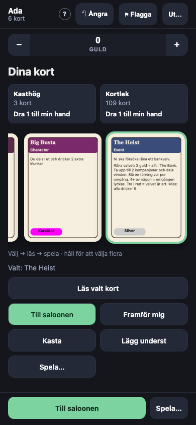
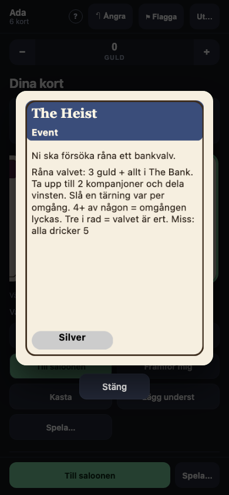
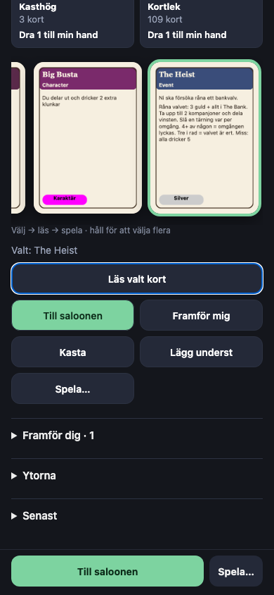

**Åtgärdat 2026-09-28 (#507, beslut A efter [prototypen](2026-09-28/prototyper/507/README.md)).**
Ett tryck håller upp kortet i K26:s läsbredd och väljer det: 294 px vid 320 (14,1 px brödtext) och 336 px vid 390 och 768 (16,1 px), mätt på texturbilden i den byggda appen.
‹ › och svep går igenom raden, så en hand på sju kort läses med ett tryck och sex steg i stället för 21 tryck.
«Ytorna» visar korten i varje öppen yta med samma tryck (fynd 3), och kortet framför en själv hålls upp i samma läsbredd (fynd 4 och 5).
Remsan följer skärmen: 112 · 133 · 200 px vid 320 · 390 · 768 (fynd 1).
«Senast» säger kortets namn när läsaren får se kortet, «Bo vände Björnen», och «ett kort» annars (fynd 6).

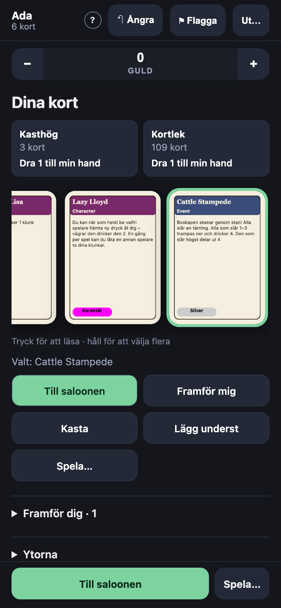
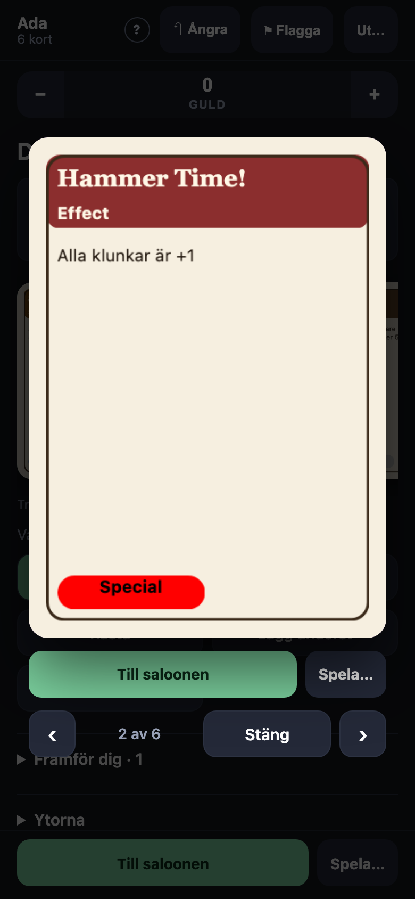
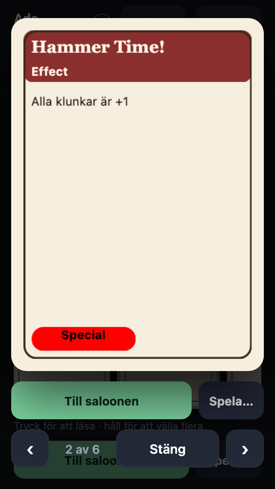
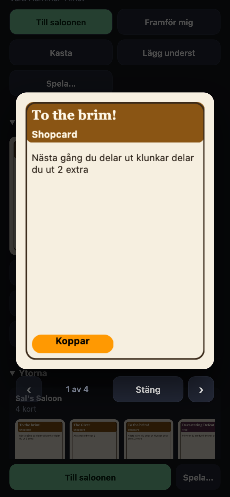

### 2. TV:n — `/table?mode=tv`

TV:n är den yta där **avståndet är störst och texten minst**.
K9 valde hela bordet på 82 px framför ett utsnitt på 116, och lät INSPEKTION vara «det kort rummet läser» (K8, reviderad 2026-09-15).
Mätt är INSPEKTION 177 px bred vid 1920 × 1080: **8,4 px brödtext och 11,9 px titel**, på en skärm där golvet för att läsa något alls är 24 px.

| # | Nivå | Fynd | Disp. |
| --- | --- | --- | --- |
| 1 | Hög | INSPEKTION är **177 × 247 px** vid 1920 × 1080 (`height: 266px` i `table.css`, krympt av spalten): 8 px brödtext på tre meters håll. Panelen som ska vara rummets läsning läser ingen | HITL |
| 2 | Hög | Rummet kan inte **välja** vad INSPEKTION visar: TV:n har ingen pekare, och vilotillståndet är kortet den senaste raden handlade om (K8). Ett kort som lades för två drag sedan, eller ett av fyra i saloonen, går inte att slå upp från soffan eller från en telefon | HITL |
| 3 | Medel | Filtens kort är 75–85 px (3,6–4 px brödtext) vid 1080p och 44–50 px vid 1280 × 800; K18 säger 45 px vid åtta platser. Det är K9:s beslut och står kvar — men det är därför 1 och 2 inte får vara som de är | — (beslut) |
| 4 | Medel | Spalten är **360 px vid varje skärmbredd** (`grid-template-columns: 1fr 360px`), så INSPEKTION kan inte växa där rum finns: vid 1080p tar filten 1 460 px av 1 920 och är höjdbunden, alltså är bredd upp till omkring 1 400 px gratis (K9 2026-09-15) | HITL med 1 |
| 5 | Låg | Vid 3840 × 2160 CSS-px står spalten i samma 360 px och INSPEKTION i 190; talet gäller bara om en TV någonsin kör DPR 1 | — |

Väg till läsning: ingen egen; INSPEKTION visar senaste kortet i 177 px (8 px).

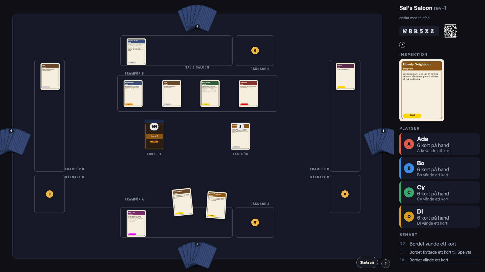

**Åtgärdat 2026-09-28 (#508, beslut B, K8):** fynd 1 och 2 genom «Visa för alla».
En telefon (presence `show`, K6) eller TV:ns eget «Titta» håller upp ett kort över filten: 672 px brett, **32,2 px brödtext** vid 1920 × 1080 (mätt på texturbilden i den byggda appen), med vem som visar och en nedräkning på 15 sekunder.
Vilan, spalten och filtens kortsida är orörda; fynd 4 behövdes inte, eftersom prototypen visade att en bredare spalt ändå inte når golvet och kostar K9.
TV:n ritar bara ett kort den själv ser uppvänt.
Telefonens knapp kommer med läsvyn för andras kort (#507).

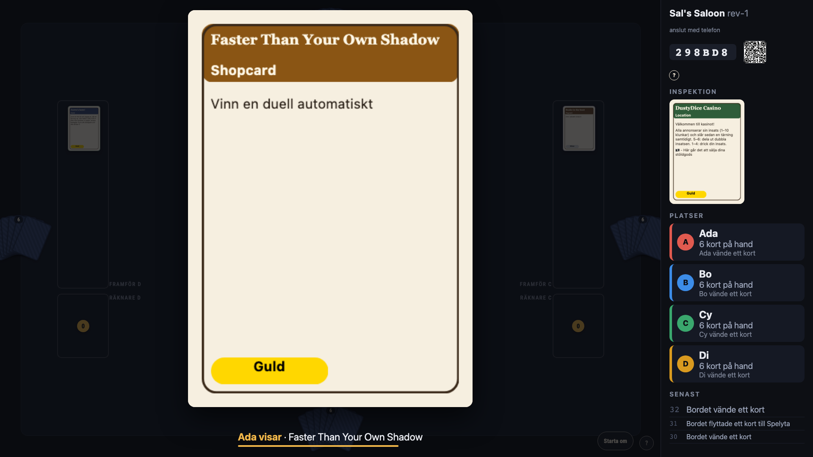

### 3. Bordsläget — `/table?mode=table`

En platta eller laptop som ligger på bordet och delas av gruppen.
Avståndet är en armlängd, så golvet är 12 px och brödtext 14 — och «Titta» når exakt 12.

| # | Nivå | Fynd | Disp. |
| --- | --- | --- | --- |
| 1 | Hög | Filtens kort är 47–55 px vid 1280 × 800, 42–49 vid 1024 × 768 och 60–71 vid 1920 × 1080: 2–3 px brödtext. Att läsa ett kort är **klick → ringen → «Titta» → Escape**, tre handlingar, och kortet i «Titta» är 252 px (12 px brödtext, 17 px titel) — på golvet, under brödtext, vid varje skärm | HITL |
| 2 | Medel | K8 säger «tryck-och-håll visar kortet i full upplösning»; ett håll på filten öppnar ringen (K14) och inte kortet. Beslutet och ytan säger olika saker, och den snabba vägen K8 beskriver finns inte | AFK/beslut |
| 3 | Medel | «Titta» är **252 × 352 px i fasta pixlar** (`.byd-inspect > [data-inspect]`) oavsett fönster: vid 1920 × 1080 finns 700 px höjd att ta, och en textur på 372 × 520 px visas i 252 | AFK efter 1 |
| 4 | Låg | Ringens verb ligger över grannkorten medan den är öppen (bilden), så det kort man vill titta på härnäst är delvis täckt | AFK |

Väg till läsning: 3 handlingar → 252 px (12 px).

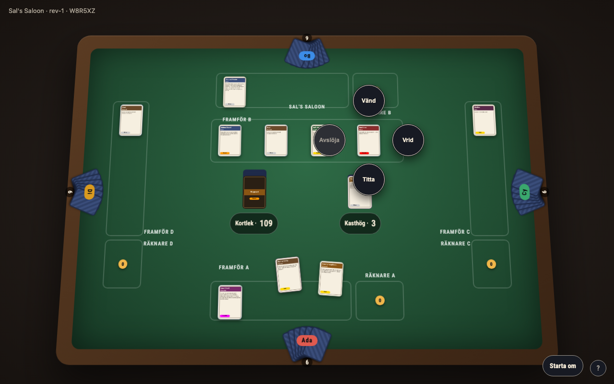
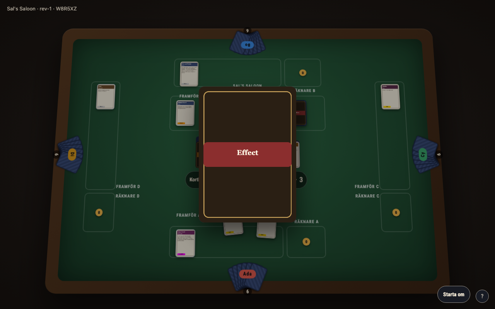

**Ändrat 2026-09-28 (#509, K8, K26).**
Första trycket, klicket eller hållet på ett uppvänt kort lyfter det upp bredvid sig självt i 0,62 av fönstrets höjd, och en mus som vilar på kortet gör detsamma; ringen står bakom ett andra tryck, som lägger ner kortet och öppnar ringen kring det.
Prototypen hade tre varianter (lyft, lässpalt, kortet med verben); beställaren valde lyftet, eftersom spalten tog filtens kort till 28–32 px vid 1024 × 768 och 36–42 vid 1280 × 800, under K9:s 45.
Uppmätt med riktiga texturer: 341 px kort och 16,4 px brödtext vid 1024 × 768, 355 och 17,0 vid 1280 × 800, 479 och 23,0 vid 1920 × 1080 — en handling, över skrivbordets 14 px vid varje skärm.
Filtens kort är orörda (lyftet ligger ovanpå filten och tar ingen plats ur den), så inget K9-, K17- eller K18-tal föll.
Ringens «Titta» håller upp kortet på samma sätt i stället för i fasta 252 px (fynd 3).
Fynd 4 — ringens verb över grannkorten — står kvar; läsningen behöver inte längre ringen, men ringen täcker fortfarande grannarna medan den är öppen.
Grindarna är `packages/web/test/felt-lift.test.tsx` (storleken mot K26:s modul och gesterna) och `packages/e2e/test/table-read.spec.ts` (resan i den byggda appen).
Samma renderare ritar distansvyns filt, så sida 4:s fynd 4 följer med.

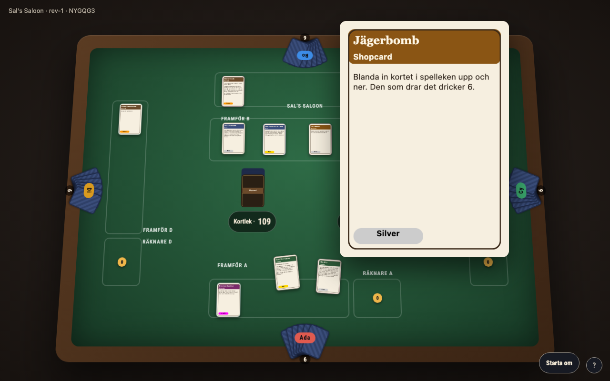
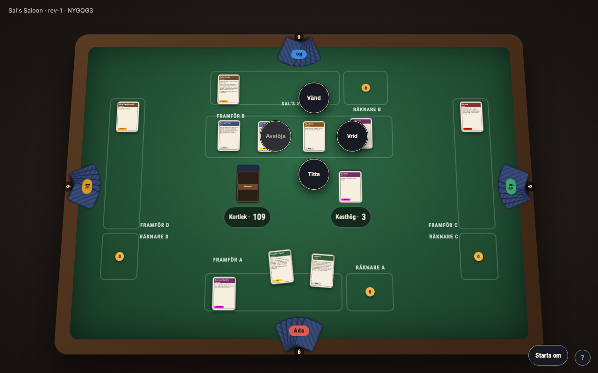

### 4. Distansvyn — `/online`

Distansvyn har **flest vägar och ingen som räcker**: handen i 112 px, en hover som lyfter kortet till 180 px, «Visa alla» som lägger ut samma 112 px utan överlapp, och ringens «Titta» på 252 px.

| # | Nivå | Fynd | Disp. |
| --- | --- | --- | --- |
| 1 | Hög | Handkolumnens kort är **112 px** (`FAN_CARD_PX`, K17): 5,3 px brödtext, 7,5 px titel. K17 kallade 112 px «läsbar storlek» från prototyp B, men det talet mättes på kortets ram och aldrig på dess text | HITL |
| 2 | Hög | Hover lyfter kortet till **180 px** (`.byd-col-peek`): 8,6 px brödtext, 12 px titel — under golvet på skrivbord. Det är den snabba vägen och den räcker inte; den finns inte heller med finger (#484 fynd 10 gav trycket «Titta» i stället) | HITL med 1 |
| 3 | Medel | «Visa alla» är samma 112 px i ett rutnät: läsbart som *vilka* kort, inte som *vad* de säger. K17:s «hela handen läsbar samtidigt» är sann om kortens ramar och falsk om deras text | HITL med 1 |
| 4 | Medel | Filten är 43–49 px vid 1280 × 800 och 36–41 vid 1024 × 768 (2 px brödtext); «Titta» på ett filtkort är tre handlingar och 252 px, som bordsläget. Andras spelade kort och saloonen läses alltså i 12 px efter tre handlingar var | HITL med sida 3 |
| 5 | Medel | Vid 768 × 1024 och 390 är handen telefonens remsa (K10, #99) med samma **154 px** vid 768 — sida 1:s fynd 1 gäller här och löses där | följer sida 1 |
| 6 | Låg | Kolumnens namn under det täckta kortet (#484 fynd 15) står i 13 px och är det enda på ytan som läses utan att göra något; det är den bästa läsbarheten distansvyn har i vila | — |

Väg till läsning: hover → 180 px (8,6 px); tre handlingar → 252 px (12 px).

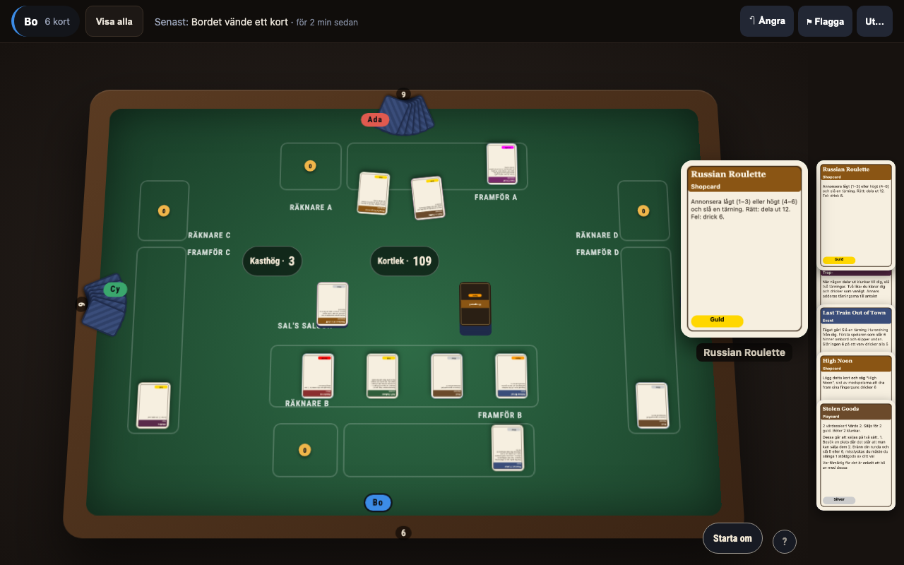
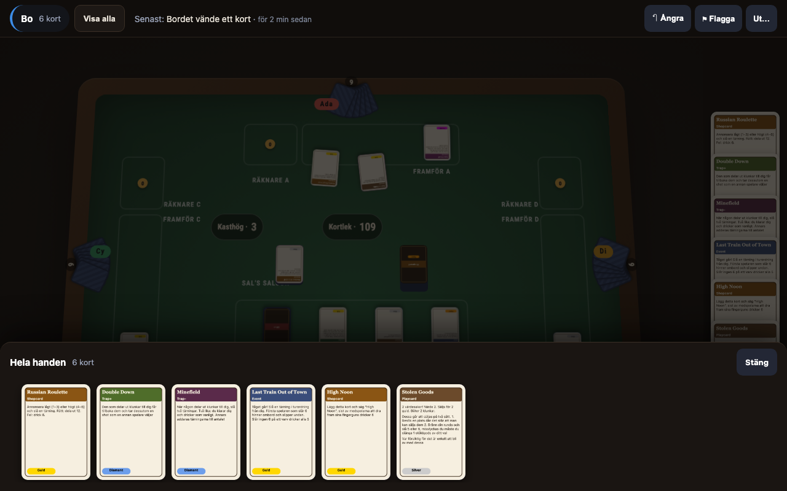
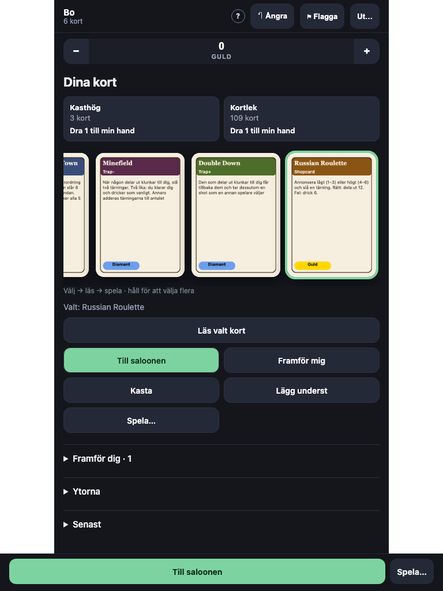

**Ändrat 2026-09-28 (#510, K17, K26).**
Hover, fokus eller ett tryck på ett kort i handkolumnen lyfter det bredvid kolumnen med filtlyftets form (#509); ett andra tryck öppnar adresspanelen.
Uppmätt med riktiga texturer: 341 px / 16,4 px brödtext vid 1024 × 768, 355 / 17,0 vid 1280 × 800, 479 / 23,0 vid 1920 × 1080 — mot hoverns 180 px / 8,6.
«Visa alla» ritar korten i 295 px (14,2 px brödtext) vid 1024 och 1280 och 336 (16,1) vid 1920, utan sidledsrullning.
Filtens kort är orörda (36–41 / 43–49 / 61–69 px), och fynd 4 löstes redan av #509; fynd 5 följer #507.
På vägen hittades att allt som ritas fast över kolumnen låg i den och fick den att hoppa 45 px, så att fel kort lyftes; det ritas nu bredvid listan.
Prototypen hade tre varianter (bred kolumn, lyft, handen hålls upp); beställaren valde lyftet.

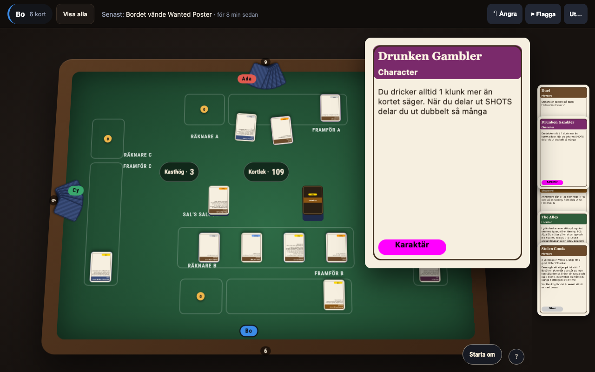
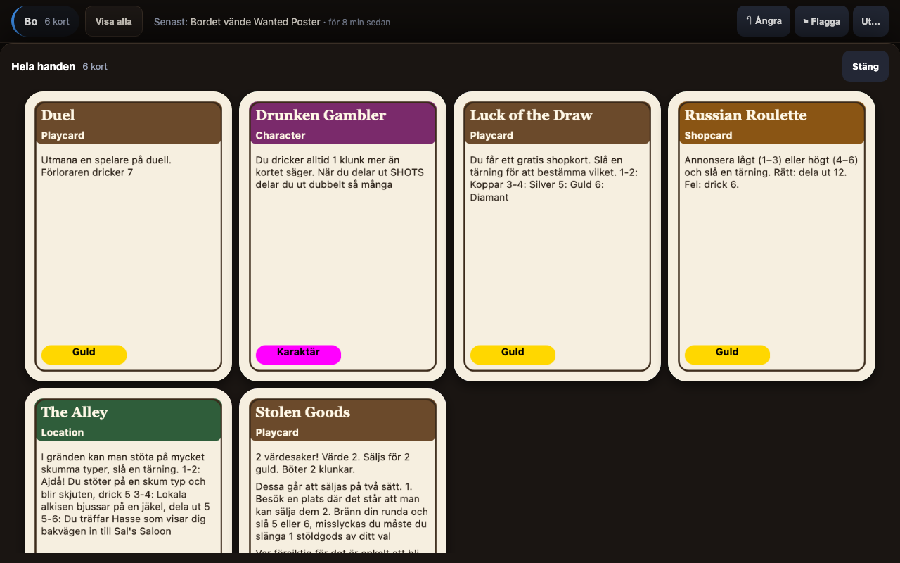

### 5. Observatören — `/observe`

Observatören **ser allt** (C8) — alla händer ligger uppvända — **i 34–43 px**.
Hon ser tjugofyra handkort och kan läsa noll av dem.

| # | Nivå | Fynd | Disp. |
| --- | --- | --- | --- |
| 1 | Hög | Filten är 36–43 px vid 1280 × 800 med händerna på (24 handkort på 34–43 px, 1,6–2 px brödtext) och 56–72 px vid 1920 × 1080. Hela poängen med rollen — att se in i händerna — är en poäng man inte kan läsa | HITL |
| 2 | Hög | INSPEKTION i observatörens spalt är **138 px** (6,6 px brödtext, 9,3 px titel) — mindre än TV:ns 177, på ett avstånd där golvet är 12. Hovern är ett steg och landar under golvet | HITL med 1 |
| 3 | Medel | På telefon (390) håller ett tryck upp kortet i 252 px (#485 fynd 9, prototyp 34): 12 px brödtext, på golvet — och det är den enda av observatörens vägar som når det | AFK efter 1 |
| 4 | Låg | Handfläktarna sprids tvärs sina zoner på sidoplatserna (K9 #84 lämnade det som öppen fråga), så handkorten där är delvis under varandra även i 43 px | — (K9:s fråga) |

Väg till läsning: hover → 138 px (6,6 px); telefon: tryck → 252 px (12 px).

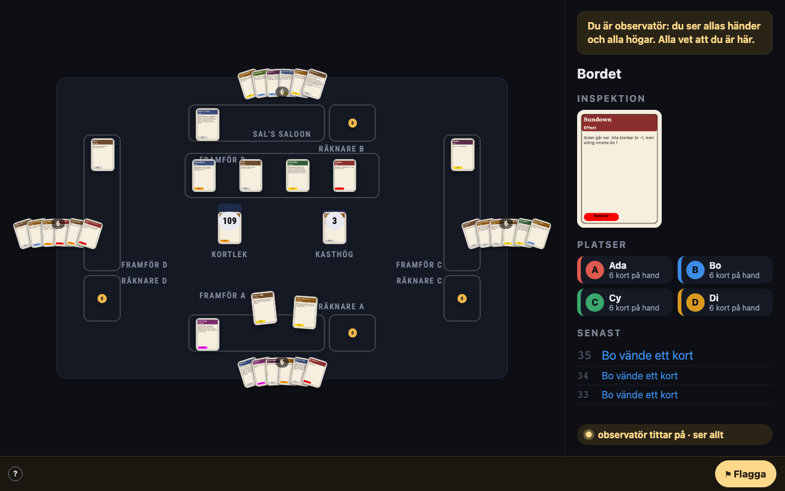
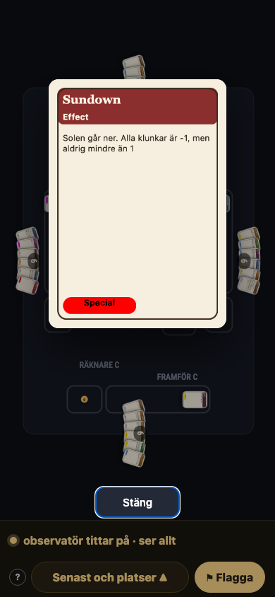

**Åtgärdat 2026-09-28 (#511, beslut A, C8):** fynd 1 och 2 genom lyftet.
En vilande mus eller ett tryck på ett kort, också i en hand, lyfter det bredvid sig: **355 px och 17,0 px brödtext** vid 1280 × 800, 479 px och 23 px vid 1920 × 1080 (mätt i den byggda appen).
Korten i händerna svarade tidigare inte på pekaren alls, så INSPEKTION kunde aldrig visa ett handkort; nu gör de det, och INSPEKTION fylls också från dem.
Filten, kolumnen och det observatören får över tråden är orörda; fynd 3 (telefonens tryck) står kvar.

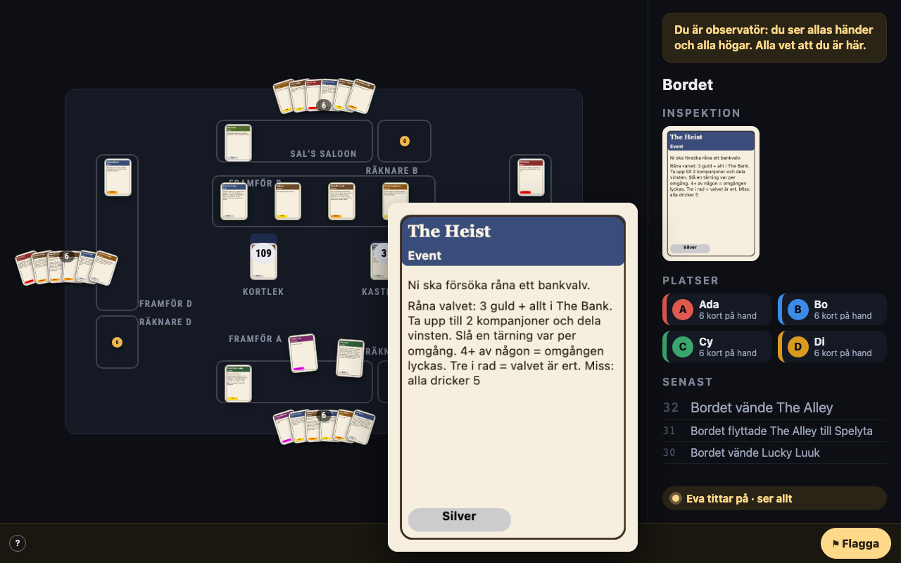

### 6. Editorn — Kortvägg och Mall

Editorn är inte en spelyta, men den är där designern ser kortet innan bordet startas, och där svaret på «hur läses det här på en telefon?» borde stå.
I dag ser designern kortet i två storlekar som ingen spelare någonsin ser det i.

| # | Nivå | Fynd | Disp. |
| --- | --- | --- | --- |
| 1 | Medel | Kortväggens kort är 150 px (7 px brödtext) som förval vid 1280 och 1920 — mindre än telefonens remsa och större än varje filt; «−»/«+» ändrar tätheten men ingen storlek motsvarar en spelyta | HITL |
| 2 | Medel | Mallens duk visar kortet i 389 px vid 1280 × 800 och 590 vid 1920 (19–28 px brödtext); en designer som sätter 8,5 pt ser text som är dubbelt så stor som «Läs valt kort» och fyra gånger «Titta», och får ingen varning att 8,5 pt blir 5 px i distansvyns hand. E5/E6 varnar för tryck (6 pt), aldrig för skärm | HITL |
| 3 | Låg | Fysisk kontroll (E5) säger «En anmärkning» om leken; en «digital kontroll» med samma form — det här kortets brödtext blir n px på telefonen, m px på TV:n — finns inte | följer 2 |

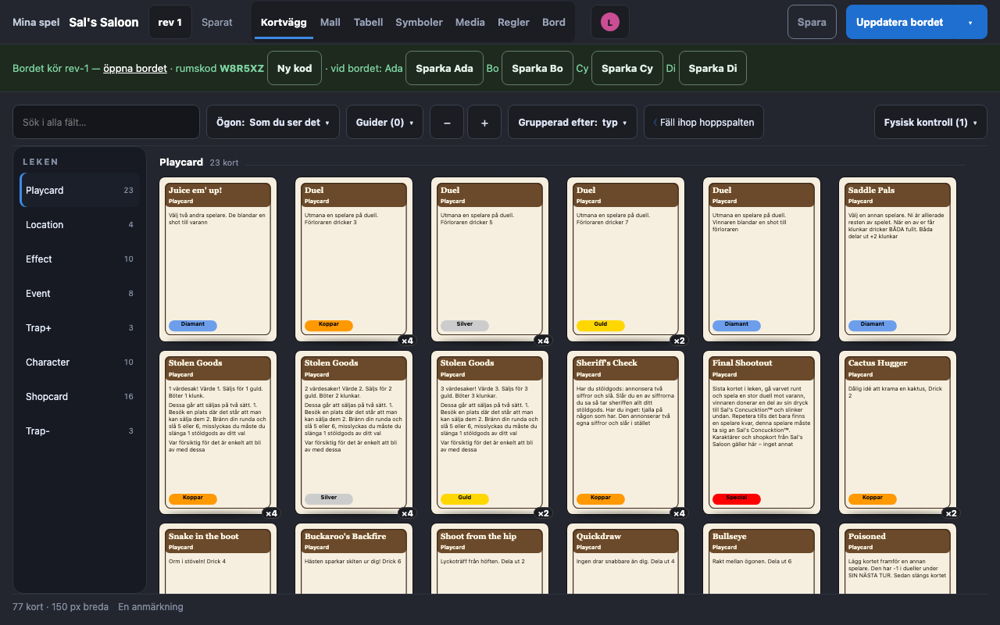

**Åtgärdat 2026-09-28 (#512, beslut A efter [prototypen](2026-09-28/prototyper/512/README.md)).**
Frågan hade flyttat sig: sedan #507–#509 läser varje spelyta kortet med en handling i golvets storlek, så det designern behöver se är om texten räcker **när kortet hålls upp**, inte i vila.
Kortväggens ögon har fått telefonens läsvy (294 px), bordets lyft (341 px) och TV:ns «Visa för alla» (672 px); väggen ritas i den bredden och varje kort säger sin minsta text i px, efter E6:s krympning, med «under golvet» i ord (fynd 1 och 2).
En lek med halverad brödtextruta visar fyra kort under telefonens golv (6,5 och 7,0 pt), och inga under bordets eller TV:ns.
Fynd 3, en digital kontroll i rapporten, valdes bort av beställaren: svaret står på kortet självt.

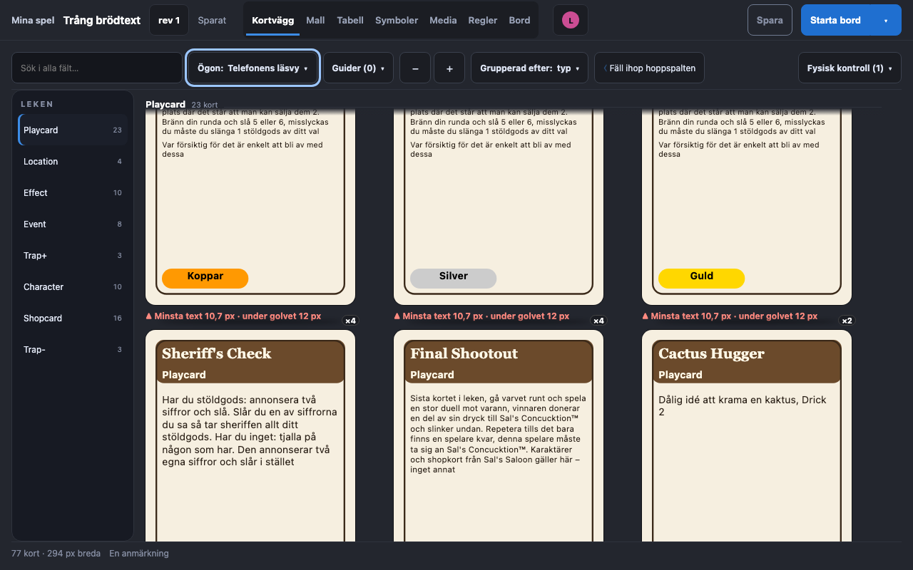
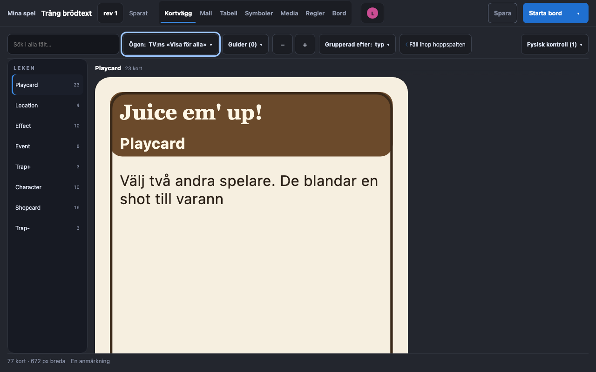

## Mönster som återkommer

Tre saker står på flera sidor.
De löses på **sida 0**, måttstocken, och följs sedan upp på varje sida.

| Mönster | Sidor | Löses på |
| --- | --- | --- |
| Ingen yta vet vad läsbar text är; storlekarna (112, 154, 177, 252) är valda på kortets ram och inte på dess text | alla | 0: golvet per skärm skrivs i DESIGN-BESLUT, och ett gemensamt mått (`textPxOnCard(sizePt, cardPx)`) används i varje mätande test |
| Vägen till läsning är två–tre handlingar per kort, olika på varje yta (välj + Läs + Stäng; klick + ring + Titta; hover; tryck) | 1, 3, 4, 5 | 0 beslutar principen (ett steg till läsning, samma gest överallt); varje sida bygger sin |
| Andras publika kort går inte att läsa där spelaren är (telefonen), och rummets yta (TV:n) kan inte välja kort | 1, 2 | 1 och 2 tillsammans: telefonen är C4:s «fäll ut bordet» — det är den kontrollen som saknas |
| Inspektionen är fasta pixlar (252 × 352, 266 hög, 138) som inte tar det rum skärmen har | 2, 3, 4, 5 | 3, som förlaga för de andra |

## Planen: en sida i taget

Ordningen är **beslutet först, sedan där spelaren är, sedan rummet, sedan resten**.
Sida 0 blockerar alla andra: utan ett golv är varje «räcker det?» en smaksak, och utan ett gemensamt mått mäter varje sida med sitt eget tal.

0. **Måttstocken** — golvet per skärm och principen för vägen till läsning skrivs som ett beslut i DESIGN-BESLUT (HITL: beställaren avgör talen och principen), plus ett gemensamt mått i testkoden. Blockerar 1–6.
1. **Telefonen** — remsan, «Läs valt kort», och andras kort. Det är där spelaren är.
2. **TV:n** — INSPEKTION i läsbar storlek och rummets sätt att välja vad den visar. Görs ihop med 1: telefonen är den kontroll TV:n saknar.
3. **Bordsläget** — vägen till «Titta» och «Titta» i det rum skärmen har. Förlagan för inspektionen på 4 och 5.
4. **Distansvyn** — handen, hovern och «Visa alla».
5. **Observatören** — filten med händerna på, och inspektionen.
6. **Editorn** — kortet i spelstorlek, och en digital kontroll bredvid den fysiska.

Varje issue följer samma arbetsgång, så att helheten blir en helhet och inte sex svar:

1. **Läs** issuet, sidans kod, de beslut i DESIGN-BESLUT som issuet pekar på (K8, K9, K10, K17, K18, C4, C8, E5, E6, L12), det här dokumentets avsnitt för sidan, och sida 0:s beslut.
2. **Återupprepa** talen i den byggda appen med render-workern igång (`run-lasbarhet.ts`, eller `packages/e2e/support/stack.ts` plus `pnpm --filter @byd/render worker` mot samma databas). Ett tal som inte går att återupprepa stryks med en rad om varför.
3. **Prototypa** HITL-fynden med `/prototype` — tre strukturellt olika varianter, på den riktiga rutten med riktiga texturer — och få dem godkända innan de byggs. Varje variant redovisar **kortbredd i px och brödtext i px** vid sidans bredder, och **antal handlingar till läsning**.
4. **Bygg** med `/tdd`. Ett mätande test i Chromium per fynd, som läser `getBoundingClientRect()` på texturbilden och räknar text-px med sida 0:s mått; grinden är golvet och inte ett tal.
5. **Verifiera** att inget K9-, K17- eller K18-tal föll: kortsidan på filten, steget i handen, träffytorna. En yta som köper läsbarhet med filtens storlek ska säga det i px.
6. **Stäng** med `pnpm typecheck`, `pnpm test`, `pnpm lint` gröna, skärmbild före/efter i issuet, och en rad i det här dokumentets avsnitt för sidan om vad som ändrades. Ett beslut som ändras skrivs i DESIGN-BESLUT.

## Summering

| Sida | Fynd | Höga | Största läsning i dag | Issue |
| --- | --- | --- | --- | --- |
| 0. Måttstocken | — | — | — | #506 |
| 1. Telefonen | 6 | 3 | 335 px / 16 px, 3 tryck, bara egna kort | #507 |
| 2. TV:n | 5 | 2 | 177 px / 8 px, kan inte väljas | #508 |
| 3. Bordsläget | 4 | 1 | 252 px / 12 px, 3 handlingar → **341–479 px / 16–23 px, 1 handling** | #509 |
| 4. Distansvyn | 6 | 2 | 180 px / 8,6 px hover; 252 / 12 «Titta» → **341–479 px / 16–23 px, 1 handling; «Visa alla» 295–336 px** | #510 |
| 5. Observatören | 4 | 2 | 138 px / 6,6 px; telefon 252 / 12 | #511 |
| 6. Editorn | 3 | 0 | (389 px / 19 px — mer än någon spelare ser) | #512 |
| **Summa** | **28** | **10** | | #505 |

Det överordnade issuet är #505.
Sida 0 tas först; sidorna 1–6 tas i nummerordning när 0 är stängt, och varje stängt issue får en rad här under sin rubrik om vad som ändrades.

## Klar-kriterium

Granskningen är klar när sida 0:s golv står i DESIGN-BESLUT och i ett gemensamt mått, när varje spelyta ovan har sitt issue stängt med fynden åtgärdade eller strukna med motivering, när ett kort på varje spelyta går att läsa i golvets storlek med **en** handling och andras publika kort går att läsa där spelaren är, och när kvalitetsgrinden är grön.
Riggen `run-lasbarhet.ts` tas bort när sista sidan stängs.
