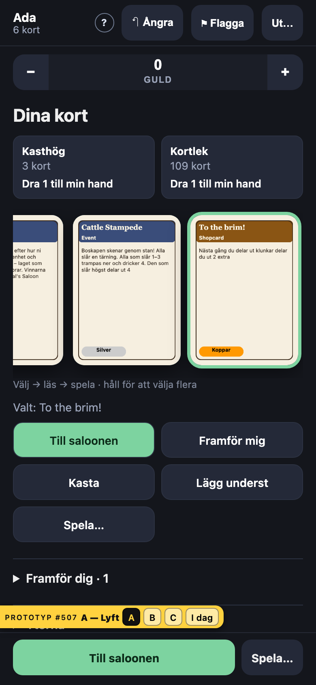
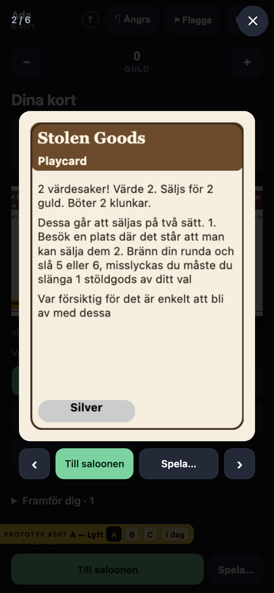
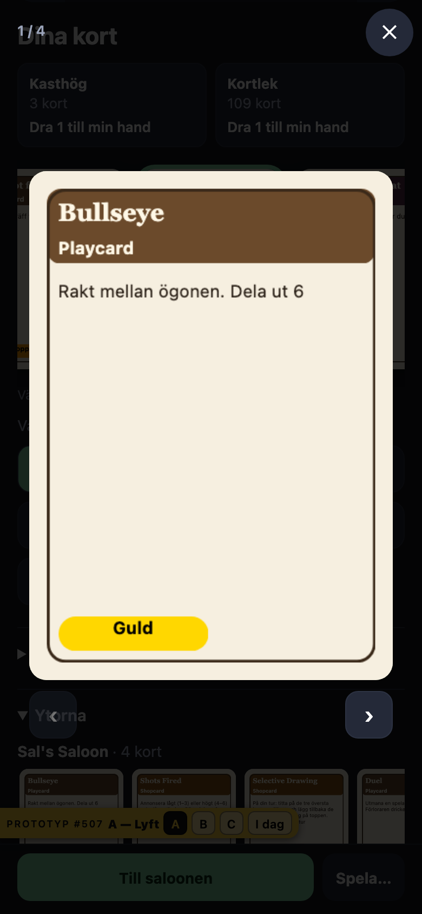
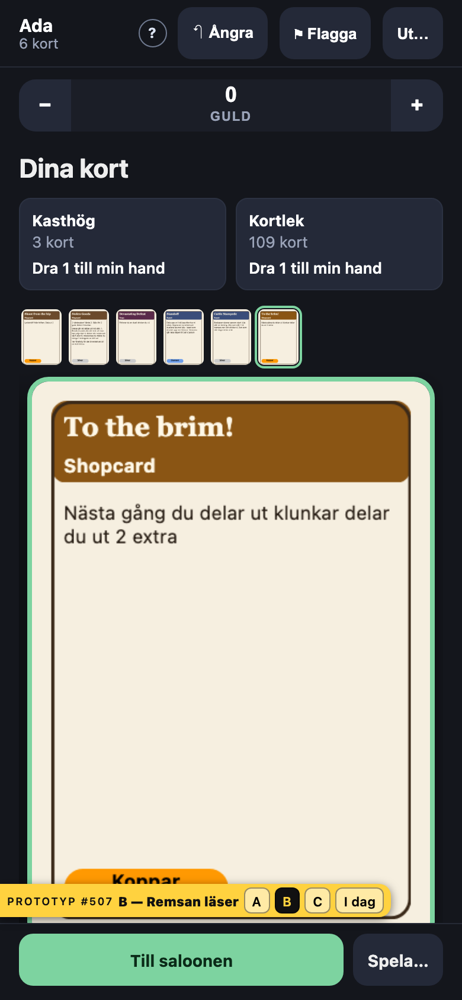
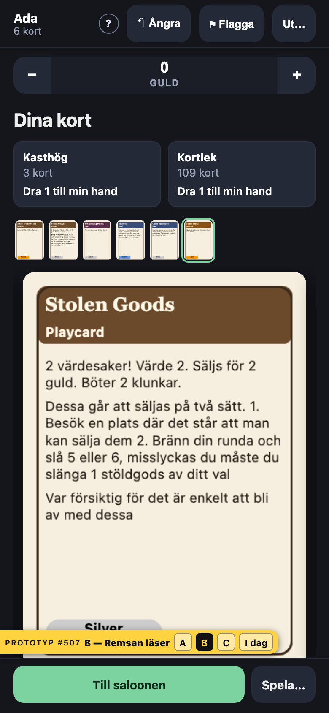
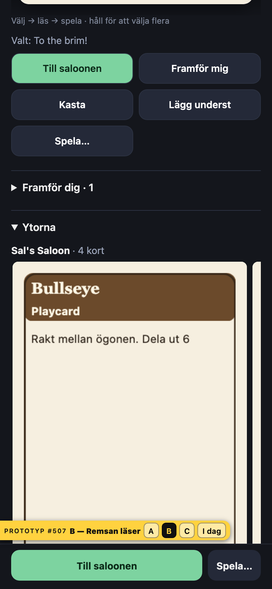
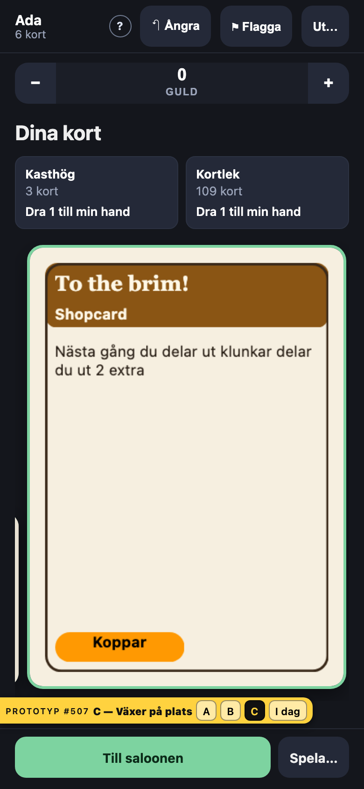
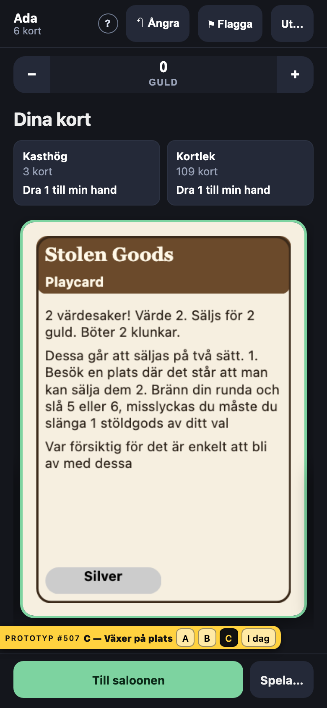
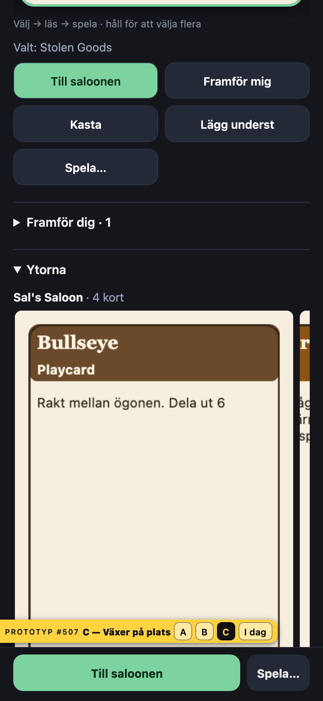

# Prototyp #507 · telefonen läser ett kort med en handling

Tre varianter på den riktiga `/play` med riktiga texturer (Sal's Saloon, render-workern igång), inom #506:s beslut: ett tryck visar kortet i golvets storlek, verben ligger bakom ett andra tryck, och andras publika kort läses på telefonen med samma gest.
Koden låg på grenen `proto/507-telefonen` (`packages/web/src/player/proto507/`) och mergades aldrig; bilderna och talen här är det som står kvar.

**Beställarens beslut 2026-09-28: A — Lyft.** Byggt i #507; beslutet står i DESIGN-BESLUT C4, K4, K10 och L48.

Golvets storlek är `clamp(294px, 100vw − 26px, 336px)`: 14 px brödtext vid 320 och 16 px från 390, alltså #506:s 14–16 px.

| Variant | Remsan i vila, px (brödtext) | Kort synliga i vila | Eget kort läst, px (brödtext) | Handlingar dit | Nästa kort | Andras kort (saloonen) |
| --- | --- | --- | --- | --- | --- | --- |
| I dag | 154 (7,4) vid alla bredder | 2 · 2 · 3 | 275 · 335 · 660 (13,2 · 16,1 · 31,7) | 2, och Stäng | 3 tryck | går inte |
| A — Lyft | 112 · 133 · 200 (5,4 · 6,4 · 9,6) | 2 · 2 · 3 | 294 · 336 · 336 (14,1 · 16,1 · 16,1) | 1 | 1 svep eller › | fliken + 1 tryck, 294–336 |
| B — Remsan läser | 294 · 336 · 336 (14,1 · 16,1 · 16,1) | 1 (plus miniatyrer) | samma, i vila | 0 | 1 svep | fliken, i vila 294–336 |
| C — Växer på plats | 112 · 133 · 200, valt kort 294–336 | 1 · 1 · 2 | 294 · 336 · 336 (14,1 · 16,1 · 16,1) | 1 | 1 tryck | fliken + 1 tryck, 294–336 |

Talen gäller 320 × 568 · 390 × 844 · 768 × 1024 och är `getBoundingClientRect()` på texturbilden efter att varje textur laddats (`matt.json`).
Inga knappar under 44 px i någon variant, och ingen sida rullar i sidled.

## Vad varianterna kostar

**A — Lyft.**
Remsan är liten och handen syns som i dag; ett tryck lyfter kortet över allt annat, ‹ › och svep går igenom handen utan att lägga ner det, och första genvägen och «Spela…» ligger under kortet.
Tryck betyder inte längre «välj»: det lästa kortet blir valt, så foten spelar det man senast läste.
Vid 320 får verbet under kortet en ellips («Till salo…»).

**B — Remsan läser.**
Ingenting att trycka för att läsa, men bara ett kort syns åt gången; handen i överblick är en rad miniatyrer (34 px) ovanför som rullar remsan.
Genvägarna under handen hamnar under skärmkanten vid 390 och 320 — foten bär den första och «Spela…», resten kräver att man rullar.
Vid 768 är det också ett kort åt gången.

**C — Växer på plats.**
Tryck väljer som i dag och det valda kortet ritas i golvets storlek där det ligger; resten står små bredvid.
Eftersom första kortet är valt från början (C4) är ett kort alltid läsbart i vila, men vid 390 lämnar det bara en strimma av grannarna: överblicken försvinner nästan lika mycket som i B.

## Gester som inte får gå förlorade

Håll för flerval och omsortering (K4, #483) är orörda i alla tre: remsans egna pekarhändelser är desamma, och bara vad ett tryck gör har ändrats.

## Bilder (390 × 844 om inget annat står)

| | Vila | Läser eget kort | Läser saloonens kort |
| --- | --- | --- | --- |
| A |  |  |  |
| B |  |  |  |
| C |  |  |  |

Därtill läsningen vid 320 × 568 (`*-320x568-2-las.png`) och vilan vid 768 × 1024 (`*-768x1024-1-vila.png`).
