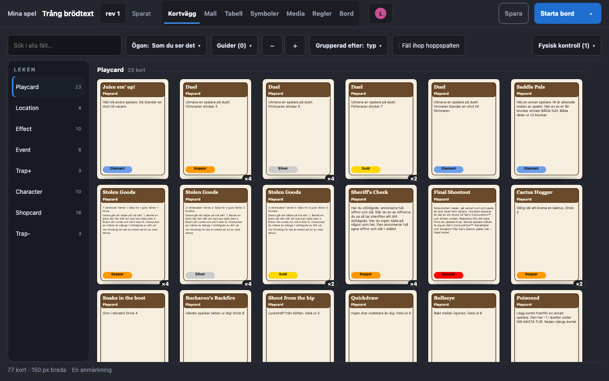
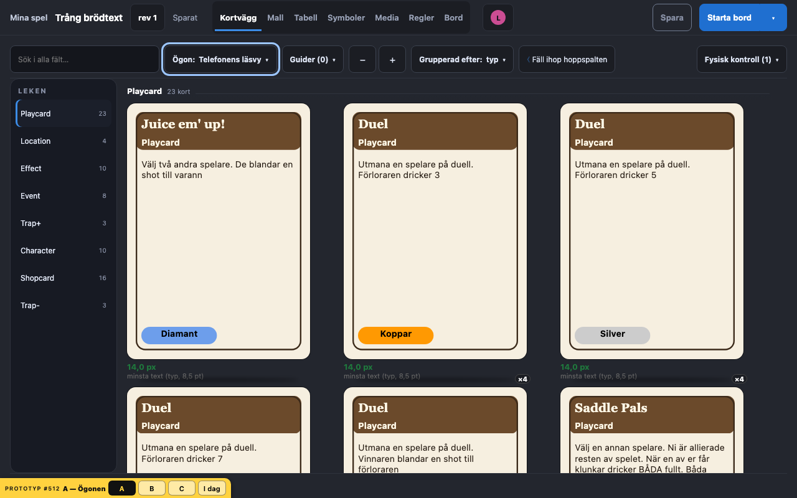
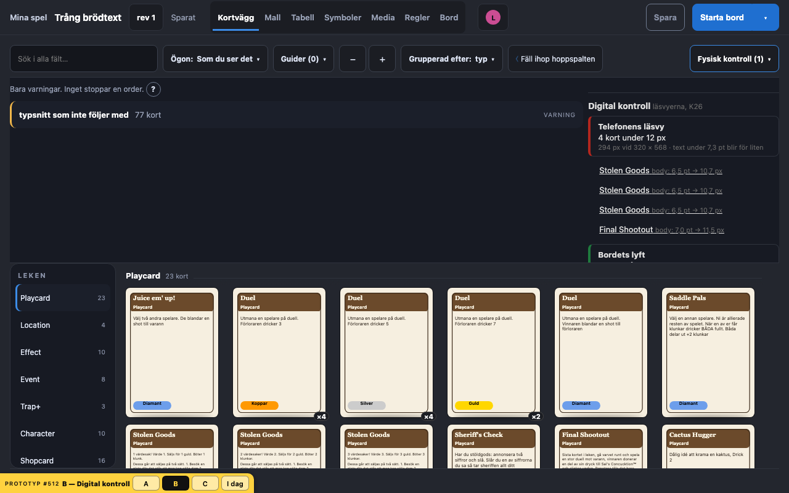
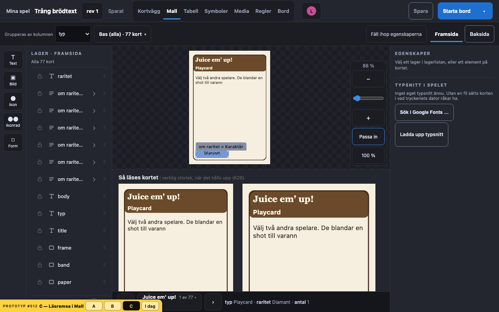

# Prototyp #512 · editorn säger hur kortet läses på skärm

Tre varianter i den riktiga editorn, på Kortväggen och i Mall, med tre lekar:
- Sal's Saloon (77 kort).
- Samma lek fyrdubblad till 308 kort.
- «Trång brödtext», där brödtextrutan är halverad så att E6 krymper de långa korten.

Koden låg på grenen `proto/512-editorn` (`packages/web/src/editor/proto512/`) och mergades aldrig.

**Beställarens beslut 2026-09-28: A — Ögonen, utan B.** Byggt i #512; beslutet står i DESIGN-BESLUT E5 och K26.

## Vad som har ändrats sedan issuet skrevs

Issuet utgick från ytornas storlek i vila: 150 px på väggen, 112 px i distansvyns hand och 177 px i TV:ns INSPEKTION.
Sedan dess läser varje spelyta ett kort med en handling i golvets storlek (K26):
- Telefonens läsvy är 294 px vid 320 (#507).
- Bordets lyft är 341 px vid 1024 × 768 (#509).
- TV:ns «Visa för alla» är 672 px vid 1080p (#508; prototypen räknade med 666).

Vilan får vara oläslig enligt K26.
Det designern behöver få veta är alltså inte vilostorleken.
Det är om någon text på kortet blir för liten **när kortet hålls upp**.

Det händer när texten är mindre än läsvyerna räknar med, antingen satt så eller krympt av E6.

| Läsvy | Bredd | Golv | Text under det här blir för liten |
| --- | --- | --- | --- |
| Telefonens läsvy | 294 px vid 320 × 568 | 12 px | 7,3 pt |
| Bordets lyft | 341 px vid 1024 × 768 | 12 px | 6,3 pt |
| TV:ns «Visa för alla» | 666 px vid 1920 × 1080 | 24 px | 6,4 pt |

Telefonen är alltså den yta som först säger nej.
Sal's Saloon klarar alla tre, eftersom dess minsta text är typraden på 8,5 pt och ingen brödtext krymper under det.
I «Trång brödtext» hamnar fyra kort under telefonens golv (Stolen Goods ×3 på 6,5 pt och Final Shootout på 7,0 pt), men inget under bordets eller TV:ns.

Storleken läses ur DOM efter E6:s anpassning (`fitInDocument`), alltså den storlek kortet verkligen får.
Golven kommer ur `legibility.ts` (K26).
Läsvyernas bredder är i prototypen skrivna i en tabell. Bygget läser dem där ytorna själva definierar dem.

## Varianterna

| | Vad designern gör | Vad den säger | 308 kort | Pris |
| --- | --- | --- | --- | --- |
| **A — Ögonen** | Väljer «Telefonens läsvy», «Bordets lyft» eller «TV:ns Visa för alla» bland väggens ögon (L21, E5) | Hela väggen ritas i den bredden; varje kort säger sin minsta text i px, rött under golvet | 308 kort i 294 px: väggen blir lång, men ett kort under golvet måste letas upp | Svaret är synligt men inte samlat; man ser en yta åt gången |
| **B — Digital kontroll** | Öppnar «Fysisk kontroll»; bredvid den står «Digital kontroll» | En rad per läsvy: «4 kort under 12 px», minsta punktstorlek; raden fälls ut till korten med element och storlek, och ett kort öppnar raden i leken (E6) | Samma rader; listan växer med antalet kort under golvet, inte med leken | Säger inte hur kortet *ser ut* i läsvyn |
| **C — Läsremsa i Mall** | Arbetar i Mall | Under duken står kortet i verklig storlek i alla tre läsvyerna, med minsta text i px | Oberoende av leken | Bara kortet som ligger i Mall; det hittar inte de fyra korten. Duken får halva höjden |

Laddtiden var ungefär 2 s i alla varianter vid både 77 och 308 kort, och ingen av dem la till något mätbart.

## Bilder

| | 1280 × 800, «Trång brödtext» |
| --- | --- |
| I dag |  |
| A |  |
| B |  |
| C |  |

Därtill A och B vid 308 kort och 1920 × 1080, och C vid 1920 × 1080.
