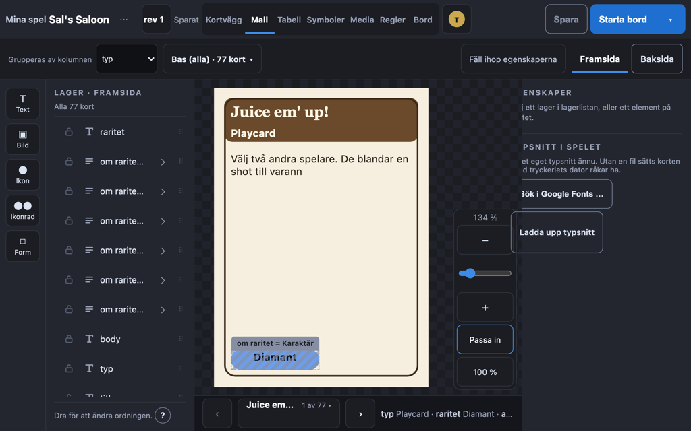
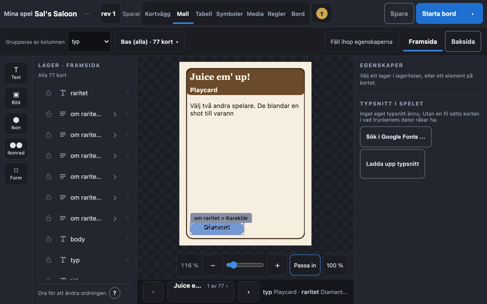
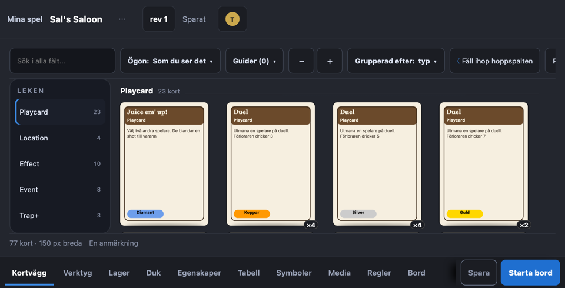
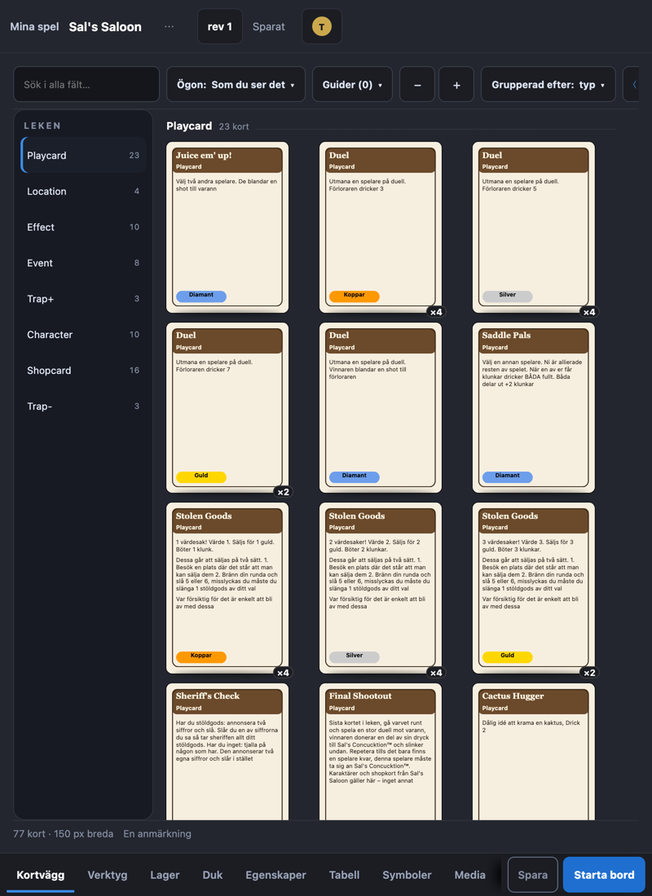

# Surfplattegranskning 2026-09-29: editorn på iPad och Galaxy Tab

Beställningen: *«Kontrollera editorns gränssnitt när man kör på mobila enheter som en ipad eller galaxy tablet. den behöver inte stödja mobiler men stora tablets vore nice to have»*.
Beställaren lade till under granskningen: *«Mycket visas utanför pekskärmens viewport, man ska inte behöva skrolla runt på en surfplatta»*, sett på en Galaxy Tab i Chrome direkt när editorn öppnas.
Beslutet som kom ur det står som ett tillägg till L12 i `DESIGN-BESLUT.md`.

## Sammanfattningen

Editorn fungerar i grunden med fingret: flikar, kort, celler och element på duken går att trycka på, och ett pekdrag flyttar ett element på duken.
Ingen vy låter sidan själv rulla i sidled eller höjdled vid någon av de uppmätta storlekarna.
Det som inte håller är fyra saker: ett layoutfel vid exakt 1024 px, två pekgrepp som är för små eller döda, att ångra bara finns på tangentbordet, och att editorns egna rader tar för mycket av en platta och gömmer kontroller i rader som rullar i sidled.

## Hur det mättes

Den riktiga tjänsten, renderaren och en lek på 77 kort kördes lokalt, och editorn drevs med Playwright.
iPad kördes i WebKit, Safaris motor, och Galaxy Tab i Chromium, båda med pekskärm.
Båda rapporterar `(pointer: coarse)` och `(hover: none)` som en riktig platta.
Pekdrag skickades som riktiga pekhändelser via CDP i Chromium, eftersom WebKit i Playwright bara kan trycka.

| Enhet | Läge | Synlig yta i CSS-px | Editorns form |
| --- | --- | --- | --- |
| iPad Pro 13 | liggande | 1366 × 950 | skrivbord |
| iPad Pro 13 | stående | 1024 × 1292 | skrivbord |
| iPad Air 11 | liggande | 1180 × 746 | skrivbord |
| iPad Air 11 | stående | 820 × 1106 | etapper |
| Galaxy Tab S9 | liggande | 1024 × 640 | skrivbord |
| Galaxy Tab S9 | stående | 640 × 1024 | telefon, ingen duk |
| Galaxy Tab S9 Ultra, ungefär | liggande | 1280 × 740 | skrivbord |

Höjderna är skärmen minus webbläsarens och systemets fält.
Därtill svepte vi 1280 × 632, 1024 × 560, 960 × 490 och 1005 × 432, som är vad mindre Galaxy-plattor lämnar i liggande läge.

## Fynden

### 1. Mallens kortrad målade över egenskaperna vid 1024 px (rättat)

Dukens kolumn växte till kortradens värden i full längd och gick 30 px in över egenskapspanelen.
Det syntes på iPad Pro 13 stående och Galaxy Tab S9 liggande, men gäller varje skärm som är exakt 1024 px bred, alltså också skrivbordets smalaste bredd.

Rättat i samma gren som den här rapporten, tillsammans med kortets namn i samma rad som stod i knappens överkant.

### 2. Tabellens breddgrepp gör ingenting med fingret

Med musen blir en kolumn 60 px bredare av ett drag i greppet vid rubrikens högerkant.
Med fingret händer ingenting, eftersom greppet saknar `touch-action` och webbläsaren tar gesten.
Greppet är dessutom 10 px brett och syns bara vid hover, så en platta visar det aldrig.

### 3. Dukens storlekshandtag är för små för ett finger

Handtagen är 15 px i fyrkant vid den zoom duken passar in kortet i.
En fingertopp täcker ungefär 40 px.
Ett tryck som träffar 8 px bredvid ett handtag tar tag i elementet under, oftast kortets bakgrundsform, och flyttar det i stället.

### 4. Ångra finns bara på tangentbordet

Ångra och gör om nås med Ctrl eller Cmd och Z, och den enda synliga ångra-knappen finns i uppställningen.
En platta utan tangentbord kan alltså inte ta tillbaka ett misstag på duken, i tabellen eller på väggen.

### 5. Editorns rader tar plattans höjd och gömmer kontroller i sidled

Vid 960 × 490 tar huvudet, verktygsraden, statusraden och etappremsan 280 av 490 px, så kortväggen visar knappt en rad kort.

L10 bestämde att raderna rullar i sidled i stället för att bryta.
På en platta betyder det att kontroller ligger utanför skärmen tills man letar efter dem.

| Storlek | Vad som ligger utanför skärmen |
| --- | --- |
| 1024 × 560 | tabellens filterchips, 6 av dem, med en egen pilknapp |
| 960 × 490 | kortväggens «Fysisk kontroll» och 7 filterchips |
| 820 × 1106 | etappremsans Media, Regler och Bord bakom Spara och Starta bord, kortväggens «Fäll ihop hoppspalten» och «Fysisk kontroll» |

Att ändra det rör ett beslutat visuellt koncept och prototypas därför först.

## Det emuleringen inte visar

Fyra saker går inte att se i en emulerad webbläsare och behöver en riktig platta.

- **Drag som startas med fingret** i lagerlistan, kolumnordningen och bilderna i tabellen, som bygger på HTML-drag.
  iPadOS startar sådana drag med ett långt tryck; Chrome på Android är osäkert.
- **Höjden under webbläsarens fält.**
  Editorn och wizarden är `100vh` höga medan sidans rot är 100 %, och i Chrome på Android kan de två skilja sig med adressfältets höjd.
- **Ett långt tryck på duken**, där iOS kan markera text eller visa sin meny.
- **Skärmtangentbordet**, som täcker halva plattan när ett fält i egenskaperna får fokus.
