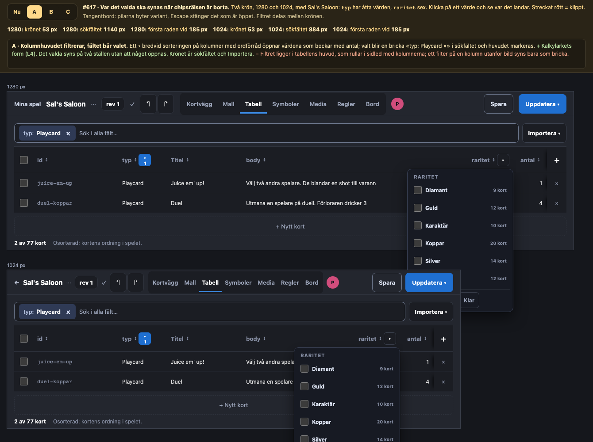
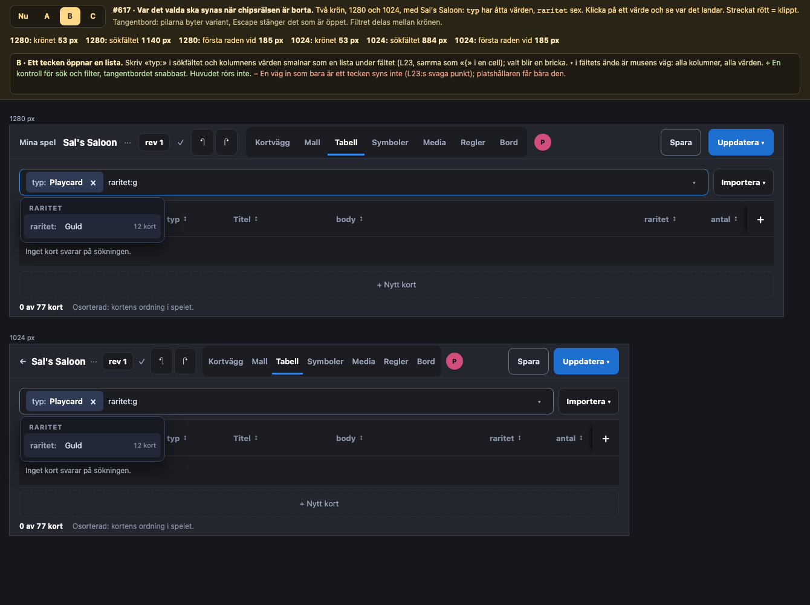
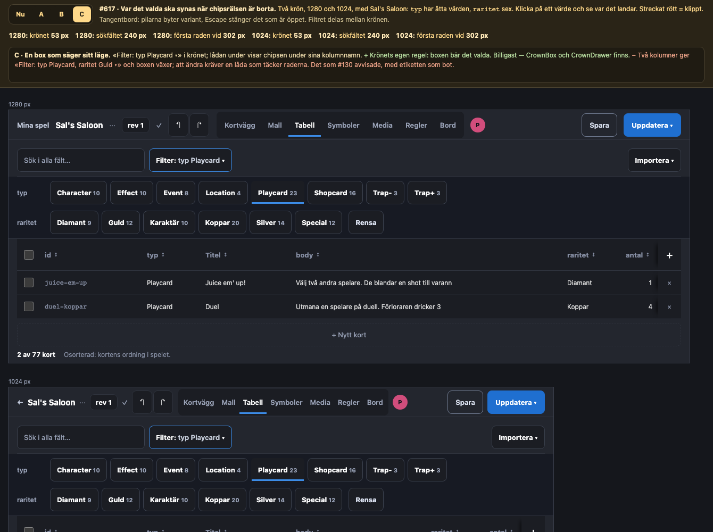
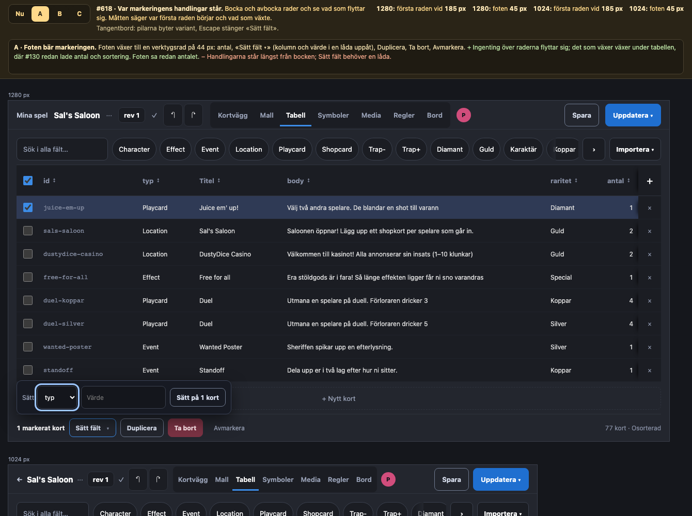
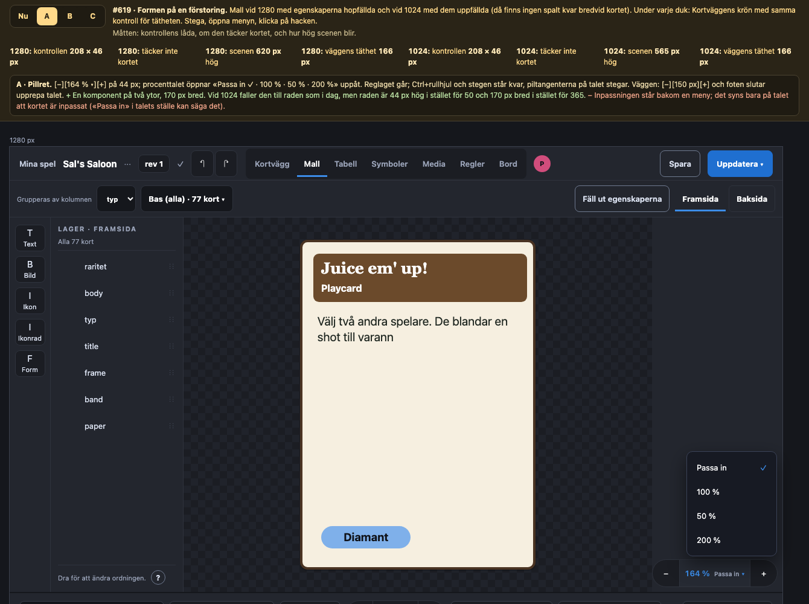
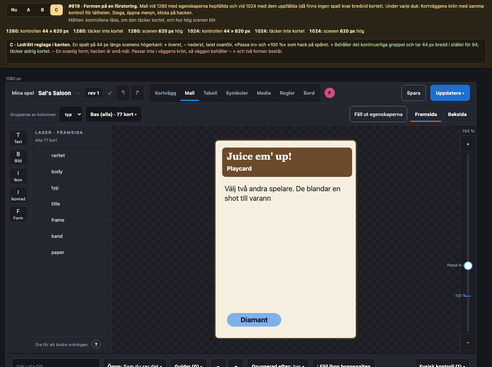
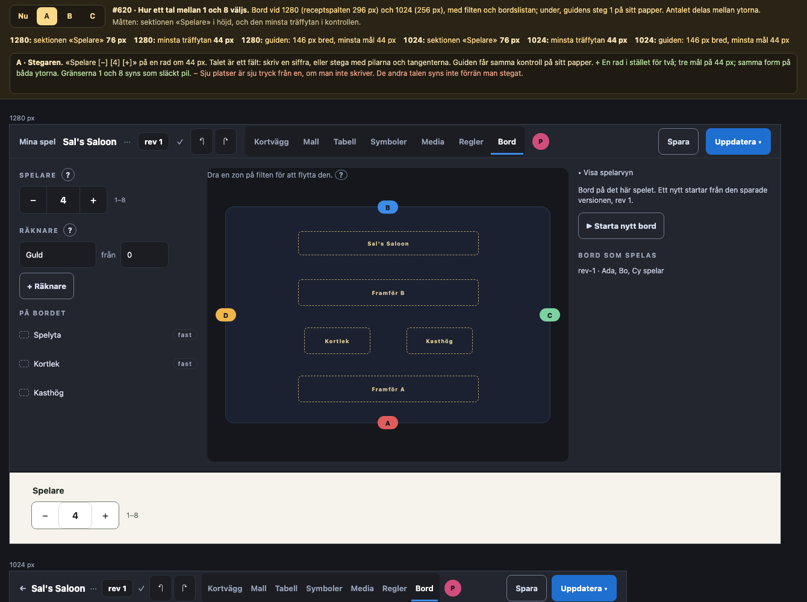
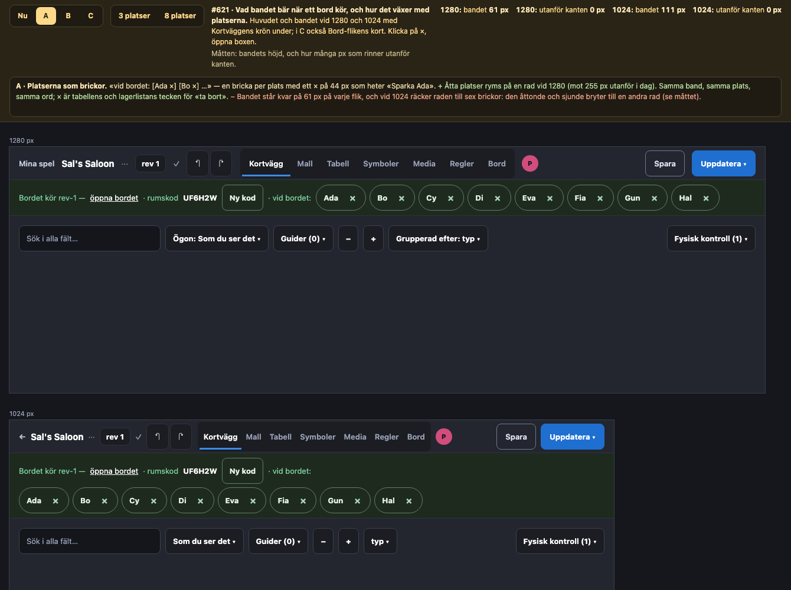

# Komponentöversikt 2026-09-30: fem stora GUI-element som kan bli små komponenter

Beställningen: *«Gör en helhetsöverblick, ta ett steg tillbaka och identifiera gränssnittsförbättringar
där vi genom helt egna komponenter eller inspirerat av andra komponenter kan slå ihop onödigt stora
GUI-element till något mer elegant. Ett exempel på något som tar för mycket plats är filtret på
tabellsidan. Skapa issues och lägg till prototyper på dina förbättringar. Ge även din rekommendation.»*

Det här dokumentet är tre saker: en inventering av vilka element som är stora i förhållande till
vad de gör, fem issues med prototyper (#617–#621), och en rekommendation om ordningen.

## Omfattning och metod

Den riktiga webbappen på `origin/main` (124083da), i minnesläge med `AUTH_BYPASS` och Sal's Saloon
(77 kort, fyra platser, ett bord som kör med tre vid bordet), i Chromium via Playwright vid
1280 × 800 och 1024 × 768 — editorns bredder enligt L12. Mått är lästa ur sidan
(`getBoundingClientRect`, `scrollWidth`), inte ur koden.

Spelarens ytor (`/play`, `/online`, `/table`, observatören) granskades i skärmbilderna från
2026-09-27 och 2026-09-28 och lämnas utanför: deras element är stora för att de ska träffas med ett
finger eller läsas på tre meter (K-serien, C5), inte för att de växt. Det som är stort där är stort
med avsikt.

## Inventeringen

Ett element räknas som «onödigt stort» när det tar mer yta än informationen eller handlingen i det
motiverar, växer med datat i stället för att stå still, eller finns i två former för en fråga.

| # | Yta | Element | Mått | Vad som är fel |
| --- | --- | --- | --- | --- |
| 1 | Tabell | Filterchipsen i krönet | räls 933/1 248 px vid 1280, 717/992 vid 1024; 204 resp. 420 px dolda bakom «›»; sökfältet 202/161 px | 14 chips utan kolumnnamn tar tre fjärdedelar av raden; det enda som svarar på vad som helst — sökfältet — är minst |
| 2 | Tabell | Åtgärdsraden vid markering | band 72 px; raderna flyttar 80 px (topp 187 → 267) | Fälls ut *över* raderna så bocken glider iväg; foten säger redan «1 markerat kort» |
| 3 | Mall, Kortvägg | Förstoringen; tätheten | stapel 94 × 269 px vid 1280, rad 365 × 50 vid 1024; väggens «− +» 92 px + talet i foten | Sex kontroller för ett tal; två former för samma fråga på två ytor |
| 4 | Bord, guidad start | Spelarväljaren | åtta knappar à 44 px; två rader och 94 px i spalten (296/256 px), sektionen 124 px | Åtta träffytor för ett tal mellan 1 och 8 |
| 5 | Editorns ram | Bordsbandet | 61 px på varje flik; 112–130 px per plats; 3 platser = 437 px, 8 platser ≈ 1 400 px | Växer med spelarna och rinner utanför vid 1280 från åtta, vid 1024 från fem; det som växer är knappar som nästan aldrig trycks |

### Övervägt men inte föreslaget

- **Mallens «Grupperas av kolumnen [typ] · [Bas (alla) · 77 kort ▾]»** — två kontroller för en sak.
  Menyn valdes 2026-09-16 (#129); att lägga kolumnvalet *i* menyn är en liten följdändring som kan
  ta rygg på beslutet i #617 (samma «en kontroll bär sitt val»-form) och behöver inget eget issue nu.
- **Kortväggens krön** — sju kontroller på en rad («Ögon», «Guider», «− +», «Grupperad efter»,
  fällknappen, «Fysisk kontroll»). Ögon, Guider och Fysisk kontroll är alla *kontroller av leken* och
  kunde vara en box, men krönets regel (#128) kräver att en box säger sitt läge, och tre lägen i en
  etikett blir längre än tre boxar. Tätheten går in i #619; resten lämnas.
- **Regler-krönet** — «Redigerbar | Som på bordet · Klicka i sidan … · Importera över boken · Häfte
  för tryck» är en rad och håller sig till den; L51 rör redan rubrikens knapp. Inget att slå ihop.
- **Telefonens handlingsrutnät** — fem knappar i två kolumner plus «Läs valt kort». Stort, men varje
  knapp är en handling spelaren gör med tummen i en hand (L12, K4); en meny skulle kosta ett tryck
  per handling. Beslutat, inte förbisett.

## Issues och prototyper

Varje issue är märkt `ready-for-human`: fyndet är mätt, tre strukturellt olika varianter är
prototypade, och beställaren väljer. Prototyperna ligger i
[`2026-09-30-komponenter/prototyper/`](2026-09-30-komponenter/prototyper/index.html), ritar ytan i
verklig bredd vid 1280 och 1024 och läser sina mått ur det ritade. De öppnas över http
(`python3 -m http.server` i mappen), inte som fil.

### #617 · Tabellens filter

| | Krönet | Sökfältet | Dolt | Första raden vid |
| --- | --- | --- | --- | --- |
| Nu | 53 px | 195 px (1280) / 153 (1024) | 233 / 448 px | 185 px |
| A · kolumnhuvudet + brickor i fältet | 53 px | 1 140 / 884 px | 0 | 185 px |
| B · «typ:» öppnar en lista | 53 px | 1 140 / 884 px | 0 | 185 px |
| C · «Filter: typ Playcard ▾» | 53 px | 240 px | 0 | 185 px, 302 med lådan öppen |

**Beslut (beställaren 2026-10-01): A, med B:s `typ:` som tangentbordets väg.**
**Ändrat (#617, L56):** chipsrälsen och `CrownRail` är borta.
Kolumner med ordförråd har ett handtag ▾ i huvudet som öppnar värdena som bockar med antal, lyft till toppskiktet (L55), stängt med Escape tillbaka till handtaget.
Det valda står som brickor «typ: varelse ×» i sökfältet, som nu tar raden: 1 142 px vid 1280 och 886 vid 1024, mot 202 och 161 förut; krönet är 55 px.
«typ:» i fältet listar kolumnens värden, pilarna går i listan och Enter tar värdet; medan texten namnger en kolumn söker den inte.
Rubrikens prosautfällning öppnas inte av en hand på handtaget eller ett fokus i dörren.
`data-table-filter.test.tsx` (23 fall) och `editor-crown.test.tsx` (fältet minst 400 px, ingen räls) är grindarna.

### #618 · Tabellens åtgärdsrad

| | Första raden vid | Foten | Anmärkning |
| --- | --- | --- | --- |
| Nu | 267 px (185 omarkerat) | 24 px | bandet 74 + 8 px |
| A · foten | 185 px | 45 px | inget över raderna flyttar |
| B · flytande remsa | 185 px | 24 px | remsan täcker en rad |
| C · krönet byter | 185 px | 24 px | sök och filter borta medan något är markerat |

**Beslut (beställaren 2026-10-01): A.**
**Ändrat (#618, L58):** bandet över raderna är borta.
Foten bär handlingarna efter antalet — «Sätt fält ▾», Duplicera, Ta bort, Avmarkera alla — och frågan före en borttagning tar deras plats.
Kolumn och värde står i en lyft box ur «Sätt fält», samma `Lifted` som kolumnfiltrets dörr.
Första raden står kvar när ett kort markeras, och foten är en rad (`data-table-layout.test.tsx`).

### #619 · Förstoringen

| | Kontrollen | Täcker kortet | Väggens täthet |
| --- | --- | --- | --- |
| Nu | 92 × 269 px (1280), 422 × 53 (1024) | nej | «− +» 92 px + foten |
| A · pillret | 208 × 46 px | nej | pill 166 px, inget i foten |
| B · allt synligt | 307 × 54 px | nej | pill 166 px |
| C · lodrätt reglage | 44 × 620 px | nej | oförändrad |

### #620 · Platsväljaren

| | Sektionen «Spelare» | Minsta träffyta | Guiden |
| --- | --- | --- | --- |
| Nu | 124 px | 44 px | 445 px, 44 px |
| A · stegaren | 76 px | 44 px | 146 px, 44 px |
| B · segmenterad rad | 76 px | 36 px (1280), 31 (1024) — under 44 | 445 px, 55 px |
| C · bordet är väljaren | 47 px (64 vid 1024) | ingen kontroll i spalten | stegaren |

### #621 · Bordsbandet

| | Bandet | Utanför kanten, 8 platser | Anmärkning |
| --- | --- | --- | --- |
| Nu | 61 px | 255 px (1280), 511 (1024) | |
| A · brickor | 61 px (111 vid 1024) | 0 | vid 1024 bryter brickorna till en andra rad |
| B · box i huvudet | borta | huvudet 73 px utanför vid 1024 | huvudet är redan fullt under 1440 (#566) |
| C · statusrad | 32 px | 0 | «Ny kod» och sparkarna på Bord-fliken |

**Beslut (beställaren 2026-10-01): A.**
**Ändrat (#621, L59):** varje plats i bandet är en bricka `[Ada ×]`, och × är en full träffyta på 44 × 44 px som heter «Sparka Ada».
Brickorna går under länken och rumskoden tillsammans när de inte ryms, och med åtta vid bordet rinner inget utanför vid 1024 eller 1280 (`editor-seat-chips.spec.ts`).
En sparkad plats lämnar fokus till nästa bricka, eller till «Ny kod» när ingen är kvar.

## Rekommendation

Ordningen är efter hur mycket yta som vinns per byggd rad, och efter vad som ger en komponent de
andra kan låna.

1. **#617 · A**, kolumnhuvudet filtrerar och sökfältet bär brickorna, med B:s `typ:` som
   tangentbordets väg in i samma fält. Det är det största fyndet, det beställaren pekade på, och
   det ger sökfältet 900 px tillbaka utan att något läge göms. C är billigast men är det #130
   avvisade, och en etikett som växer med varje kolumn.
2. **#618 · A**, foten bär markeringen. Foten sa redan antalet; att den också bär handlingarna tar
   bort 80 px förskjutning över raderna och ett band. B täcker arbetet, vilket L19 redan valt bort
   för förstoringen; C tar bort sökningen just när man markerar.
3. **#619 · A**, pillret, på Mall *och* Kortvägg. En komponent för två ytor; 208 × 46 px i stället
   för 94 × 269. Vid 1024 med egenskaperna uppfällda faller det till en rad som i dag, men raden är
   44 px hög och 208 bred i stället för 50 × 365.
4. **#620 · A**, stegaren, i Bord och i guidad start. Sektionen går från 124 till 76 px och behåller
   44 px mål. B faller på träffytan i spalten; C är vackrast men lämnar guiden med en annan form.
5. **#621 · A**, brickorna. Bandet står kvar men rinner inte utanför vid 1280; vid 1024 bryter det
   till två rader med åtta vid bordet, vilket är sällsynt och läsbart. B faller på huvudet vid 1024;
   C är en större flytt (handling till Bord-fliken) som kan göras senare om bandet ändå stör.

Byggs i den ordningen blir det tre nya komponenter — ett brickfält, ett pill, en stegare — och två
befintliga som får nya platser (foten, bandet). Ingen av dem uppfinner ett nytt mönster: brickan är
tabellens «×», pillret är L19:s hörn, stegaren är räknarens «− +» på telefonen, och det valda står
alltid där det kan läsas utan att något öppnas (#128).

## Klar-kriterium

Varje issue får beställarens val som kommentar, byggs med `/tdd` med ett mätande test på måttet i
tabellen ovan, och stänger med en rad i det här avsnittet om vad som ändrades. Prototypmappen tas
bort när alla fem är byggda; besluten skrivs i DESIGN-BESLUT.
